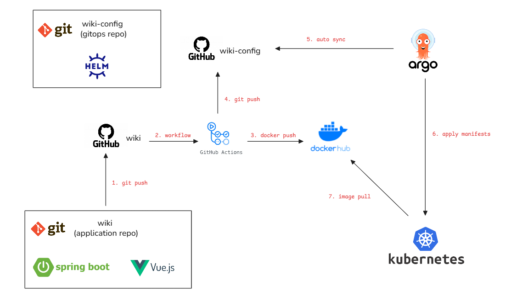

# WIKI

**A Cloud-Native GitOps Project Built During My Time at Avaya**

---

## Overview

This project is a cloud-native ebook management system built as a hands-on project to practice modern **DevOps** and **GitOps** workflows.  

The system provides basic ebook management capabilities and demonstrates how to deliver applications using **Kubernetes**, **GitHub Actions**, **Docker**, and **ArgoCD** with a **GitOps** approach.

This project focuses not only on application development, but also on building a production-like cloud-native delivery pipeline.

---

## 🧱 Tech Stack

### Frontend
- Vue.js
- Ant Design Vue

### Backend
- Spring Boot
- MyBatis

### Database
- PostgreSQL

### DevOps / Cloud Native
- GitHub (Source Control)
- GitHub Actions (CI)
- Docker & Docker Hub (Image Build & Registry)
- Kubernetes (Runtime Platform)
- Helm (Manifests Management)
- ArgoCD (GitOps Continuous Deployment)

---

## 🏗 Architecture Overview

The project follows a cloud-native GitOps workflow.

Source code and deployment configuration are separated into two repositories:

- **Application Repository (wiki)** – contains frontend/backend source code and CI pipeline.
- **Configuration Repository (wiki-config)** – contains Kubernetes/Helm manifests defining the desired state.

---

## 🔄 GitOps Workflow

1. Developers push code to the **Application Repository (wiki)**.
2. GitHub Actions is triggered to:
    - Build and test the application.
    - Build Docker images.
    - Push images to Docker Hub.
3. The pipeline updates the image tag in the **Configuration Repository (wiki-config)**.
4. ArgoCD continuously **reconciles** the GitOps repository.
5. When a change is detected, ArgoCD **syncs and applies manifests** to the Kubernetes cluster.
6. Kubernetes creates new Pods based on the updated manifests.
7. The kubelet performs an **image pull** from Docker Hub and starts the new containers.

This enables a fully automated **GitOps-driven Continuous Deployment** workflow:

