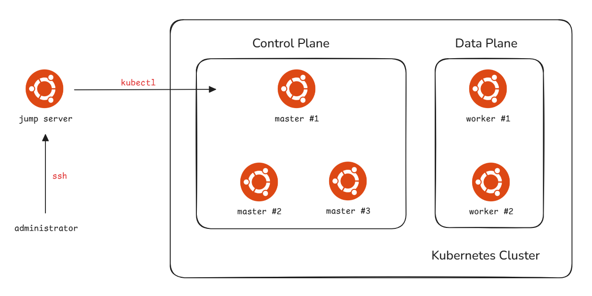

# Kubernetes Infrastructure Deployment

This document outlines the automated deployment process for a **High Availability (HA) Kubernetes cluster**.

The deployment utilizes a centralized "Jump Server" architecture, where all provisioning and configuration are orchestrated remotely via automated scripts.

## Cluster Architecture and Resource Allocation

The cluster implements a multi-master control plane design to eliminate single points of failure. The topology consists of six Ubuntu 24 (https://ubuntu.com/download/server) nodes:
- **1 Jump Server**: The deployment orchestrator and administrative gateway. (4vCPU, 4GB RAM, 60GB HDD)
- **3 Master Nodes**: The High Availability Control Plane. (4vCPU, 4GB RAM, 60GB HDD)
- **2 Worker Nodes**: Data plane nodes for application workloads. (4vCPU, 8GB RAM, 60GB HDD)




## Automated Deployment Workflow

The deployment is managed by a series of Bash scripts hosted in the config repository (https://github.com/yijun-l/wiki-config/blob/main/scripts/k8s-setup/).

Note, All scripts must be executed exclusively from the Jump Server.

### 1.Define Your Environment (`cluster.env`)

Before execution, the cluster's logical topology (IP addresses, hostnames, and credentials) must be defined in the environment file. This file serves as the **Single Source of Truth (SSoT)** for the automation suite.

### 2. Node Bootstrapping (`k8s-node-bootstrap.sh`)

This script automates the baseline OS configuration for all target nodes via remote execution. Key operations include:
- **SSH Orchestration**: Distribution of SSH public keys and configuration of passwordless sudo.
- **Package Management**: System updates and installation of core dependencies (Containerd, Kubelet, Kubeadm, and Kubectl).
- **System Tuning**: Kernel parameter optimization, Swap deactivation, and firewall management.

### 3. High Availability Configuration (`k8s-haproxy-keepalived-deploy.sh`)

To provide a unified entry point for the Kubernetes API Server, a **Virtual IP (VIP)** is established across the master nodes:
- **HAProxy**: Provides Layer 4 load balancing for the API Server.
- **Keepalived**: Manages VRRP-based VIP failover, ensuring control plane accessibility if a master node fails.

### 4.Cluster Initialization (`k8s-cluster-init.sh`)

The final stage involves orchestrating the Kubernetes control plane. The script:
- Executes `kubeadm init` on the primary master.
- Configures the **Pod Network Interface (CNI)**.
- Automates the joining of remaining master and worker nodes to the cluster.

## Post-Deployment Verification

Upon successful execution, verify the cluster state from the Jump Server using `kubectl`. 

All nodes should report a **Ready** status.

```shell
$ kubectl get nodes
NAME       STATUS   ROLES           AGE   VERSION
master01   Ready    control-plane   23m   v1.34.5
master02   Ready    control-plane   18m   v1.34.5
master03   Ready    control-plane   17m   v1.34.5
worker01   Ready    <none>          16m   v1.34.5
worker02   Ready    <none>          16m   v1.34.5
```
