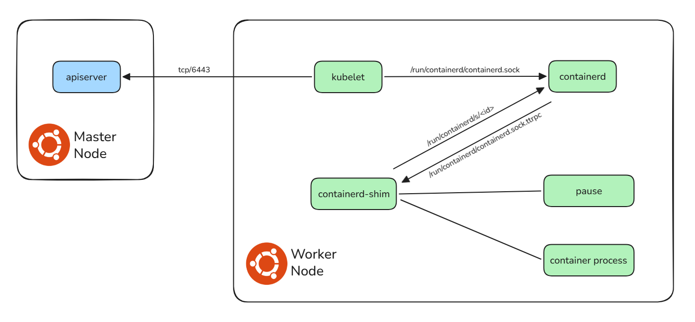
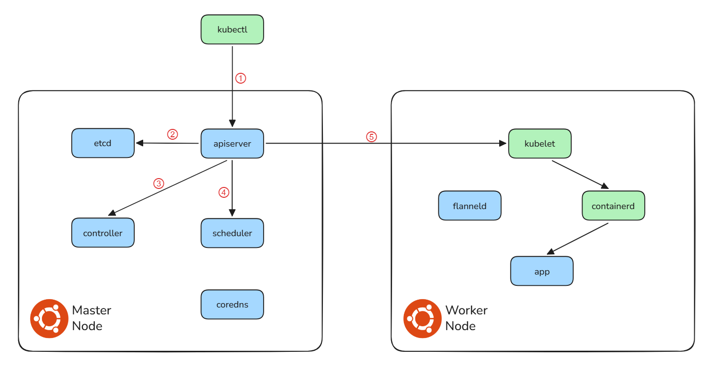

# Observe K8S Components

## Initial Process Architecture on Fresh K8s Cluster

After a complete Kubernetes cluster deployment, we can use the `pstree` command to view the parent-child process hierarchy and process orchestration on master and worker nodes.

### Master Node Process Tree

The master node runs all K8s control plane components, plus high-availability tools. Most components run in containers managed by `containerd`.

```shell
systemd─┬─containerd
        ├─containerd-shim─┬─pause
        │                 └─etcd
        ├─containerd-shim─┬─pause
        │                 └─kube-apiserver
        ├─containerd-shim─┬─pause
        │                 └─kube-controller
        ├─containerd-shim─┬─pause
        │                 └─kube-scheduler
        ├─containerd-shim─┬─pause
        │                 └─kube-proxy
        ├─containerd-shim─┬─pause
        │                 └─flanneld
        ├─containerd-shim─┬─pause
        │                 └─coredns
        ├─haproxy───haproxy
        ├─keepalived───keepalived
        └─kubelet
```
### Worker Node Process Tree

Worker nodes only run components to run workloads and connect to the master plane, with fewer processes for easier observation.

```shell
systemd─┬─containerd
        ├─containerd-shim─┬─pause
        │                 └─kube-proxy
        ├─containerd-shim─┬─pause
        │                 └─flanneld
        └─kubelet
```

## Inspect Inter-Process Communication

We use simple Linux commands (e.g. `ps`, `ss`) to check inter-process communication, including the Watch connection between components and API server.

### Worker Node Process
We start with the worker node because it has fewer processes, making it easy to trace local communication between `kubelet`, `containerd` and `containerd-shim`.

1. `kubelet` (Worker Node) watches the `apiserver` and detects a new Pod assigned to its node.
2. `kubelet` sends a request to `containerd` via the gRPC Unix Socket `/run/containerd/containerd.sock`.
3. `containerd` starts a `containerd-shim` for the Pod. The `containerd-shim` connects back to `containerd` via `/run/containerd/containerd.sock.ttrpc` for event reporting, while `containerd` manages the `containerd-shim` via a dedicated TTRPC Socket (e.g., `/run/containerd/s/<id>`).
4. `containerd-shim` invokes `runc` to create the `pause` container (Sandbox), which initializes and "holds" the Namespaces (Network, IPC, etc.).
5. `containerd-shim` then invokes `runc` to start the actual container process, instructing it to join the Namespaces previously created by the pause container.



### Full Pod Creation Process

The `apiserver` **Watch Mechanism** is the core of K8s coordination. The `apiserver` does NOT send broadcasts to all components. Instead, every key component sets up a long, filtered Watch connection to the `apiserver`, and only gets events it needs. This makes cluster communication efficient and simple.

Below is the full, easy-to-understand Pod creation process:

1. The `kubectl` client sends a Pod creation request to the Kubernetes `apiserver`.
2. The `apiserver` validates the request and saves the **Pending** Pod object to `etcd`, the cluster’s source of truth.
3. Core components (`kube-controller`, `kube-scheduler`, `kube-kubelet`, `kube-proxy`) watch the `apiserver` with custom filters, only receiving events relevant to their roles.
4. The `scheduler` watches unscheduled Pods, selects a suitable worker node, and updates the Pod’s nodeName via the `apiserver` to `etcd`, marking the Pod as **Scheduled**.
5. The `kubelet` on the target node detects the assigned Pod, creates the Pod sandbox via CRI (`containerd`), sets up networking with CNI (`flanneld`), and starts the application containers.
6. The `kubelet` updates the Pod status to **Running** via the `apiserver`.
7. The Pod runs fully: cross-node traffic is encapsulated via CNI VXLAN, Service traffic is routed by `kube-proxy`, and DNS queries are handled by `coredns`.

