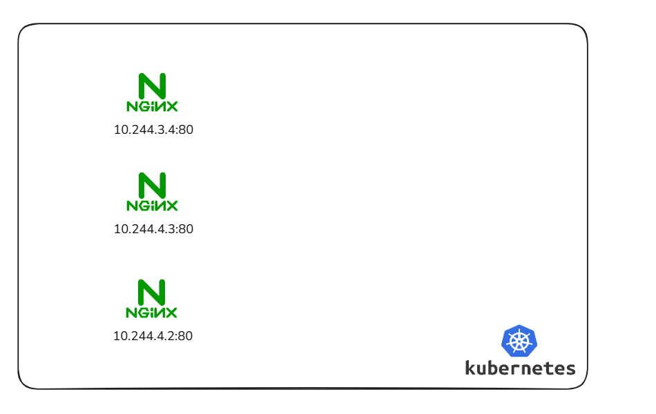
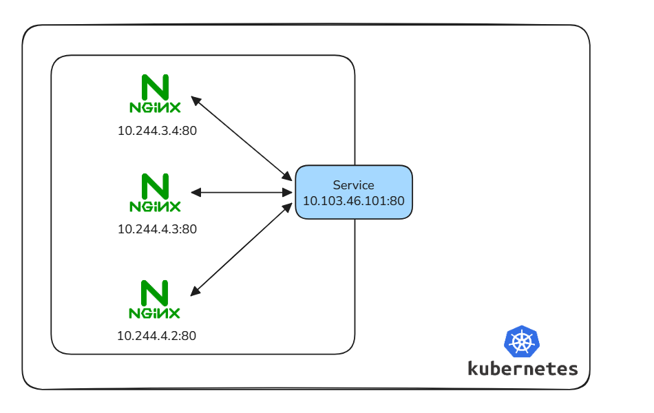
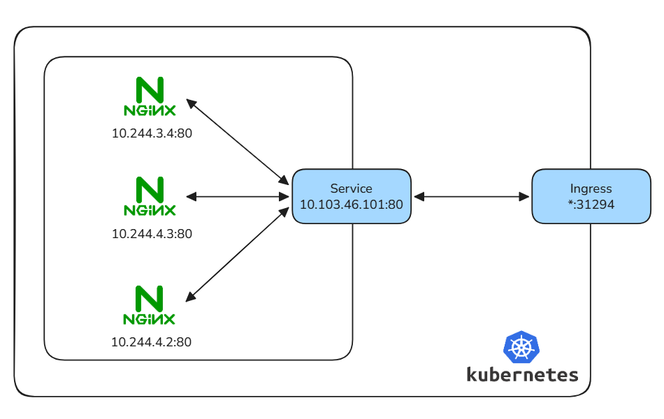
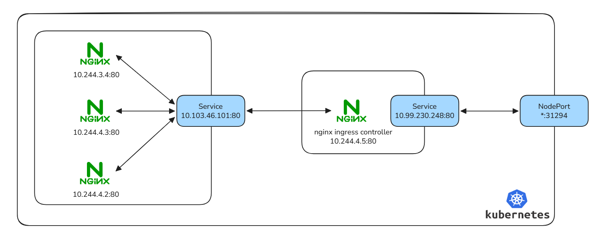

# Create a Pod

A Kubernetes cluster consists of many different working resources that together manage and run containerized applications. To get a quick, practical look at how Pods function, we will create a simple Pod, and learn exactly what supporting resources are required to make it run and accessible.

## Create a Pod via Deployment

In Kubernetes, we rarely create a single **Pod** directly. Instead, we use the **Deployment** resource to manage Pod replicas in a unified manner, which supports automatic fault recovery, replica scaling, and rolling updates, ensuring the stable operation of applications. 

The **Deployment** defines the **desired state** of the application, and the K8s control plane will continuously adjust the actual cluster state to match the desired state.

### Write Deployment YAML Manifest

We create a Nginx Deployment to maintain 3 running Pod replicas, with clear label matching to associate Deployment with corresponding Pods (the core logic of K8s resource association).

```yaml
# nginx-deployment.yaml
apiVersion: apps/v1
kind: Deployment
metadata:
  name: nginx-demo
  labels:
    app: nginx
spec:
  # Desired state: maintain 3 functional pods at all times
  replicas: 3
  selector:
    # Logic link: defines which pods this deployment is responsible for
    matchLabels:
      app: nginx
  template:
    metadata:
      labels:
        # Pod identity: MUST match the selector above to be recognized
        app: nginx
    spec:
      containers:
      - name: nginx
        image: nginx:alpine
        ports:
        - containerPort: 80
```

###  Deploy and Verify the Deployment & Pods

Use the `kubectl apply` command to create resources in the cluster, then check the Deployment status and Pod running details to confirm successful deployment.

Note, Pod IPs are dynamic and will change after Pod restart or reconstruction. Direct access via Pod IP is not feasible for production environments

```shell
$ kubectl apply -f nginx-deployment.yaml
deployment.apps/nginx-demo created

$ kubectl get deploy
NAME         READY   UP-TO-DATE   AVAILABLE   AGE
nginx-demo   3/3     3            3           81s

$ kubectl get po -o wide
NAME                         READY   STATUS    RESTARTS   AGE     IP           NODE       NOMINATED NODE   READINESS GATES
nginx-demo-54fc99c8d-5f7fd   1/1     Running   0          2m26s   10.244.3.4   worker21   <none>           <none>
nginx-demo-54fc99c8d-7px2s   1/1     Running   0          2m26s   10.244.4.3   worker22   <none>           <none>
nginx-demo-54fc99c8d-8d8hj   1/1     Running   0          2m26s   10.244.4.2   worker22   <none>           <none>

$ ssh master21 "curl -Is 10.244.3.4"
HTTP/1.1 200 OK
Server: nginx/1.29.6
Date: Mon, 16 Mar 2026 13:50:23 GMT
Content-Type: text/html
Content-Length: 896
Last-Modified: Tue, 10 Mar 2026 16:28:44 GMT
Connection: keep-alive
ETag: "69b046bc-380"
Accept-Ranges: bytes
```



## Create Service for Cluster Internal Access

**Service** is a core K8s resource that provides a fixed Cluster IP and automatic load balancing for a group of Pods with the same label. 

It shields the dynamic changes of Pod IPs, allowing other applications in the cluster to access the target application through a stable address, and distributes traffic evenly to backend Pods.

### Write Service YAML Manifest

The Service uses label selector to associate with the Nginx Pods we created earlier, mapping the Service port to the Pod container port.

```yaml
# nginx-svc.yaml
apiVersion: v1
kind: Service
metadata:
  name: nginx-svc
spec:
  # Route traffic to pods that have this specific label
  selector:
    app: nginx
  ports:
    # Port exposed on the service's internal IP
  - port: 80
    # Port on the pod where the application is listening
    targetPort: 80
```

### Deploy and Verify the Service

After creating the Service, we verify the fixed Cluster IP and test the load balancing effect by accessing the Service IP repeatedly, checking that traffic is distributed to different backend Pods.

```shell
$ kubectl apply -f nginx-svc.yaml
service/nginx-svc created

$ kubectl get svc nginx-svc -o wide
NAME        TYPE        CLUSTER-IP      EXTERNAL-IP   PORT(S)   AGE     SELECTOR
nginx-svc   ClusterIP   10.103.46.101   <none>        80/TCP    4m59s   app=nginx

$ kubectl get po -l app=nginx -o name | xargs -I{} kubectl exec {} -- sh -c "hostname -i > /usr/share/nginx/html/ip.txt"

$ ssh master21 "curl -s 10.103.46.101/ip.txt"
10.244.4.3
$ ssh master21 "curl -s 10.103.46.101/ip.txt"
10.244.4.2
$ ssh master21 "curl -s 10.103.46.101/ip.txt"
10.244.3.4
```



## Deploy Ingress for External Network Access

ClusterIP Service can only be accessed inside the K8s cluster. To allow external clients (outside the cluster) to access applications, we use the **Ingress** resource. 

Ingress acts as the cluster external traffic entry gateway, supporting domain name-based routing, SSL termination, and path matching, replacing the need to expose multiple NodePort services for external access.

### Deploy Nginx Ingress Controller

Ingress itself is just a routing rule configuration; it requires an Ingress Controller (a specialized Pod running in the cluster) to parse and execute these rules. We deploy the official Nginx Ingress Controller for bare-metal K8s clusters.

```shell
$ kubectl apply -f https://raw.githubusercontent.com/kubernetes/ingress-nginx/main/deploy/static/provider/baremetal/deploy.yaml

$ kubectl get po -n ingress-nginx -o wide
NAME                                        READY   STATUS    RESTARTS   AGE   IP           NODE       NOMINATED NODE   READINESS GATES
ingress-nginx-controller-55c4fd6d97-zg9cx   1/1     Running   0          10h   10.244.4.5   worker22   <none>           <none>


$ kubectl get svc -n ingress-nginx ingress-nginx-controller
NAME                       TYPE       CLUSTER-IP      EXTERNAL-IP   PORT(S)                      AGE
ingress-nginx-controller   NodePort   10.99.230.248   <none>        80:31294/TCP,443:30489/TCP   2m30s
```

### Write and Deploy Ingress Routing Rules

Configure Ingress rules to bind a custom domain name to the internal Nginx Service, realizing external access through the domain name.

```yaml
# nginx-ingress.yaml
apiVersion: networking.k8s.io/v1
kind: Ingress
metadata:
  name: nginx-ingress
spec:
  # Binding: Specifies which Ingress Controller should handle this object
  ingressClassName: nginx
  rules:
    # Domain matching: The virtual host used to filter incoming traffic
  - host: k8s-demo.test
    http:
      paths:
      - path: /
        pathType: Prefix
        backend:
          service:
            # Destination: The internal service that will receive the traffic
            name: nginx-svc
            port:
              number: 80
```

### Configure Hosts and Verify External Access

Map the custom domain name to the cluster node IP (Ingress Controller access address) in the local hosts file, then test external access and verify load balancing.

```shell
$ kubectl apply -f nginx-ingress.yaml
ingress.networking.k8s.io/nginx-ingress created

$ kubectl get ing
NAME            CLASS   HOSTS           ADDRESS          PORTS   AGE
nginx-ingress   nginx   k8s-demo.test   192.168.66.205   80      63s

$ echo "192.168.66.205 k8s-demo.test" | sudo tee -a /etc/hosts
192.168.66.205 k8s-demo.test

$ curl k8s-demo.test:31294/ip.txt
10.244.4.2
$ curl k8s-demo.test:31294/ip.txt
10.244.3.4
$ curl k8s-demo.test:31294/ip.txt
10.244.4.3
```



In fact, **nginx-ingress-controller** is just a normal Pod, no magic.


