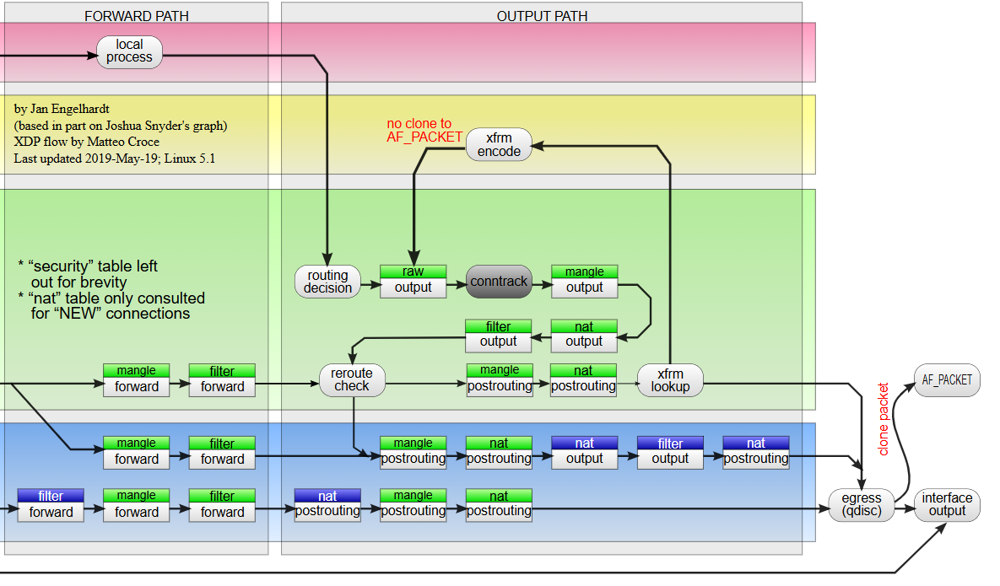
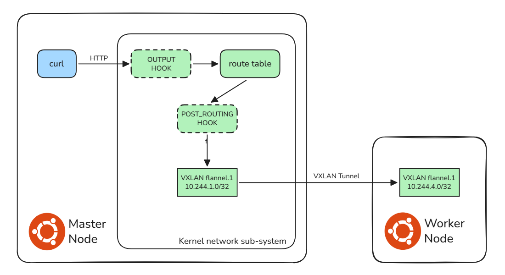
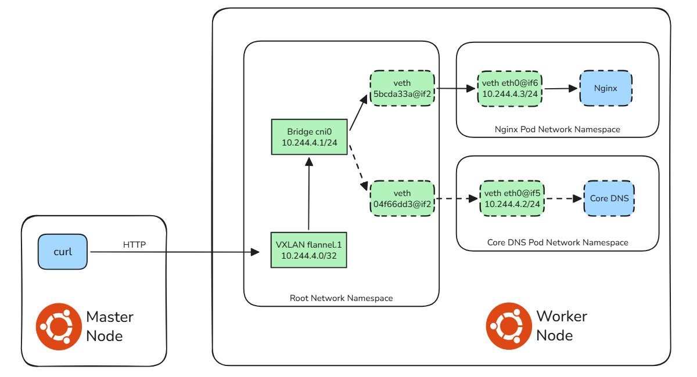

# Service Controllers

The Service resource is one of the most critical and complex resources in Kubernetes, as it integrates control-plane logic, node-level networking, packet filtering, and overlay networking.

There is no single "Service Controller" component in Kubernetes. Service functionality is jointly implemented by a set of controllers in `kube-controller-manager`, `kube-proxy`, `CNI`, and `CoreDNS`.

## How a Service is Created & Processed

Let's apply an easy example below:

```yaml
apiVersion: v1
kind: Pod
metadata:
  name: my-nginx
  labels:
    app: my-nginx
spec:
  containers:
  - name: nginx
    image: nginx
    ports:
    - containerPort: 80

---

apiVersion: v1
kind: Service
metadata:
  name: my-nginx-svc
spec:
  type: ClusterIP 
  selector:
    app: my-nginx
  ports:
  - port: 80
    targetPort: 80
```
```shell
$ kubectl apply -f test-nginx.yaml
pod/my-nginx created
service/my-nginx-svc created

$ kubectl get svc my-nginx-svc
NAME           TYPE        CLUSTER-IP       EXTERNAL-IP   PORT(S)   AGE
my-nginx-svc   ClusterIP   10.111.153.236   <none>        80/TCP    76m

$ kubectl get endpointslices -l kubernetes.io/service-name=my-nginx-svc
NAME                 ADDRESSTYPE   PORTS   ENDPOINTS    AGE
my-nginx-svc-7jsk5   IPv4          80      10.244.4.3   78m

$ kubectl get po my-nginx -o wide
NAME       READY   STATUS    RESTARTS   AGE   IP           NODE              NOMINATED NODE   READINESS GATES
my-nginx   1/1     Running   0          77m   10.244.4.3   k8sprodworker02   <none>           <none>
```
### 1. Pod Creation Pipeline

- The `kube-scheduler` assigns the Pod to a healthy node (`k8sprodworker02`).
- The `kubelet` on the destination node creates the pod sandbox (pause container) and an isolated network namespace.
- The `kubelet` invokes the `CNI` plugin (**Flannel** in this cluster), which:
  - Creates a Linux **bridge** (`cni0`) if it does not exist. 
  - Creates a **veth pair** and attaches one end to the **bridge**, and the other to the Pod’s network namespace. 
  - Allocates a dedicated IP address for the Pod via the **CNI IPAM module**. 
  - Configures **routes**, **ARP entries**, and **basic iptables rules** to ensure Pod network connectivity.

### 2. EndpointSlice Population

- Inside `kube-controller-manager`, the **EndpointSlice Controller** (the modern replacement of the legacy **Endpoints Controller**) watches **Service** and **Pod resources**.
- It matches Pods with the Service’s label selector, then creates and updates an **EndpointSlice** object that stores the real `IP:port` of backend Pods.
- The **EndpointSlice** object is persisted in `etcd` via `kube-apiserver`.

### 3. Node-Level Proxy Programming

- `kube-proxy`, running as a **DaemonSet** on every node, watches **Service** and **EndpointSlice** changes.
- In `iptables` mode (default), `kube-proxy` dynamically programs **iptables rules** to implement ClusterIP load balancing, DNAT, and packet marking for service traffic.

### 4. Service Discovery via DNS

- `CoreDNS` (running as a **Deployment**) watches **Service resources** and automatically generates DNS A/AAAA records (e.g., my-nginx-svc.default.svc.cluster.local).
- This enables domain-based service discovery inside the cluster.

## How Kubernetes Routes Traffic to a Pod

Kubernetes implements Service networking using native Linux kernel technologies: **netfilter (iptables)**, **policy routing**, **network namespaces**, and **overlay networks such as VXLAN**.

### Packet Processing on the Source Node (Master Node)

Since this is a **ClusterIP Service** and the backend Pod resides on `k8sprodworker02`, the Service IP is reachable from any node in the cluster, including the control-plane node.

```shell
$ curl 10.111.153.236 -I
HTTP/1.1 200 OK
Server: nginx/1.29.6
```

Linux network processing follows the general path:

`Local Process (curl) >> Routing Table >> Netfilter (OUTPUT chain) >> Routing Table >> Netfilter (POSTROUTING chain)`



```shell
## Initial route lookup for the ClusterIP
$ ip route get 10.111.153.236
10.111.153.236 via 192.168.64.1 dev ens33 src 192.168.66.212 uid 0

## Inspect relevant iptables rules programmed by kube-proxy
$ iptables-save
## New connections to service VIPs are directed to the "KUBE-SERVICES" chain
-A OUTPUT -m conntrack --ctstate NEW -m comment --comment "kubernetes service portals" -j KUBE-SERVICES
## Since the destination 10.111.153.236:80, jump to "KUBE-SVC-NE3M6G7FP5C7DVRO" chain
-A KUBE-SERVICES -d 10.111.153.236/32 -p tcp -m comment --comment "default/my-nginx-svc cluster IP" -m tcp --dport 80 -j KUBE-SVC-NE3M6G7FP5C7DVRO
## Jump to "KUBE-SEP-VLFXDB4R6QWP6LW5" chain
-A KUBE-SVC-NE3M6G7FP5C7DVRO -m comment --comment "default/my-nginx-svc -> 10.244.4.3:80" -j KUBE-SEP-VLFXDB4R6QWP6LW5

## Perform DNAT: rewrite destination from 10.111.153.236:80 to 10.244.4.3:80
-A KUBE-SEP-VLFXDB4R6QWP6LW5 -p tcp -m comment --comment "default/my-nginx-svc" -m tcp -j DNAT --to-destination 10.244.4.3:80
```

After DNAT, the destination IP becomes the real Pod IP (10.244.4.3), triggering a new route lookup:

```shell
## Inner Package
##   src mac: 4e:91:11:87:85:f8 (flannel.1)
##   dst mac: a6:41:5a:24:99:8b (ARP of 10.244.4.0)
##   src ip:  10.244.1.0 (flannel.1)
##   dst ip:  10.244.4.3
##   dst port:  tcp/80
$ ip route get 10.244.4.3
10.244.4.3 via 10.244.4.0 dev flannel.1 src 10.244.1.0 uid 0
$ ip neigh show dev flannel.1 10.244.4.0
10.244.4.0 lladdr a6:41:5a:24:99:8b PERMANENT
```

**Flannel** uses **VXLAN** to encapsulate cross-node Pod traffic:

```shell
## Outer Packet
##   src mac: 00:50:56:b2:5a:ac (ens33)
##   dst mac: 00:50:56:b2:e4:c6 (ARP of 192.168.66.215)
##   src ip:  192.168.66.212 (ens33)
##   dst ip:  192.168.66.215
##   dst port:  udp/8472
$ ip -d link show flannel.1
3: flannel.1: <BROADCAST,MULTICAST,UP,LOWER_UP> mtu 1450 qdisc noqueue state UNKNOWN mode DEFAULT group default
    link/ether 4e:91:11:87:85:f8 brd ff:ff:ff:ff:ff:ff promiscuity 0  allmulti 0 minmtu 68 maxmtu 65535
info: Using default fan map value (33)
    vxlan id 1 local 192.168.66.212 dev ens33 srcport 0 0 dstport 8472 nolearning ttl auto ageing 300 udpcsum noudp6zerocsumtx noudp6zerocsumrx addrgenmode eui64 numtxqueues 1 numrxqueues 1 gso_max_size 65536 gso_max_segs 65535 tso_max_size 65536 tso_max_segs 65535 gro_max_size 65536

## The VXLAN forwarding database maps the remote Pod subnet to the physical IP of the worker node
$ bridge fdb show dev flannel.1
a6:41:5a:24:99:8b dst 192.168.66.215 self permanent
8a:cd:53:ad:c3:2b dst 192.168.66.211 self permanent
0a:a2:25:e1:e7:2a dst 192.168.66.213 self permanent
c2:5d:57:e7:46:49 dst 192.168.66.214 self permanent
```



### Packet Processing on the Destination Node (Worker Node)

The packet is VXLAN-encapsulated and sent from the master node (192.168.66.212) to the worker node (192.168.66.215), then the worker node decapsulates the VXLAN packet and routes it locally: 

```shell
## According to VXLAN ID, the package sent to flannel.1
$ ip -d link show type vxlan
3: flannel.1: <BROADCAST,MULTICAST,UP,LOWER_UP> mtu 1450 qdisc noqueue state UNKNOWN mode DEFAULT group default
    link/ether a6:41:5a:24:99:8b brd ff:ff:ff:ff:ff:ff promiscuity 0  allmulti 0 minmtu 68 maxmtu 65535
info: Using default fan map value (33)
    vxlan id 1 local 192.168.66.215 dev ens33 srcport 0 0 dstport 8472 nolearning ttl auto ageing 300 udpcsum noudp6zerocsumtx noudp6zerocsumrx addrgenmode eui64 numtxqueues 1 numrxqueues 1 gso_max_size 65536 gso_max_segs 65535 tso_max_size 65536 tso_max_segs 65535 gro_max_size 65536

## Checking route table, sent it to cni0    
$ ip route get 10.244.4.3
10.244.4.3 dev cni0 src 10.244.4.1 uid 0

ip neigh show 10.244.4.3
10.244.4.3 dev cni0 lladdr 0a:f5:b9:5c:7e:fb STALE

```

`cni0` is a **Linux bridge** that connects to Pod network namespaces via `veth` pairs:

```shell
$ ip -d link show cni0
4: cni0: <BROADCAST,MULTICAST,UP,LOWER_UP> mtu 1450 qdisc noqueue state UP mode DEFAULT group default qlen 1000
    link/ether a6:a1:1d:ab:83:64 brd ff:ff:ff:ff:ff:ff promiscuity 0  allmulti 0 minmtu 68 maxmtu 65535
    bridge forward_delay 1500 hello_time 200 max_age 2000 ageing_time 30000 stp_state 0 priority 32768 vlan_filtering 0 vlan_protocol 802.1Q bridge_id 8000.a6:a1:1d:ab:83:64 
    
$ ip netns list
cni-f442ec70-fb56-317d-f42d-9110bd8a68e5 (id: 1)
cni-09a136c1-2512-a490-4f8b-21e81a4a6175 (id: 0)

$ ip netns exec  cni-f442ec70-fb56-317d-f42d-9110bd8a68e5 ip addr
2: eth0@if6: <BROADCAST,MULTICAST,UP,LOWER_UP> mtu 1450 qdisc noqueue state UP group default qlen 1000
    link/ether 0a:f5:b9:5c:7e:fb brd ff:ff:ff:ff:ff:ff link-netnsid 0
    inet 10.244.4.3/24 brd 10.244.4.255 scope global eth0
       valid_lft forever preferred_lft forever
```



```shell
$ kubectl get pods -A -o wide --field-selector spec.nodeName=k8sprodworker02
NAMESPACE      NAME                       READY   STATUS    RESTARTS      AGE    IP               NODE              NOMINATED NODE   READINESS GATES
default        my-nginx                   1/1     Running   0             3h5m   10.244.4.3       k8sprodworker02   <none>           <none>
kube-flannel   kube-flannel-ds-mq5qr      1/1     Running   5 (21d ago)   21d    192.168.66.215   k8sprodworker02   <none>           <none>
kube-system    coredns-66bc5c9577-8j8sq   1/1     Running   0             9d     10.244.4.2       k8sprodworker02   <none>           <none>
kube-system    kube-proxy-zc6b2           1/1     Running   0             21d    192.168.66.215   k8sprodworker02   <none>           <none>

```