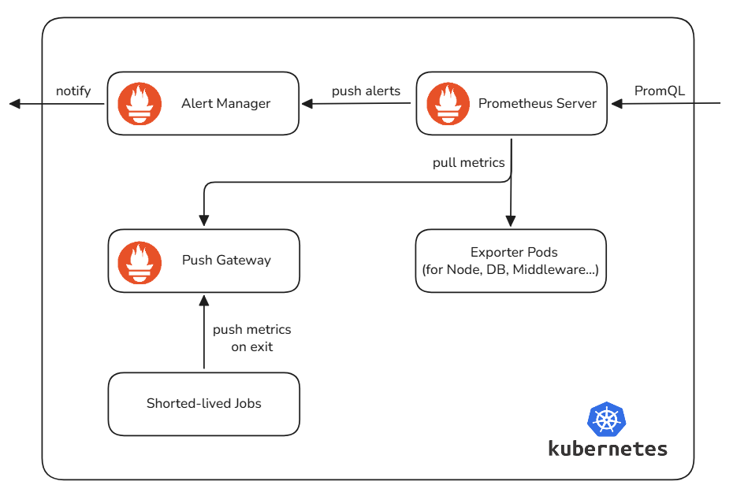
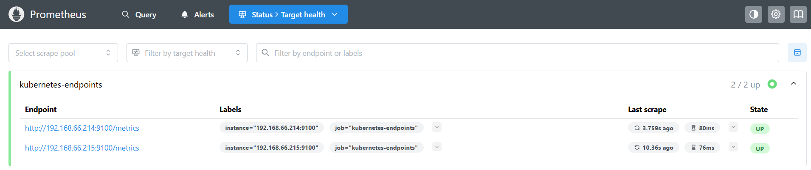
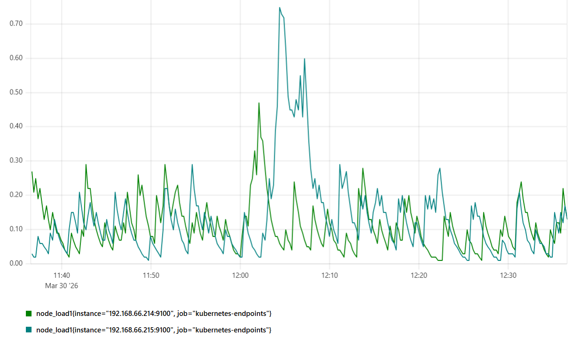

# Prometheus

**Prometheus** is an open-source **monitoring and alerting system** optimized for cloud-native environments like Kubernetes. It scrapes and stores time-series metrics in its internal **Time-Series Database (TSDB)**, enabling flexible querying, visualization, and automated alerting via **Prometheus Query Language (PromQL)**.

## Core Components

The architecture shown in the diagram illustrates Prometheus as a pull‑based system:



### 1. Prometheus Server

The **Prometheus Server** is the core component of the monitoring system. Its main responsibilities include:
- **Metric Scraping**: It actively fetches (pulls) time-series metrics from monitored targets (Exporters and PushGateway) over HTTP at regular intervals.
- **Data Storage**:It stores collected metrics in its built-in high-performance **TSDB**, either on local disk or persistent volumes in Kubernetes.
- **Querying Engine**: It provides a powerful query interface for visualization tools (e.g., Grafana) and internal alert rule evaluation.
- **Alert Evaluation**: It continuously evaluates alerting rules against stored metrics. When thresholds are breached, it sends firing alerts to the AlertManager.

### 2. Exporters

**Exporters** are lightweight, standardized **metrics collectors** that expose system and service metrics in Prometheus format. They provide a unified `/metrics` HTTP endpoint for the **Prometheus Server** to scrape. Typical examples:

- **Node Exporter**: Exposes hardware and operating system metrics (CPU, load, memory, disk, network).
- **Database Exporters**: Monitor MySQL, PostgreSQL, and other databases (connections, queries, latency).
- **Middleware Exporters**: Collect metrics from Nginx, Redis, Kafka, and other infrastructure components.

### 3. PushGateway

Prometheus follows a pull model by design, which is not suitable for short‑lived jobs (e.g., cron jobs, batch tasks) that may terminate before being scraped.

The **PushGateway** acts as a **metrics buffer**. Short-lived jobs push their metrics to the gateway before exiting, and the **Prometheus Server** scrapes the **PushGateway** to retain those metrics.

### 4. AlertManager

**AlertManager** processes alerts sent by the **Prometheus Server** and reduces alert noise. Key functions:

- **Deduplication & Grouping**: Merges similar alerts into consolidated notifications.
- **Inhibition & Silencing**: Suppresses dependent alerts and allows muting alerts during maintenance.
- **Routing & Delivery**: Delivers alerts to administrators via channels such as Slack, Email, PagerDuty, or webhooks.

### The Operational Workflow

- **Metrics Generation**: Applications and infrastructure expose metrics; short-lived jobs push metrics to the PushGateway.
- **Collection**: Prometheus Server scrapes metrics from Exporters and PushGateway.
- **Storage**: Metrics are compressed, indexed, and persisted in the TSDB.
- **Visualization & Analysis**: Dashboards query data via PromQL for real-time monitoring.
- **Alert Triggering**: Prometheus evaluates rules and sends alerts to AlertManager.
- **Notification**: AlertManager processes and routes alerts to operators.

## Deployment

To demonstrate Prometheus in action, we will deploy a **Node Exporter** to collect hardware metrics and a **Prometheus Server** to scrape and visualize them.

### 1. Deploy the Node Exporter

The Node Exporter is deployed as a **DaemonSet** to ensure it runs on every node in the cluster. We use `hostNetwork: true` so it can access the host's network stack directly.

```yaml
apiVersion: apps/v1
kind: DaemonSet
metadata:
  name: node-exporter
  namespace: monitoring
spec:
  selector:
    matchLabels:
      app: node-exporter
  template:
    metadata:
      labels:
        app: node-exporter
    spec:
      hostNetwork: true
      containers:
        - name: node-exporter
          image: prom/node-exporter:v1.10.2
          ports:
            - containerPort: 9100
              name: metrics-port
---
apiVersion: v1
kind: Service
metadata:
  name: node-exporter-svc
  namespace: monitoring
spec:
  clusterIP: None
  ports:
    - name: metrics
      port: 9100
      targetPort: 9100
  selector:
    app: node-exporter
```

Create the namespace and apply the configuration:

```shell
$ kubectl create ns monitoring
namespace/monitoring created

$ kubectl apply -f node-exporter.yaml
daemonset.apps/node-exporter created
service/node-exporter-svc created

$ kubectl get all -n monitoring
NAME                      READY   STATUS    RESTARTS   AGE
pod/node-exporter-l2mhl   1/1     Running   0          71s
pod/node-exporter-xt69h   1/1     Running   0          71s

NAME                        TYPE        CLUSTER-IP   EXTERNAL-IP   PORT(S)    AGE
service/node-exporter-svc   ClusterIP   None         <none>        9100/TCP   71s

NAME                           DESIRED   CURRENT   READY   UP-TO-DATE   AVAILABLE   NODE SELECTOR   AGE
daemonset.apps/node-exporter   2         2         2       2            2           <none>          71s
```

### 2. Deploy the Prometheus Server

The server requires **RBAC (Role-Based Access Control)** permissions to "view" the cluster endpoints for service discovery. 

We also configure a **ConfigMap** to define the scraping rules and an **Ingress** for GUI access.

```yaml
apiVersion: v1
kind: ServiceAccount
metadata:
  name: prometheus-sa
  namespace: monitoring
---
apiVersion: rbac.authorization.k8s.io/v1
kind: ClusterRoleBinding
metadata:
  name: prometheus-server-binding
subjects:
  - kind: ServiceAccount
    name: prometheus-sa
    namespace: monitoring
roleRef:
  kind: ClusterRole
  name: view
  apiGroup: rbac.authorization.k8s.io
---
apiVersion: v1
kind: ConfigMap
metadata:
  name: prometheus-config
  namespace: monitoring
data:
  prometheus.yml: |
    global:
      scrape_interval: 15s
    scrape_configs:
      - job_name: 'kubernetes-endpoints'
        kubernetes_sd_configs:
          - role: endpoints
        relabel_configs:
          - source_labels: [__meta_kubernetes_service_name]
            action: keep
            regex: node-exporter-svc
---
apiVersion: apps/v1
kind: Deployment
metadata:
  name: prometheus-server
  namespace: monitoring
spec:
  selector:
    matchLabels:
      app: prometheus
  template:
    metadata:
      labels:
        app: prometheus
    spec:
      serviceAccountName: prometheus-sa
      containers:
        - name: prometheus
          image: prom/prometheus:latest
          args:
            - "--config.file=/etc/prometheus/prometheus.yml"
          ports:
            - containerPort: 9090
          volumeMounts:
            - name: config-volume
              mountPath: /etc/prometheus
      volumes:
        - name: config-volume
          configMap:
            name: prometheus-config
---
apiVersion: v1
kind: Service
metadata:
  name: prometheus-ui
  namespace: monitoring
spec:
  type: ClusterIP
  ports:
    - port: 9090
      targetPort: 9090
  selector:
    app: prometheus
---
apiVersion: networking.k8s.io/v1
kind: Ingress
metadata:
  name: prometheus-ingress
  namespace: monitoring
spec:
  ingressClassName: nginx
  rules:
    - host: prometheus.local
      http:
        paths:
          - path: /
            pathType: Prefix
            backend:
              service:
                name: prometheus-ui
                port:
                  number: 9090
```

Apply the Prometheus server manifests:

```shell
$ kubectl apply -f https://raw.githubusercontent.com/kubernetes/ingress-nginx/main/deploy/static/provider/cloud/deploy.yaml

$ kubectl apply -f prometheus-server.yaml
serviceaccount/prometheus-sa created
clusterrolebinding.rbac.authorization.k8s.io/prometheus-server-binding created
configmap/prometheus-config created
deployment.apps/prometheus-server created
service/prometheus-ui created
ingress.networking.k8s.io/prometheus-ingress created

$ kubectl get svc -n ingress-nginx
NAME                                 TYPE           CLUSTER-IP      EXTERNAL-IP   PORT(S)                      AGE
ingress-nginx-controller             LoadBalancer   10.97.115.14    <pending>     80:30670/TCP,443:30785/TCP   21h
ingress-nginx-controller-admission   ClusterIP      10.105.57.165   <none>        443/TCP                      21h
```

### 3. Access and Verification

Once the pods are running, you can access the **Prometheus dashboard** via the Ingress controller. 

Map `prometheus.local` to your Worker Node IP in your local **hosts file** and use the **NodePort** of the Nginx Ingress Controller (e.g., `http://prometheus.local:30670/`).

Navigate to **Status -> Targets** to verify that Prometheus is successfully pulling data from the Node Exporter endpoints.



You can inspect the raw data by accessing a Node Exporter endpoint directly (e.g., `http://<node-ip>:9100/metrics`). 

The output follows the standard Prometheus text format:

```shell
# HELP node_load1 1m load average.
# TYPE node_load1 gauge
node_load1 0.04
```

Enter a metric name like `node_load1` in the **Graph** tab and click **Execute**. Prometheus will generate a time-series graph based on the collected data, allowing you to observe trends in real-time.




