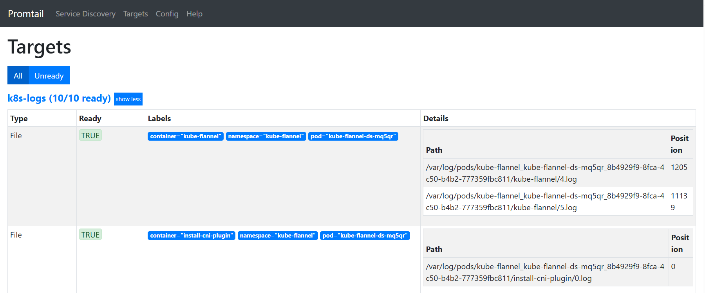

# Loki

## How Container write a log

Before diving into Loki, it’s essential to understand how a standard Kubernetes Pod and its containers generate and store logs.

Unlike traditional virtual machines, containers do not have a persistent filesystem by default, so their log output follows a specific flow managed by the **Container Runtime Interface (CRI)**, such as `containerd`.

Let’s use a simple **BusyBox** Pod to demonstrate the log flow step by step. First, create a basic Pod configuration:

```shell
apiVersion: v1
kind: Pod
metadata:
  name: busybox
  namespace: monitoring
spec:
  containers:
  - name: busybox
    image: busybox:1.36
    command: ["sleep", "infinity"]
```

Apply the Pod and check its status:

```shell
$ kubectl apply -f busybox.yaml
pod/busybox created

$ kubectl get pod busybox -o wide -n monitoring
NAME      READY   STATUS    RESTARTS   AGE   IP             NODE              NOMINATED NODE   READINESS GATES
busybox   1/1     Running   0          66s   10.244.4.124   k8sprodworker02   <none>           <none>

```

Next, access the worker node where the Pod is running and inspect the process and **file descriptors (FD)** of the container. The container’s main process (`sleep infinity`) outputs all **standard output (STDOUT)** and **standard error (STDERR)** to pipes, which are connected to the `containerd-shim` (a lightweight `shim` process that mediates between the **container** and `containerd`):

```shell
## Access the worker node (k8sprodworker02 in this case)
$ ps -ef | grep sleep
root     2134352 2134296  0 12:04 ?        00:00:00 sleep infinity

## List file descriptors of the sleep process
$ sudo ls -l /proc/2134352/fd
total 0
lrwx------ 1 root root 64 Apr  1 12:04 0 -> /dev/null
l-wx------ 1 root root 64 Apr  1 12:04 1 -> 'pipe:[74872777]'
l-wx------ 1 root root 64 Apr  1 12:04 2 -> 'pipe:[74872778]'

## Check which process is connected to these pipes
$ sudo lsof 2>&1 | grep -E "74872777|74872778"
COMMAND       PID     TID TASKCMD               USER   FD      TYPE             DEVICE  SIZE/OFF       NODE NAME
container 2134296                               root   13r     FIFO               0,14       0t0   74872777 pipe
container 2134296                               root   15r     FIFO               0,14       0t0   74872778 pipe
sleep     2134352                               root    1w     FIFO               0,14       0t0   74872777 pipe
sleep     2134352                               root    2w     FIFO               0,14       0t0   74872778 pipe

## Identify the container shim process
$ ps -ef | grep 2134296
root     2134296       1  0 12:04 ?        00:00:00 /usr/bin/containerd-shim-runc-v2 -namespace k8s.io -id 02b8feb4662f5527c58cdfae3344d96c456dbea333ea53adc85856430b38e04c -address /run/containerd/containerd.sock
```

The `containerd-shim` forwards the log data to `containerd`, which then writes the logs to a persistent file on the node’s filesystem. This file is typically located in `/var/log/pods/<namespace>_<pod-name>_<pod-uid>/<container-name>/<log-index>.log`:

```shell
## Check the file descriptors of the containerd-shim process
$ sudo ls -l /proc/2134296/fd
lr-x------ 1 root root 64 Apr  1 12:08 13 -> 'pipe:[74872777]'
l--------- 1 root root 64 Apr  1 12:04 14 -> /run/containerd/io.containerd.grpc.v1.cri/containers/74a084230faa6406e9707e7c9e7cae87c5594ee08cf131f46d7d516bb97eccb6/io/266581289/74a084230faa6406e9707e7c9e7cae87c5594ee08cf131f46d7d516bb97eccb6-stdout
lr-x------ 1 root root 64 Apr  1 12:08 15 -> 'pipe:[74872778]'
l-wx------ 1 root root 64 Apr  1 12:08 2 -> /run/containerd/io.containerd.runtime.v2.task/k8s.io/02b8feb4662f5527c58cdfae3344d96c456dbea333ea53adc85856430b38e04c/log
l--------- 1 root root 64 Apr  1 12:04 20 -> /run/containerd/io.containerd.grpc.v1.cri/containers/74a084230faa6406e9707e7c9e7cae87c5594ee08cf131f46d7d516bb97eccb6/io/266581289/74a084230faa6406e9707e7c9e7cae87c5594ee08cf131f46d7d516bb97eccb6-stderr

## Verify containerd is the final receiver of the log data
$ sudo lsof /run/containerd/io.containerd.grpc.v1.cri/containers/74a084230faa6406e9707e7c9e7cae87c5594ee08cf131f46d7d516bb97eccb6/io/266581289/74a084230faa6406e9707e7c9e7cae87c5594ee08cf131f46d7d516bb97eccb6-stdout
COMMAND       PID USER   FD   TYPE DEVICE SIZE/OFF   NODE NAME
container   19343 root  104u  FIFO   0,26      0t0 213991 /run/containerd/io.containerd.grpc.v1.cri/containers/74a084230faa6406e9707e7c9e7cae87c5594ee08cf131f46d7d516bb97eccb6/io/266581289/74a084230faa6406e9707e7c9e7cae87c5594ee08cf131f46d7d516bb97eccb6-stdout
container 2134296 root   14u  FIFO   0,26      0t0 213991 /run/containerd/io.containerd.grpc.v1.cri/containers/74a084230faa6406e9707e7c9e7cae87c5594ee08cf131f46d7d516bb97eccb6/io/266581289/74a084230faa6406e9707e7c9e7cae87c5594ee08cf131f46d7d516bb97eccb6-stdout

$ sudo ps -ef | grep 19343
root       19343       1  1 Mar02 ?        07:27:07 /usr/bin/containerd

$ sudo ls -l /proc/19343/fd
l--------- 1 root root 64 Mar 31 23:34 104 -> /run/containerd/io.containerd.grpc.v1.cri/containers/74a084230faa6406e9707e7c9e7cae87c5594ee08cf131f46d7d516bb97eccb6/io/266581289/74a084230faa6406e9707e7c9e7cae87c5594ee08cf131f46d7d516bb97eccb6-stdout
l-wx------ 1 root root 64 Mar 31 23:41 111 -> /var/log/pods/monitoring_busybox_f9f72652-5204-4666-889b-463f176f822c/busybox/0.log
```
To summarize, the log flow for K8s containers is: `Container > containerd-shim > containerd > /var/log/pods/<container>/*.log`.
We can verify this flow by writing a test log to the container’s STDOUT and checking the corresponding log file on the node:

Verify
```shell
## Write a test log to the container's STDOUT
$ kubectl exec -it busybox -n monitoring -- sh -c 'echo "This is a real log!" > /proc/1/fd/1'

$ sudo cat /var/log/pods/monitoring_busybox_f9f72652-5204-4666-889b-463f176f822c/busybox/0.log
2026-04-01T12:59:19.427164461Z stdout F This is a real log!
```

## Loki

**Loki** is an open-source log aggregation system developed by **Grafana Labs**, inspired by **Prometheus**. It is specifically optimized for cloud-native and Kubernetes environments, addressing the challenges of log management at scale, such as high volume, distributed deployments, and cost efficiency.

Unlike traditional log aggregation tools (e.g., Elasticsearch) that index full log content, Loki uses a label-based indexing approach: it only indexes metadata labels (e.g., namespace, pod name, container name) and stores the actual log data in compressed chunks. This design significantly reduces storage costs and improves query performance, making it ideal for large-scale K8s clusters.

Loki’s core value propositions include:

- **Cost-Effective Storage**: Compressed log chunks and label-only indexing minimize storage overhead.
- **Seamless K8s Integration**: Natively supports Kubernetes service discovery and container log collection.
- **LogQL Query Language**: A Prometheus-like query language for filtering and aggregating logs, enabling unified monitoring and logging workflows.
- **Scalability**: Horizontally scalable architecture that can handle log volumes from thousands of containers.

### Core Components

Loki follows a push-based, label-oriented architecture, consisting of 2 core components:

#### 1. Promtail

**Promtail** is Loki’s official log collection agent (now replaced by **Grafana Alloy**), typically deployed as a DaemonSet on every node in the K8s cluster (similar to **Prometheus Node Exporter**). Its primary responsibilities are:
- **Log Collection**: Tails log files (e.g., `/var/log/pods/`), container `STDOUT/STDERR`, and `systemd journals` to gather log data.
- **Labeling**: Attaches Prometheus-compatible metadata labels (e.g.,namespace, pod, container) to log streams, enabling unified querying across the cluster.
- **Log Pushing**: Forwards labeled log streams to the Loki server via HTTP.

A keynote: When deploying **Promtail** in K8s, it is critical to set the `HOSTNAME` environment variable to the node name, see details in https://github.com/grafana/loki/issues/10104

#### 2. Loki Server

The **Loki Server** is the core component responsible for log ingestion, storage, and querying. It consists of several internal modules:
- **Distributor**: Receives log streams from **Promtail**, validates requests, and distributes the streams to the appropriate ingesters based on label hashing.
- **Ingester**: Buffers logs in memory, compacts them into compressed chunks, and persists the chunks and label indexes to storage (e.g., filesystem, object storage).
- **Querier**: Processes LogQL queries, retrieves log data from storage or ingesters, and aggregates results for the user.
- **Storage**: Stores lightweight label indexes and compressed log chunks. It supports multiple storage backends, including local filesystem, Amazon S3, Google Cloud Storage (GCS), and Azure Blob Storage.

## Loki Deployment and Verification in Kubernetes

Next, we will deploy **Loki** (v3.6.8) and **Promtail** (v3.6.8) in a K8s cluster, and use **Local Path Provisioner** to provide persistent storage for Loki (since Loki is a stateful application that requires persistent storage for log chunks and indexes).

### Deploy Promtail

Deploy **Promtail** as a DaemonSet (to run on every node) with the necessary **RBAC permissions** (to access K8s resources like pods and nodes) and configuration.

```yaml
# --------------------------
# Promtail 3.6.8
# --------------------------
apiVersion: v1
kind: ServiceAccount
metadata:
   name: promtail
   namespace: monitoring
---
apiVersion: rbac.authorization.k8s.io/v1
kind: ClusterRole
metadata:
   name: promtail
rules:
   - apiGroups: [""]
     resources: ["nodes","pods","namespaces"]
     verbs: ["get","list","watch"]
---
apiVersion: rbac.authorization.k8s.io/v1
kind: ClusterRoleBinding
metadata:
   name: promtail
subjects:
   - kind: ServiceAccount
     name: promtail
     namespace: monitoring
roleRef:
   kind: ClusterRole
   name: promtail
   apiGroup: rbac.authorization.k8s.io
---
apiVersion: v1
kind: ConfigMap
metadata:
   name: promtail-config
   namespace: monitoring
data:
   promtail.yaml: |
      server:
        http_listen_port: 9080

      clients:
      - url: http://loki:3100/loki/api/v1/push

      positions:
        filename: /tmp/positions.yaml

      scrape_configs:
      - job_name: k8s-logs
        kubernetes_sd_configs:
        - role: pod
        relabel_configs:
        - source_labels: [__meta_kubernetes_namespace]
          target_label: namespace
        - source_labels: [__meta_kubernetes_pod_name]
          target_label: pod
        - source_labels: [__meta_kubernetes_pod_container_name]
          target_label: container
        - source_labels:
          - __meta_kubernetes_pod_uid
          - __meta_kubernetes_pod_container_name
          target_label: __path__
          separator: /
          replacement: /var/log/pods/*$1/*.log
        - source_labels: [__meta_kubernetes_namespace]
          action: drop
          regex: kube-system
---
apiVersion: apps/v1
kind: DaemonSet
metadata:
   name: promtail
   namespace: monitoring
spec:
   selector:
      matchLabels:
         app: promtail
   template:
      metadata:
         labels:
            app: promtail
      spec:
         serviceAccountName: promtail
         containers:
            - name: promtail
              image: grafana/promtail:3.6.8
              env:
                 - name: HOSTNAME
                   valueFrom:
                      fieldRef:
                         fieldPath: spec.nodeName
              args:
                 - -config.file=/etc/promtail/promtail.yaml
              volumeMounts:
                 - name: config
                   mountPath: /etc/promtail
                 - name: varlog
                   mountPath: /var/log
                 - name: varlogpods
                   mountPath: /var/log/pods
                   readOnly: true
         volumes:
            - name: config
              configMap:
                 name: promtail-config
            - name: varlog
              hostPath:
                 path: /var/log
            - name: varlogpods
              hostPath:
                 path: /var/log/pods
         tolerations:
            - key: node-role.kubernetes.io/master
              effect: NoSchedule
            - key: node-role.kubernetes.io/control-plane
              effect: NoSchedule
```

We can validate **Promtail** through its web interface by exposing its port. 

First, forward the **Promtail** port (9080) to your local machine

```shell
$ kubectl apply -f promtail.yaml

$ kubectl get pods -n monitoring -l app=promtail
NAME             READY   STATUS    RESTARTS   AGE
promtail-5qpzd   1/1     Running   0          9h
promtail-cg25p   1/1     Running   0          9h
promtail-dtfn6   1/1     Running   0          9h
promtail-l5zf6   1/1     Running   0          9h
promtail-wpkqr   1/1     Running   0          9h

$ kubectl port-forward promtail-5qpzd -n monitoring 9080:9080 --address 0.0.0.0
Forwarding from 0.0.0.0:9080 -> 9080
```

Then, access the **Promtail** web interface via your browser (use the server IP where port forwarding is performed, e.g., `http://<server-ip>:9080`). 

If **Promtail** is running correctly, you will see the labels it has collected and the log locations it has found, confirming that **Promtail** is properly configured to scrape logs.



### Deploy Local Path Provisioner

**Local Path Provisioner** is a lightweight storage provisioner that creates **persistent volumes (PVs)** using the local filesystem of K8s nodes. It is ideal for testing and small-scale deployments.

```shell
$ kubectl apply -f https://raw.githubusercontent.com/rancher/local-path-provisioner/v0.0.28/deploy/local-path-storage.yaml

$ kubectl get sc
NAME         PROVISIONER             RECLAIMPOLICY   VOLUMEBINDINGMODE      ALLOWVOLUMEEXPANSION   AGE
local-path   rancher.io/local-path   Delete          WaitForFirstConsumer   false                  86s
```

### Deploy Loki Server

Create a Loki configuration (ConfigMap) and deploy Loki as a StatefulSet (to ensure stable network identities and persistent storage).

```yaml
# --------------------------
# Loki 3.6.8
# --------------------------
apiVersion: v1
kind: ConfigMap
metadata:
   name: loki-config
   namespace: monitoring
data:
   loki.yaml: |
      auth_enabled: false
      server:
        http_listen_port: 3100
        grpc_listen_port: 9096
      common:
        path_prefix: /loki
        storage:
          filesystem:
            chunks_directory: /loki/chunks
            rules_directory: /loki/rules
        replication_factor: 1
        ring:
          kvstore:
            store: inmemory
      limits_config:
        allow_structured_metadata: false
      schema_config:
        configs:
          - from: 2020-10-24
            store: tsdb
            object_store: filesystem
            schema: v13
            index:
              prefix: index_
              period: 24h
---
apiVersion: apps/v1
kind: StatefulSet
metadata:
   name: loki
   namespace: monitoring
spec:
   serviceName: loki
   replicas: 1
   selector:
      matchLabels:
         app: loki
   template:
      metadata:
         labels:
            app: loki
      spec:
         containers:
            - name: loki
              image: grafana/loki:3.6.8
              args:
                 - -config.file=/etc/loki/loki.yaml
                 - -target=all
              ports:
                 - containerPort: 3100
                   name: http
              volumeMounts:
                 - name: config
                   mountPath: /etc/loki
                 - name: data
                   mountPath: /loki
         volumes:
            - name: config
              configMap:
                 name: loki-config
   volumeClaimTemplates:
      - metadata:
           name: data
        spec:
           accessModes: [ "ReadWriteOnce" ]
           storageClassName: local-path
           resources:
              requests:
                 storage: 5Gi
---
apiVersion: v1
kind: Service
metadata:
   name: loki
   namespace: monitoring
spec:
   selector:
      app: loki
   ports:
      - port: 3100
```

Deploy and verify:

```shell
$ kubectl apply -f promtail.yaml

$ kubectl get pods -n monitoring -l app=loki
NAME     READY   STATUS    RESTARTS   AGE
loki-0   1/1     Running   0          31h
```

We will use `logcli` (Loki’s command-line tool) to verify that Loki is receiving and storing logs from **Promtail**.

```shell
$ wget https://github.com/grafana/loki/releases/download/v3.6.8/logcli-linux-amd64.zip
$ unzip logcli-linux-amd64.zip
$ sudo mv logcli-linux-amd64 /usr/local/bin/logcli

$ logcli --version
logcli, version 3.6.8 (branch: release-3.6.x, revision: 138c391f)
  build user:       root@837670e6d09f
  build date:       2026-03-25T13:12:44Z
  go version:       go1.25.7
  platform:         linux/amd64
  tags:             netgo
```

To access the Loki server from your local machine, use kubectl port-forward to forward the Loki port (3100) to your local machine, then use `logcli` to list the labels collected and query logs

```shell
$ kubectl port-forward loki-0  -n monitoring 3100:3100
Forwarding from 127.0.0.1:3100 -> 3100
Forwarding from [::1]:3100 -> 3100

$ logcli labels
2026/04/02 12:42:59 http://localhost:3100/loki/api/v1/labels?end=1775133779983808050&start=1775130179983808050
__stream_shard__
container
filename
namespace
pod
service_name

$ logcli query '{namespace="monitoring"}' --limit=300
2026-04-02T12:40:15Z {container="loki", filename="/var/log/pods/monitoring_loki-0_d9848978-db39-47ee-bff2-d36b47424d30/loki/0.log", pod="loki-0", service_name="loki"}                                                                           2026-04-02T12:40:15.971012554Z stderr F level=info ts=2026-04-02T12:40:15.892923051Z caller=index_set.go:86 msg="uploading table index_20541"
2026-04-02T12:40:15Z {container="loki", filename="/var/log/pods/monitoring_loki-0_d9848978-db39-47ee-bff2-d36b47424d30/loki/0.log", pod="loki-0", service_name="loki"}                                                                           2026-04-02T12:40:15.971000528Z stderr F level=info ts=2026-04-02T12:40:15.892911971Z caller=index_set.go:186 msg="cleaning up unwanted indexes from table index_20544"
```
