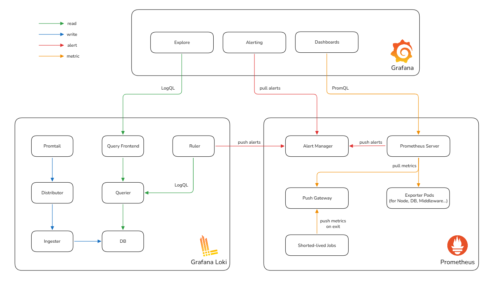
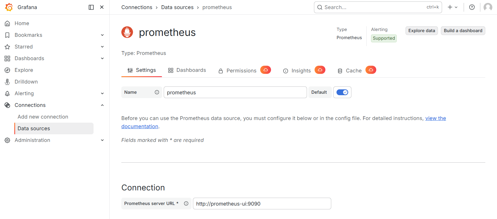
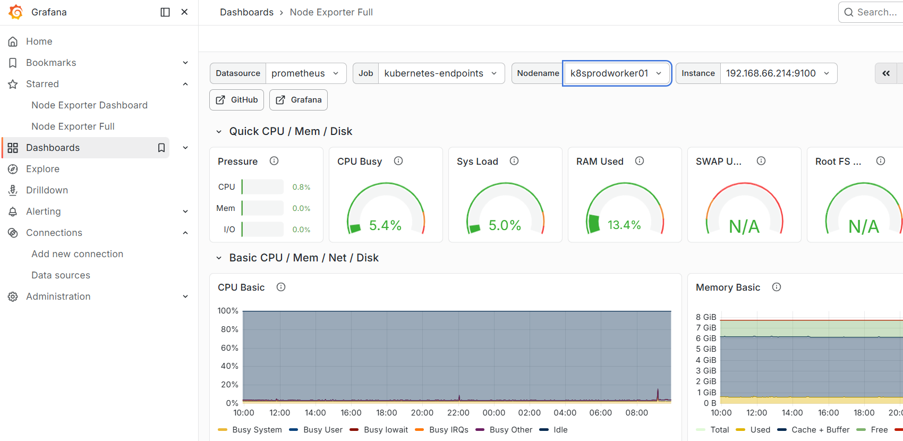
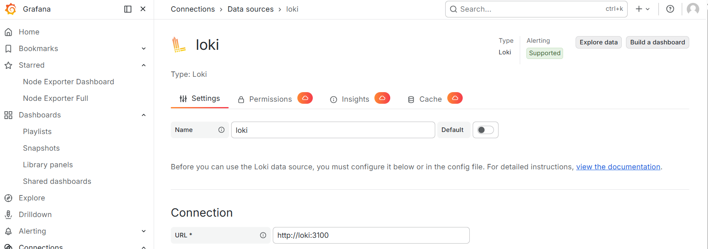
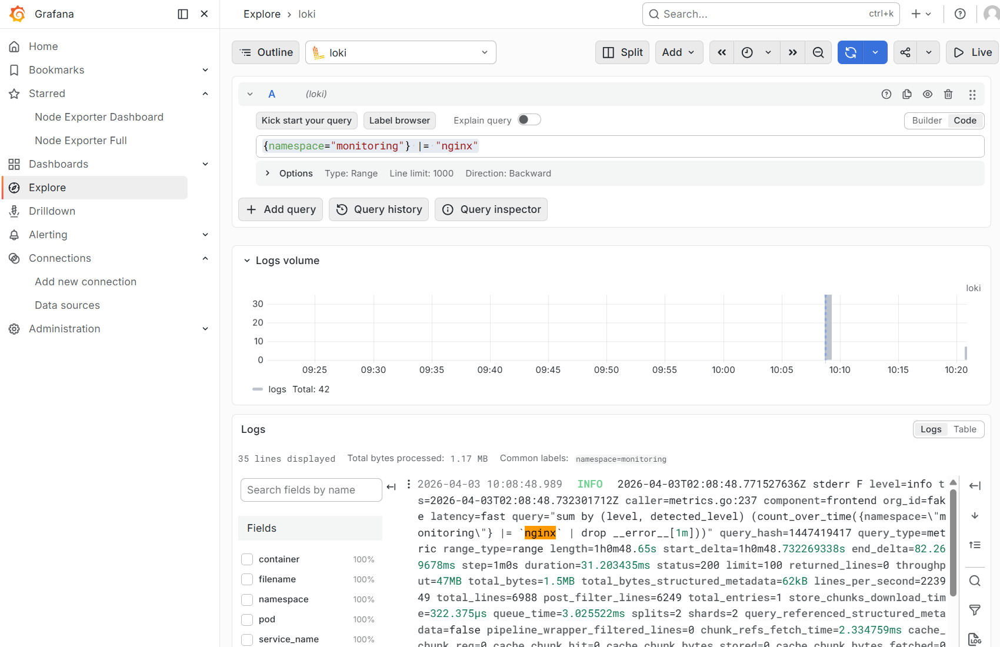

# Grafana

**Grafana** is a powerful open-source **multi-platform analytics and visualization tool** that simplifies complex data monitoring and analysis. It uses a flexible, decoupled architecture without native data storage, integrating seamlessly with backend sources like Prometheus, InfluxDB, Loki, and Tempo. This allows users to aggregate diverse data in one interface, avoiding tool-switching.

Key features include **unified querying** (supporting PromQL, LogQL, etc.) across multiple sources, and **dynamic, customizable visualizations** (heatmaps, histograms, etc.) tailored to monitoring needs.

Grafana offers three core modes for observability: **Dashboards** (real-time monitoring), **Explore** (ad-hoc troubleshooting), and **Alerting** (proactive notifications for incident response).

Widely used by organizations of all sizes, it helps teams maintain system availability, optimize performance, and make data-driven decisions, becoming essential for modern IT monitoring.



## Deploy Grafana in Kubernetes

Apply following YAML file to deploy **Grafana** in the monitoring namespace.

```yaml
---
apiVersion: v1
kind: PersistentVolumeClaim
metadata:
  name: grafana-pvc
  namespace: monitoring
spec:
  accessModes:
    - ReadWriteOnce
  storageClassName: local-path
  resources:
    requests:
      storage: 5Gi
---
apiVersion: apps/v1
kind: Deployment
metadata:
  name: grafana
  namespace: monitoring
spec:
  replicas: 1
  selector:
    matchLabels:
      app: grafana
  template:
    metadata:
      labels:
        app: grafana
    spec:
      securityContext:
        fsGroup: 472
      containers:
      - name: grafana
        image: grafana/grafana:latest
        ports:
        - containerPort: 3000
        volumeMounts:
        - name: grafana-storage
          mountPath: /var/lib/grafana
        env:
        - name: GF_SECURITY_ADMIN_PASSWORD
          value: "admin123"
      volumes:
      - name: grafana-storage
        persistentVolumeClaim:
          claimName: grafana-pvc
---
apiVersion: v1
kind: Service
metadata:
  name: grafana
  namespace: monitoring
spec:
  ports:
  - port: 80
    targetPort: 3000
  selector:
    app: grafana
---
apiVersion: networking.k8s.io/v1
kind: Ingress
metadata:
  name: grafana-ingress
  namespace: monitoring
spec:
  ingressClassName: nginx
  rules:
  - host: grafana.local
    http:
      paths:
      - path: /
        pathType: Prefix
        backend:
          service:
            name: grafana
            port:
              number: 80
```

Verify the deployment status:

```shell
$ kubectl apply -f grafana.yaml
persistentvolumeclaim/grafana-pvc created
deployment.apps/grafana created
service/grafana created
ingress.networking.k8s.io/grafana-ingress created

$ kubectl get po -n monitoring -l app=grafana
NAME                       READY   STATUS    RESTARTS   AGE
grafana-5fd989cdf5-svm2l   1/1     Running   0          4m39s
```

After adding `grafana.local` to your local PC's `hosts` file (mapping to the IP address of your Kubernetes cluster), you can access the Grafana web UI through a browser using the configured credentials:
- Username: `admin`
- Password: `admin123`.

## Integrate Prometheus with Grafana

In the Grafana web UI, navigate to **Connections - Data Sources** and click **Add new data source**, then select **Prometheus** as the data source type, and enter the Prometheus server address in the URL field.



Once integrated, you can use **PromQL (Prometheus Query Language)** in the **Explore tab** to query metrics. However, **Prometheus** metrics are most commonly visualized using pre-built dashboards.

You can easily find official and community-built Prometheus dashboards from the Grafana Dashboard Marketplace (https://grafana.com/grafana/dashboards/). 

Since we only deployed **Prometheus Node Exporter** in the cluster, we can directly use the **Node Exporter Full** dashboard (ID: 1860) — download the JSON file from Grafana Labs and import it into Grafana.



## Integrate Loki with Grafana

Add Loki in Data Sources.



Unlike **Prometheus**, **Loki** is primarily used in the **Explore tab** rather than **dashboards**. It uses **LogQL (Loki Query Language)** to search and filter logs. 

The basic LogQL syntax consists of two parts: **label matcher** and **line filter**.

**Example**: To search for logs where the **namespace** label is **monitoring** and the log content contains the keyword **nginx**:
- **Label matcher**: `{namespace="monitoring"}` (filters logs by the specified label)

- **Line filter**: `|= "nginx"` (filters logs containing the exact word `nginx`; `|=` denotes a partial match)

Combined query: `{namespace="monitoring"} |= "nginx"`

