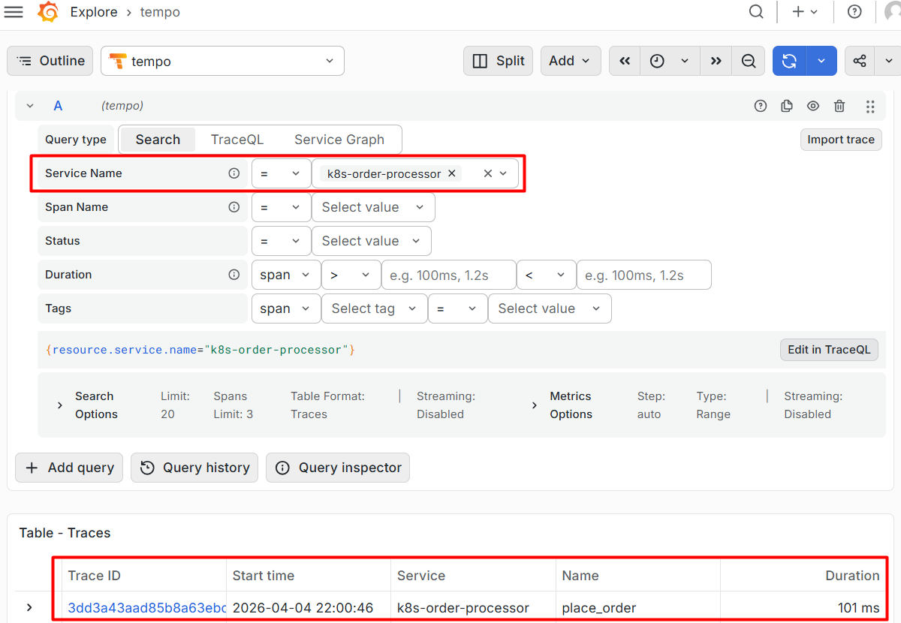
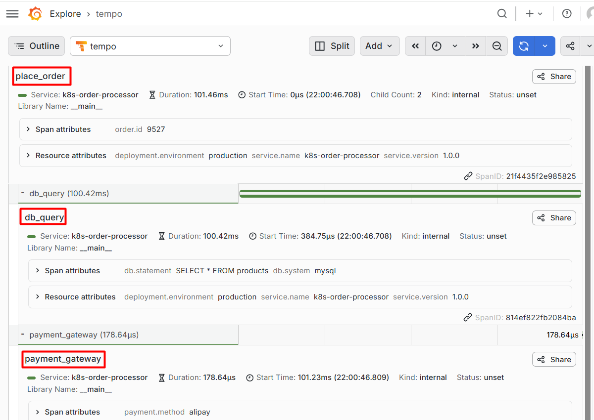

# OpenTelemetry

In the era of microservices, just knowing a system is broken is no longer sufficient, as we need to identify where and why the failure occurred. **OpenTelemetry (OTel)**, a **Cloud Native Computing Foundation (CNCF)** project, fills this gap as **the industry standard for high-fidelity telemetry, offering a unified method for collecting traces, metrics, and logs.**

Next, we will focus on the tracing functionality. At the heart of OTel tracing is the **Span**, which represents a single unit of work in a distributed system, mainly includes:

- `trace_id`, `span_id`, `parent_id`: Unique identifiers that form the distributed trace tree and establish parent-child relationships between operations.
- `start_time`, `end_time`: Timestamps that define the duration and timeline of the unit of work.
- `attributes`, `status`: Key-value metadata (e.g., db.statement, http.status_code) and a flag indicating success or failure.
- `resource`: Metadata describing the source environment (e.g., service.name, host.name, pod.id) where the operation runs.

## Local Python Implementation

Before deploying to a complex cluster, it is essential to understand how the SDK constructs and emits telemetry data. Below is a foundational Python example using the **Manual-Instrumentation** approach.

### Environment Preparation (Ubuntu)

First, set up a clean Python virtual environment to isolate your dependencies:

```shell
# Install the virtual environment manager
$ sudo apt install python3-pip python3-venv

# Create and activate the workspace
$ mkdir ~/otel && cd ~/otel
$ python3 -m venv .venv
$ source .venv/bin/activate

# Install the core OpenTelemetry API and SDK
(.venv) $ pip install opentelemetry-api opentelemetry-sdk
```

### Writing the Instrumentation Script

Create a file named `otel.py`. In this script, we initialize the **TracerProvider** (the engine) and a **SpanProcessor** that sends data to a **ConsoleExporter** (for local debugging).

```python
from opentelemetry import trace
from opentelemetry.sdk.trace import TracerProvider
from opentelemetry.sdk.trace.export import BatchSpanProcessor, ConsoleSpanExporter

# 1. Initialization: Setup the TracerProvider (The "Brain" of the SDK)
provider = TracerProvider()

# 2. Configure the Exporter: Print spans directly to the console
# This represents the internal logic: once data is generated, the Processor 
# handles how it's dispatched (in this case, formatted as JSON to stdout).
processor = BatchSpanProcessor(ConsoleSpanExporter())
provider.add_span_processor(processor)

# Set the global tracer provider
trace.set_tracer_provider(provider)
tracer = trace.get_tracer(__name__)

# 3. Simulate business logic
with tracer.start_as_current_span("place_order"):
    print("Processing order...")
    
    # Nested span representing a sub-operation (Child Span)
    with tracer.start_as_current_span("db_query") as span:
        # Simulating the database action mentioned in your K8s context
        span.set_attribute("db.system", "mysql")
        span.set_attribute("db.statement", "SELECT * FROM products")
        print("Database query completed.")

    with tracer.start_as_current_span("payment_gateway"):
        print("Payment successful.")
```

### Execution and Output

When you run the script, you will see the standard print statements followed by the raw JSON representation of the spans generated by the SDK.

```shell
(.venv) $ python3 otel.py
Processing order...
Database query completed.
Payment successful.
{
    "name": "db_query",
    "context": {
        "trace_id": "0x1a28d3608c28c3d7efda235d5eef8db5",
        "span_id": "0xb9739987f4b8d96f",
        "trace_state": "[]"
    },
    "kind": "SpanKind.INTERNAL",
    "parent_id": "0x9e21180fc7d0cf76",
    "start_time": "2026-04-04T13:37:15.946835Z",
    "end_time": "2026-04-04T13:37:15.946985Z",
    "status": {
        "status_code": "UNSET"
    },
    "attributes": {
        "db.system": "mysql",
        "db.statement": "SELECT * FROM products"
    },
    "events": [],
    "links": [],
    "resource": {
        "attributes": {
            "telemetry.sdk.language": "python",
            "telemetry.sdk.name": "opentelemetry",
            "telemetry.sdk.version": "1.40.0",
            "service.name": "unknown_service"
        },
        "schema_url": ""
    }
}
{
    "name": "payment_gateway",
    "context": {
        "trace_id": "0x1a28d3608c28c3d7efda235d5eef8db5",
        "span_id": "0xf9c49ef7ea5e36ad",
        "trace_state": "[]"
    },
    "kind": "SpanKind.INTERNAL",
    "parent_id": "0x9e21180fc7d0cf76",
    "start_time": "2026-04-04T13:37:15.947382Z",
    "end_time": "2026-04-04T13:37:15.947475Z",
    "status": {
        "status_code": "UNSET"
    },
    "attributes": {},
    "events": [],
    "links": [],
    "resource": {
        "attributes": {
            "telemetry.sdk.language": "python",
            "telemetry.sdk.name": "opentelemetry",
            "telemetry.sdk.version": "1.40.0",
            "service.name": "unknown_service"
        },
        "schema_url": ""
    }
}
{
    "name": "place_order",
    "context": {
        "trace_id": "0x1a28d3608c28c3d7efda235d5eef8db5",
        "span_id": "0x9e21180fc7d0cf76",
        "trace_state": "[]"
    },
    "kind": "SpanKind.INTERNAL",
    "parent_id": null,
    "start_time": "2026-04-04T13:37:15.946587Z",
    "end_time": "2026-04-04T13:37:15.947521Z",
    "status": {
        "status_code": "UNSET"
    },
    "attributes": {},
    "events": [],
    "links": [],
    "resource": {
        "attributes": {
            "telemetry.sdk.language": "python",
            "telemetry.sdk.name": "opentelemetry",
            "telemetry.sdk.version": "1.40.0",
            "service.name": "unknown_service"
        },
        "schema_url": ""
    }
}
```

This nested structure demonstrates the **Parent-Child relationship**: the `db_query` span automatically captures the `parent_id` of the `place_order` span because it was created within that context. This "trace context" is what allows OpenTelemetry to reconstruct the entire execution path across different functions or services.

While **Manual-Instrumentation** offers the highest precision for business logic, implementing it across hundreds of microservices is impractical. In production environments, **OpenTelemetry** provides **Auto-Instrumentation** to generate spans automatically without changing a single line of your business code.

## Deploying to Kubernetes

In a Kubernetes environment, we move beyond the local console and send data to a centralized **OpenTelemetry Collector** via the **OTLP (OpenTelemetry Line Protocol)**. This usually involves sending data over **HTTP (port 4318)** or **gRPC (port 4317)**.

### Injecting SDK via InitContainers

In restricted environments where you cannot modify the base image, you can use a Kubernetes `initContainer` to "inject" the OpenTelemetry libraries into your application container using a shared volume.

```yaml
apiVersion: v1
kind: Pod
metadata:
  name: otel-lab-combined
spec:
  # 1. Init Container: Responsible for "delivering" OTel libraries
  initContainers:
    - name: otel-provider
      image: ghcr.io/open-telemetry/opentelemetry-operator/autoinstrumentation-python:latest
      command: ["cp", "-a", "/autoinstrumentation/.", "/otel_libs"]
      volumeMounts:
        - name: shared-libs
          mountPath: /otel_libs

  # 2. Main Container: Your Python environment
  containers:
    - name: python-lab
      image: python:3.9-slim
      command: ["sleep", "3600"]
      env:
        # Crucial: Tell Python where to find the "airdropped" libraries
        - name: PYTHONPATH
          value: "/otel_libs"
      volumeMounts:
        - name: shared-libs
          mountPath: /otel_libs

  # 3. Shared Volume: The "transfer station" between containers
  volumes:
    - name: shared-libs
      emptyDir: {}
```

### Running the Production-Ready Script

Access the container and create the instrumentation script `test.py`. This version includes **Resource** attributes (the identity of the service) and the **OTLPSpanExporter**.

```shell
# Access the main container
$ kubectl exec -it otel-lab-combined -c python-lab -- bash

# Create the test script
$ cat <<EOF > test.py
import time
from opentelemetry import trace
from opentelemetry.sdk.trace import TracerProvider
from opentelemetry.sdk.trace.export import BatchSpanProcessor
from opentelemetry.exporter.otlp.proto.http.trace_exporter import OTLPSpanExporter
from opentelemetry.sdk.resources import Resource

# 1. Initialization: Setup the Resource (The "Identity" of the SDK)
# Define the service's persona in the K8s environment for easier filtering in Grafana
resource = Resource(attributes={
    "service.name": "k8s-order-processor",
    "service.version": "1.0.0",
    "deployment.environment": "production"
})

provider = TracerProvider(resource=resource)

# 2. Configure the Exporter: Send spans to the OTel Collector via HTTP
# The endpoint points to the collector service; the SDK handles the /v1/traces path
processor = BatchSpanProcessor(
    OTLPSpanExporter(endpoint="http://otel-collector.opentelemetry.svc:4318/v1/traces")
)
provider.add_span_processor(processor)

# Set the global tracer provider and get a tracer instance
trace.set_tracer_provider(provider)
tracer = trace.get_tracer(__name__)

# 3. Simulate business logic
with tracer.start_as_current_span("place_order") as root_span:
    print("Processing order...")
    # Manually add business attributes to the root span
    root_span.set_attribute("order.id", "9527")
    
    # Sub-operation 1: Database Query
    with tracer.start_as_current_span("db_query") as span:
        span.set_attribute("db.system", "mysql")
        span.set_attribute("db.statement", "SELECT * FROM products")
        time.sleep(0.1)  # Simulate latency
        print("Database query completed.")

    # Sub-operation 2: Payment Gateway
    with tracer.start_as_current_span("payment_gateway") as span:
        span.set_attribute("payment.method", "alipay")
        print("Payment successful.")

# 4. Critical: Flush and shutdown
# Ensure all spans in the buffer are pushed to the Collector before the script exits
provider.shutdown()
print("Trace sent successfully!")
EOF

# Execute the script
$ python3 test.py
Processing order...
Database query completed.
Payment successful.
Trace sent successfully!
```

Once the script completes, the trace is sent to the **OTel Collector**, which forwards it to a storage backend like **Grafana Tempo**. By searching for `service.name="k8s-order-processor"`, you can visualize the full waterfall of the order process, complete with custom attributes and timing data.



