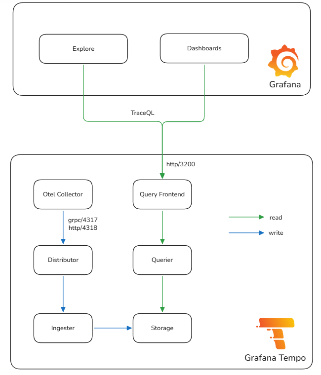
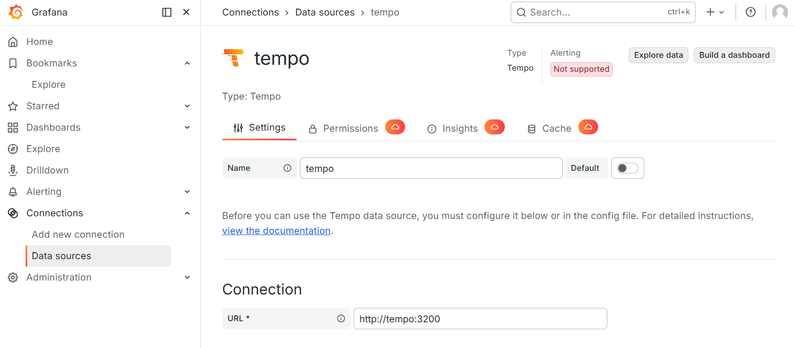
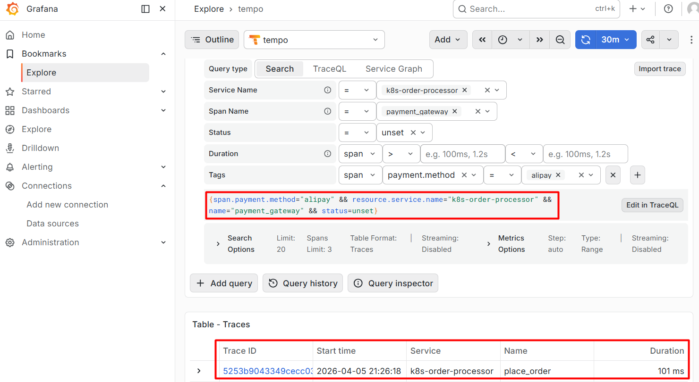
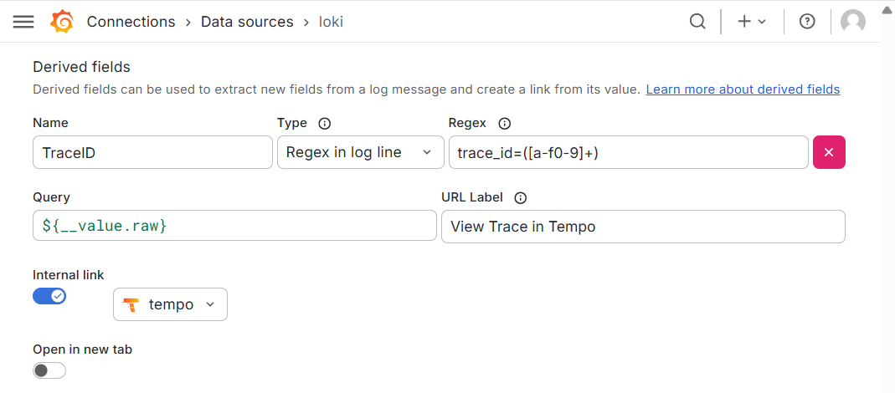
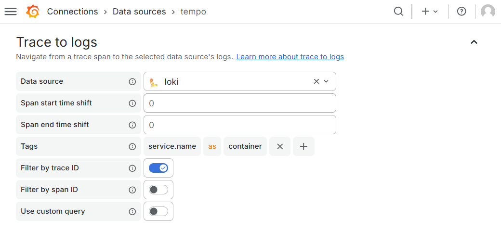
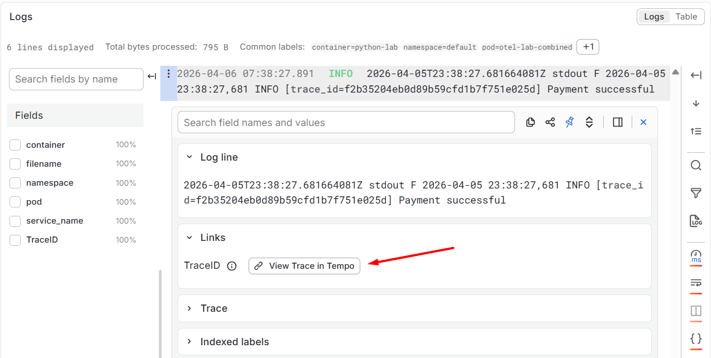
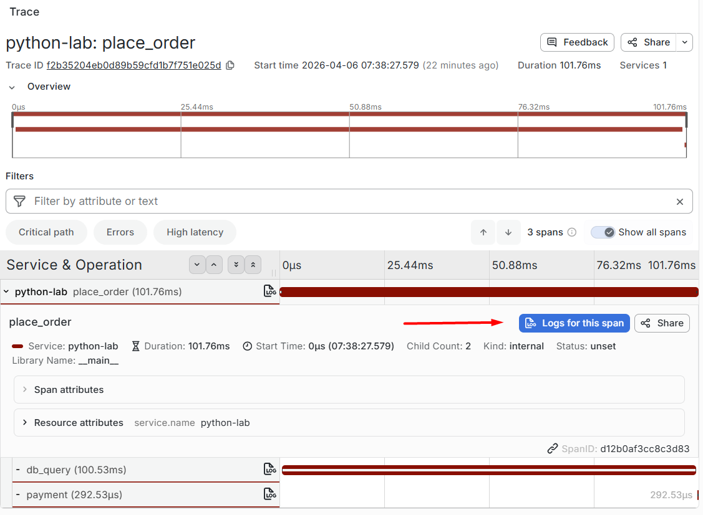

# Tempo

**Grafana Tempo** is a high-volume, low-cost, and easy-to-operate distributed tracing backend designed for cloud-native environments. It supports ingestion from multiple tracing protocols including OTLP, Jaeger, Zipkin, and uses object storage for long-term trace retention. Tempo integrates seamlessly with OpenTelemetry Collector, Grafana, and Loki to provide full observability across traces, metrics, and logs.

## Core Components

**Tempo** consists of multiple microservice components that can run in **monolithic mode** (all-in-one) or **distributed mode** (scaled independently).

- **Distributor**: Accepts trace spans via OTLP/gRPC, OTLP/HTTP, Jaeger, or Zipkin. It validates, batches, and routes spans to ingesters using a consistent hash ring based on traceID.
- **Ingester**: Batches incoming spans, builds trace blocks, creates indexes and bloom filters for fast lookup, and flushes compacted blocks to backend storage (local disk or object storage).
- **Querier**: Retrieves trace data either from in-memory ingesters (recent data) or from storage blocks (historical data) by traceID or TraceQL query.
- **Query Frontend**: Serves as the HTTP API entry for queries (port 3200). It shards queries, parallelizes execution across multiple queriers, aggregates results, and responds to Grafana.
- **Compactor**: Merges small trace blocks into larger ones, deduplicates data, applies retention policies, and cleans up expired blocks to optimize storage and query performance.
- **Storage**: Tempo relies on durable storage (local filesystem for testing, S3/GCS/Azure for production) to persist trace blocks in Apache Parquet format.



## Deploy OpenTelemetry Collector in Kubernetes

The **OpenTelemetry Collector** acts as a **centralized gateway** for trace ingestion, processing, and export. It receives traces from applications and forwards them to Tempo. 

We deploy it as a **DaemonSet** to ensure one collector runs on every node.

```yaml
apiVersion: v1
kind: Namespace
metadata:
  name: opentelemetry
---
apiVersion: v1
kind: ConfigMap
metadata:
  name: otel-collector-conf
  namespace: opentelemetry
data:
  otel-collector-config.yaml: |
    receivers:
      otlp:
        protocols:
          grpc:
            endpoint: 0.0.0.0:4317
          http:
            endpoint: 0.0.0.0:4318

    processors:
      batch:

    exporters:
      otlp:
        endpoint: tempo.monitoring.svc:4317
        tls:
          insecure: true

    service:
      pipelines:
        traces:
          receivers: [otlp]
          processors: [batch]
          exporters: [otlp]
---
apiVersion: apps/v1
kind: DaemonSet
metadata:
  name: otel-collector
  namespace: opentelemetry
spec:
  selector:
    matchLabels:
      app: otel-collector
  template:
    metadata:
      labels:
        app: otel-collector
    spec:
      containers:
        - name: otel-collector
          image: otel/opentelemetry-collector-contrib:latest
          args: ["--config=/etc/otel-collector-config.yaml"]
          volumeMounts:
            - name: config
              mountPath: /etc/otel-collector-config.yaml
              subPath: otel-collector-config.yaml
          ports:
            - containerPort: 4317
            - containerPort: 4318
      volumes:
        - name: config
          configMap:
            name: otel-collector-conf
---
apiVersion: v1
kind: Service
metadata:
  name: otel-collector
  namespace: opentelemetry
spec:
  selector:
    app: otel-collector
  ports:
    - name: otlp-grpc
      port: 4317
      targetPort: 4317
    - name: otlp-http
      port: 4318
      targetPort: 4318
```

Apply the manifest and verify:

```shell
$ $ kubectl apply -f otel-collector.yaml
namespace/opentelemetry created
configmap/otel-collector-conf created
daemonset.apps/otel-collector created
service/otel-collector created

$ kubectl get pod -n opentelemetry -l app=otel-collector
NAME                   READY   STATUS    RESTARTS   AGE
otel-collector-g8rxq   1/1     Running   0          42s
otel-collector-pbzc8   1/1     Running   0          42s
```

## Deploy Tempo in Kubernetes

The following manifest deploys **Tempo** in **monolithic mode** (`target: all`), which runs all components in a single pod for development and testing purposes. 

It will receive traces forwarded by the **OpenTelemetry Collector** deployed above.

```yaml
apiVersion: v1
kind: PersistentVolumeClaim
metadata:
  name: tempo-pvc
  namespace: monitoring
spec:
  accessModes:
    - ReadWriteOnce
  storageClassName: local-path
  resources:
    requests:
      storage: 10Gi
---
apiVersion: v1
kind: ConfigMap
metadata:
  name: tempo-config
  namespace: monitoring
data:
  tempo.yaml: |
    server:
      http_listen_port: 3200

    target: all

    distributor:
      receivers:
        otlp:
          protocols:
            grpc:
              endpoint: 0.0.0.0:4317
            http:
              endpoint: 0.0.0.0:4318

    ingester:
      max_block_duration: 5m
      lifecycler:
        ring:
          kvstore:
            store: memberlist
          replication_factor: 1

    storage:
      trace:
        backend: local
        local:
          path: /var/tempo/data
        wal:
          path: /var/tempo/wal

---
apiVersion: apps/v1
kind: Deployment
metadata:
  name: tempo
  namespace: monitoring
spec:
  replicas: 1
  strategy:
    type: Recreate
  selector:
    matchLabels:
      app: tempo
  template:
    metadata:
      labels:
        app: tempo
    spec:
      securityContext:
        fsGroup: 10001
      containers:
        - name: tempo
          image: grafana/tempo:2.10.3
          args:
            - "-config.file=/etc/tempo/tempo.yaml"
            - "-target=all"
          ports:
            - containerPort: 3200
              name: http-query
            - containerPort: 4317
              name: otlp-grpc
            - containerPort: 4318
              name: otlp-http
          volumeMounts:
            - name: config
              mountPath: /etc/tempo
            - name: data
              mountPath: /var/tempo
      volumes:
        - name: config
          configMap:
            name: tempo-config
        - name: data
          persistentVolumeClaim:
            claimName: tempo-pvc
---
apiVersion: v1
kind: Service
metadata:
  name: tempo
  namespace: monitoring
spec:
  type: ClusterIP
  selector:
    app: tempo
  ports:
    - name: http
      port: 3200
      targetPort: 3200
    - name: otlp-grpc
      port: 4317
      targetPort: 4317
    - name: otlp-http
      port: 4318
      targetPort: 4318

```

Apply the manifest and verify:

```shell
$ kubectl apply -f tempo.yaml
persistentvolumeclaim/tempo-pvc created
configmap/tempo-config created
deployment.apps/tempo created
service/tempo created


$ kubectl get pod -n monitoring -l app=tempo
NAMESPACE    NAME                     READY   STATUS    RESTARTS   AGE
monitoring   tempo-66788559b8-tv5xn   1/1     Running   0          14s
```

## Integration with Grafana

To visualize traces, add **Tempo** as a data source in **Grafana**:



You can now search a **trace** in **Grafana Explore**:



### Correlation with Loki

**Tempo** and **Loki** are tightly integrated within Grafana to enable seamless navigation between logs and traces. The correlation is achieved through the following mechanism:

- **Log Enrichment (Application Level)**: Applications inject the `trace_id` as a structured or unstructured field within the log message (Log Line), providing the common "anchor" for correlation.

- **Loki to Tempo (Log-to-Trace)**: Grafana employs **Derived Fields** to extract the `trace_id` from Loki logs via Regex. It then dynamically constructs a **TraceQL** query (e.g., `${__value.raw}`) to jump directly to the specific trace in Tempo.

  

- **Tempo to Loki (Trace-to-Log)**: Tempo utilizes **Trace to logs** (e.g., mapping the span attribute `service.name` to the Loki label `container`). By combining these **mapped labels** with the active `trace_id`, it triggers a Loki query to retrieve all logs associated with that specific execution path.

  

### Example Instrumented Python Application

Below is a complete Python app instrumented with **OpenTelemetry**. 

It generates traces and injects `trace_id` into logs, enabling full correlation with **Loki** and **Tempo**.

```shell
# Access the main container
$ kubectl exec -it otel-lab-combined -c python-lab -- bash

$ cat <<EOF > test.py
import time
import logging
from opentelemetry import trace
from opentelemetry.sdk.trace import TracerProvider
from opentelemetry.sdk.trace.export import BatchSpanProcessor
from opentelemetry.exporter.otlp.proto.http.trace_exporter import OTLPSpanExporter
from opentelemetry.sdk.resources import Resource

# --- 1. Minimal Logging Setup ---
# Use a custom LogRecord factory to inject trace_id without a complex Filter class
old_factory = logging.getLogRecordFactory()

def record_factory(*args, **kwargs):
    record = old_factory(*args, **kwargs)
    span = trace.get_current_span()
    # Inject trace_id in hex format if a span exists
    record.trace_id = format(span.get_span_context().trace_id, '032x') if span.get_span_context().is_valid else "0" * 32
    return record

logging.setLogRecordFactory(record_factory)
logging.basicConfig(level=logging.INFO, format='%(asctime)s %(levelname)s [trace_id=%(trace_id)s] %(message)s')
logger = logging.getLogger("order-service")

# --- 2. OTel Initialization ---
resource = Resource(attributes={"service.name": "python-lab"})
provider = TracerProvider(resource=resource)
processor = BatchSpanProcessor(OTLPSpanExporter(endpoint="http://otel-collector.opentelemetry.svc:4318/v1/traces"))
provider.add_span_processor(processor)
trace.set_tracer_provider(provider)
tracer = trace.get_tracer(__name__)

# --- 3. Business Logic ---
with tracer.start_as_current_span("place_order"):
    logger.info("Processing order 9527") 
    
    with tracer.start_as_current_span("db_query"):
        logger.info("Querying database...")
        time.sleep(0.1)

    with tracer.start_as_current_span("payment"):
        logger.info("Payment successful")

provider.shutdown()
EOF

# Execute the script
$ python3 test.py > /proc/1/fd/1 2>&1
```

In **Loki**:



In **Tempo**:

