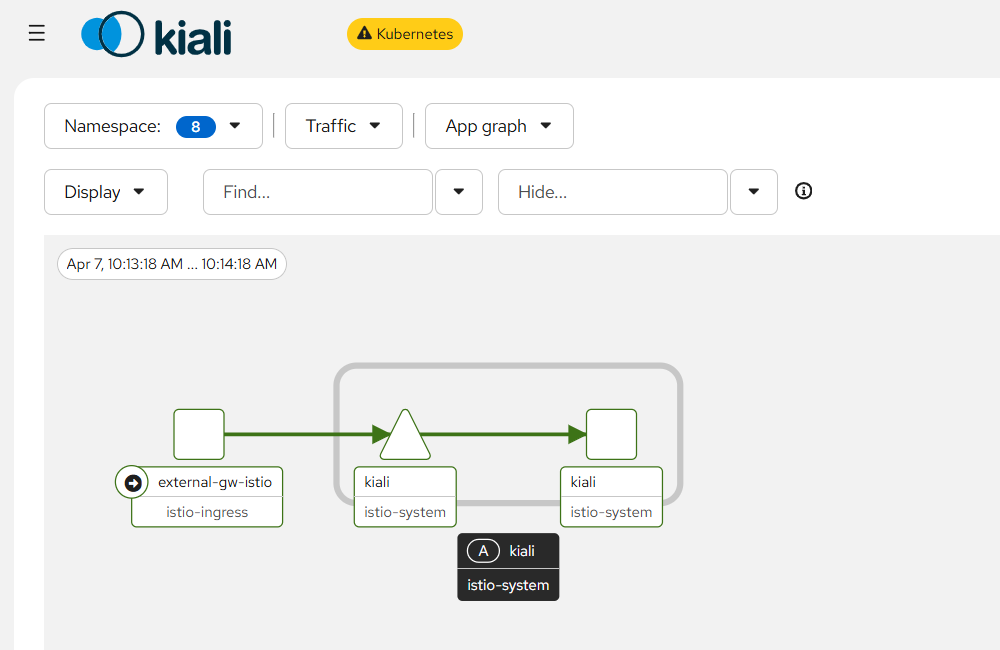
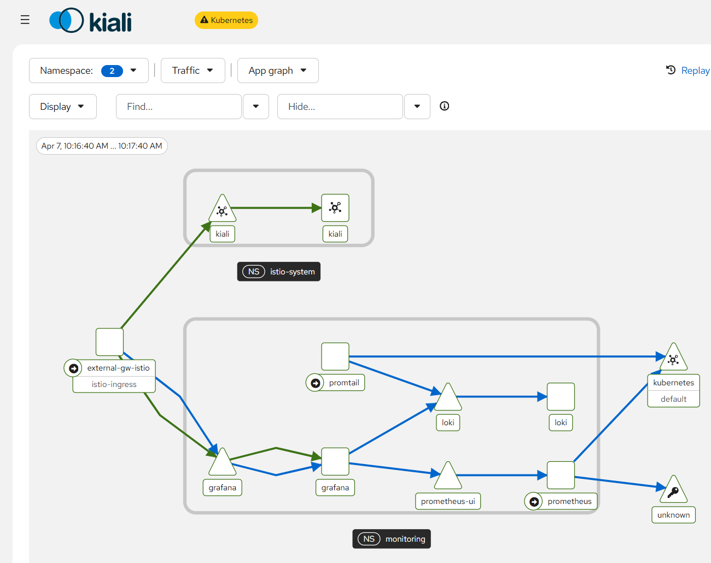

# Istio

**Istio** remains the industry standard for **Service Mesh**, providing critical security, observability, and traffic management. However, the architecture has shifted from the resource-heavy **Sidecar model** to the streamlined, "sidecar-less" **Ambient Mesh**.

## Operation Mode

### The Legacy: Sidecar Architecture

Historically, **Istio** deployed an **Envoy proxy** as a sidecar inside every application Pod. This design delivered granular **Layer 7 (L7)** traffic control but introduced the "Sidecar Tax", a set of tradeoffs that became burdensome as clusters scaled:

- **Resource Heavy**: High CPU and memory consumption scaled linearly with the number of Pods.

- **Operational Friction**: Proxy injection required Pod restarts, disrupting application availability, and managing the lifecycle of thousands of sidecars added significant complexity.

### The Innovation: Ambient Mesh

**Ambient Mesh** solves these problems by splitting the traditional sidecar into two dedicated layers: **Secure Overlay** and **L7 Processing**. It separates **Ztunnel** (for L4 mTLS and identity) from **Waypoint Proxy** (for advanced L7 policies). 

This sidecar-free design removes per-Pod proxy overhead while keeping full service mesh features. With transparent redirection, security is enforced at the node level, making it ideal for large-scale cloud-native environments.

## Core Components in Ambient Mode

Ambient mode relies on three core, collaborative components that work seamlessly together to enable sidecar-less mesh functionality. Each component is purpose-built to handle specific tasks, ensuring efficient, secure, and reliable service-to-service communication:

1. **Ztunnel**: A node-level DaemonSet proxy focused on Layer 4 (L4) traffic management. It is responsible for **mutual TLS (mTLS)** encryption, basic IP-based routing, and identity propagation via Kubernetes Service Accounts. Deployed on every node, Ztunnel ensures all inter-Pod traffic is secured and routed correctly.

2. **Istiod**: Istio's centralized control plane. It handles service discovery, distributes configuration to all ambient components, and acts as a **certificate authority (CA)** for mTLS certificate issuance and rotation. Istiod also serves as the Gateway API Controller, translating user-defined Gateway and HTTPRoute resources into actionable configurations.

3. **Istio CNI Plugin**: A node-level component that integrates Istio with the Kubernetes network stack. It replaces Sidecar mode’s init containers by redirecting Pod traffic to Ztunnel and configuring network namespaces. 

### Component Interaction

**Istiod** acts as the Control Plane and Gateway API Controller, translating **Gateway** and **HTTPRoute** resources into xDS configurations. Upon Gateway creation, it provisions a dedicated Ingress Gateway Deployment and pushes L7 rules directly to it. 

In the Ambient Data Plane, the **Istio CNI** acts as the "traffic enforcer," specifically watching for the `istio.io/dataplane-mode=ambient` label on Namespaces to trigger Transparent Redirection via **eBPF** (or **iptables**). This hijacks Pod traffic and diverts it to the node's **Ztunnel** without modifying application containers. 

The **Ztunnel** itself is a stateless L4 proxy that does not watch K8s resources; instead, it receives its "Workload Index" and mTLS certificates exclusively from **Istiod** via the ZDS (Ztunnel Data Service) protocol.

The end-to-end inbound traffic flow follows a decoupled path: the Ingress Gateway evaluates the HTTPRoute to select a target Pod, the Source Ztunnel intercepts the egress traffic to wrap it in an HBONE (mTLS) tunnel, and the Destination Ztunnel decapsulates the HBONE to enforce L4 Authorization before delivering the traffic to the Target Pod.

## Deploy Istio in Kubernetes

First, download the Istio installation package and configure the environment variables to ensure the `istioctl` command is available globally.

```shell
$ curl -L https://istio.io/downloadIstio | sh -
$ cd istio-1.29.1
$ echo "export PATH=$PWD/bin:$PATH" >> ~/.bashrc
$ . ~/.bashrc
```

Install Istio in ambient mode and skip the confirmation step for quick deployment.

```shell
$ istioctl install --set profile=ambient --skip-confirmation
✔ Istio core installed ⛵️
✔ CNI installed 🪢
✔ Istiod installed 🧠
✔ Ztunnel installed 🔒
✔ Installation complete

$ kubectl get po -n istio-system
NAME                      READY   STATUS    RESTARTS   AGE
istio-cni-node-4p9pv      1/1     Running   0          54s
istio-cni-node-7ct2g      1/1     Running   0          54s
istio-cni-node-dcmn4      1/1     Running   0          54s
istio-cni-node-kgzj6      1/1     Running   0          54s
istio-cni-node-t5pwl      1/1     Running   0          54s
istiod-6cb87d8b64-ndzl2   1/1     Running   0          53s
ztunnel-74bqv             1/1     Running   0          50s
ztunnel-czr84             1/1     Running   0          50s
ztunnel-hzq7m             1/1     Running   0          50s
ztunnel-kn9xz             1/1     Running   0          50s
ztunnel-wkgbd             1/1     Running   0          50s

```

Istio uses the Kubernetes Gateway API to manage ingress traffic, so we need to install the corresponding **Custom Resource Definitions (CRDs)** first (skip if already installed).

```shell
$ kubectl get crd gateways.gateway.networking.k8s.io &> /dev/null || \
  kubectl apply --server-side -f https://github.com/kubernetes-sigs/gateway-api/releases/download/v1.4.0/experimental-install.yaml
```

### Configure external access to Grafana

Once Istio deployed, we could add a Gateway as the entry point for Grafana access. 

```yaml
apiVersion: v1
kind: Namespace
metadata:
  name: istio-ingress
  labels:
    istio.io/dataplane-mode: ambient
---
apiVersion: gateway.networking.k8s.io/v1
kind: Gateway
metadata:
  name: external-gw
  namespace: istio-ingress
spec:
  gatewayClassName: istio
  listeners:
  - name: http
    port: 80
    protocol: HTTP
    allowedRoutes:
      namespaces:
        from: All
---
apiVersion: gateway.networking.k8s.io/v1beta1
kind: ReferenceGrant
metadata:
  name: allow-gw-to-grafana
  namespace: monitoring
spec:
  from:
  - group: gateway.networking.k8s.io
    kind: Gateway
    namespace: istio-ingress
  to:
  - group: ""
    kind: Service
    name: grafana
---
apiVersion: gateway.networking.k8s.io/v1
kind: HTTPRoute
metadata:
  name: grafana-route
  namespace: monitoring
spec:
  parentRefs:
  - name: external-gw
    namespace: istio-ingress
  hostnames:
  - "grafana.local"
  rules:
  - matches:
    - path:
        type: PathPrefix
        value: /
    backendRefs:
    - name: grafana
      port: 80
```

Apply and check the status of each resource to ensure the deployment is successful.

```shell
kubectl apply -f gw-to-grafana.yaml
namespace/istio-ingress created
gateway.gateway.networking.k8s.io/external-gw created
referencegrant.gateway.networking.k8s.io/allow-gw-to-grafana created
httproute.gateway.networking.k8s.io/grafana-route created

$ kubectl get all -n istio-ingress
NAME                                     READY   STATUS    RESTARTS   AGE
pod/external-gw-istio-7b75d8d86d-267cm   1/1     Running   0          6m34s

NAME                        TYPE           CLUSTER-IP      EXTERNAL-IP   PORT(S)                        AGE
service/external-gw-istio   LoadBalancer   10.97.179.191   <pending>     15021:30983/TCP,80:30257/TCP   6m34s

NAME                                READY   UP-TO-DATE   AVAILABLE   AGE
deployment.apps/external-gw-istio   1/1     1            1           6m34s

NAME                                           DESIRED   CURRENT   READY   AGE
replicaset.apps/external-gw-istio-7b75d8d86d   1         1         1       6m34s


$ kubectl get referencegrant -A
NAMESPACE    NAME                  AGE
monitoring   allow-gw-to-grafana   5m4s

$ kubectl get httproute -A
NAMESPACE    NAME            HOSTNAMES           AGE
monitoring   grafana-route   ["grafana.local"]   4m36s
```

After all configurations are successful, you can access Grafana via the following address: http://grafana.local:30257

# Deploy Kiali for visibility

**Kiali** is an observability tool for Istio service meshes, providing visualization, monitoring, and troubleshooting capabilities for service interactions. 

### Deploy Kiali and Prometheus

**Kiali** relies on **Prometheus** to collect and analyze metrics, so we need to deploy both components simultaneously. Use the official Istio add-on YAML files for deployment

```shell
$ kubectl apply -f https://raw.githubusercontent.com/istio/istio/release-1.29/samples/addons/kiali.yaml
$ kubectl apply -f https://raw.githubusercontent.com/istio/istio/release-1.29/samples/addons/prometheus.yaml
```

### Configure Gateway Access for Kiali

To access **Kiali** from outside the cluster, we need to configure **ReferenceGrant** (cross-namespace access permission) and **HTTPRoute** (routing rules), which are compatible with the Kubernetes Gateway API deployed earlier.

```yaml
apiVersion: gateway.networking.k8s.io/v1beta1
kind: ReferenceGrant
metadata:
  name: allow-gw-to-kiali
  namespace: istio-system
spec:
  from:
  - group: gateway.networking.k8s.io
    kind: Gateway
    namespace: istio-ingress
  to:
  - group: ""
    kind: Service
    name: kiali
---
apiVersion: gateway.networking.k8s.io/v1
kind: HTTPRoute
metadata:
  name: kiali-route
  namespace: istio-system
spec:
  parentRefs:
  - name: external-gw
    namespace: istio-ingress
  hostnames:
  - "kiali.local"
  rules:
  - matches:
    - path:
        type: PathPrefix
        value: /
    backendRefs:
    - name: kiali
      port: 20001
```

Apply the routing configuration file and confirm that the resources are created successfully.

```shell
$ kubectl apply -f gw-to-kiali.yaml
referencegrant.gateway.networking.k8s.io/allow-gw-to-kiali created
httproute.gateway.networking.k8s.io/kiali-route created
```

### Access Kiali

After all configurations are completed, you can access **Kiali** via the following address: http://kiali.local:30257/.

By default, we could see below when accessing Kiali.



To make **Kiali** display service mesh details normally in Istio Ambient mode, you need to add the `istio.io/dataplane-mode=ambient` label to the corresponding namespaces. This label enables Ambient mode for the namespace, allowing **Kiali** to collect service interaction data.

Add label to `monitoring` namespace (to view Grafana service interaction data in Kiali)

```shell
$ kubectl label ns monitoring istio.io/dataplane-mode=ambient
```

