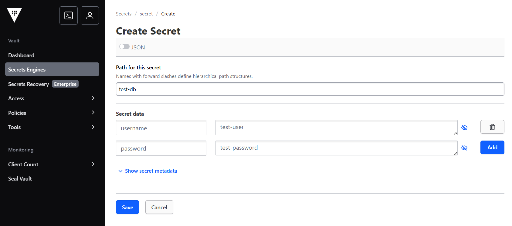

# Vault and ESO

## Core Components in Secret Management

In modern cloud-native architectures, secret management is decoupled into two distinct roles to ensure security, scalability, and compatibility with GitOps workflows.

### Secret Provider (e.g. HashiCorp Vault)

The Secret Provider acts as the centralized "Source of Truth." It is responsible for the secure storage, encryption, and lifecycle management of sensitive data.

### Secret Consumer (e.g. External Secrets Operator, ESO)

The Secret Consumer is a Kubernetes-native operator responsible for "fetching and delivering" secrets. Instead of applications querying Vault directly, it retrieves secrets from the Provider and injects them into the cluster as Native Kubernetes Secret objects.

### Workflow of Vault and ESO

1. **Store Secret in Vault**: Encrypt and save sensitive data (e.g. database passwords) at a specific path in Vault.

2. **Establish Trust**: Create a `SecretStore` (`ss`) to define how ESO authenticates with Vault.

3. **Sync Data**: Create an `ExternalSecret` (`es`) to map the Vault path to a Kubernetes Secret. ESO automatically fetches the value and generates a Native K8s Secret.

4. **Consume in Pod**: The Pod uses the `Secret` via Environment Variables or Volume Mounts.

## Deploy HashiCorp Vault in Kubernetes

Deploy Vault via Helm (dev mode for testing; disable in production):

```shell
$ helm repo add hashicorp https://helm.releases.hashicorp.com
$ helm install vault hashicorp/vault -n vault --create-namespace --set "server.dev.enabled=true"

$ kubectl get po -n vault
NAME                                    READY   STATUS    RESTARTS   AGE
vault-0                                 1/1     Running   0          5m41s
vault-agent-injector-5b7dd85f5c-hmdh9   1/1     Running   0          5m41s
```

Configure gateway access (Istio example)

```yaml
apiVersion: gateway.networking.k8s.io/v1beta1
kind: ReferenceGrant
metadata:
  name: allow-gw-to-vault
  namespace: vault
spec:
  from:
  - group: gateway.networking.k8s.io
    kind: Gateway
    namespace: istio-ingress
  to:
  - group: ""
    kind: Service
    name: vault
---
apiVersion: gateway.networking.k8s.io/v1
kind: HTTPRoute
metadata:
  name: vault-route
  namespace: vault
spec:
  parentRefs:
  - name: external-gw
    namespace: istio-ingress
  hostnames:
  - "vault.local"
  rules:
  - matches:
    - path:
        type: PathPrefix
        value: /
    backendRefs:
    - name: vault
      namespace: vault
      port: 8200
```

### GUI Access (Dev Mode)

Authenticate with token root. Then create a test secret at `secret/test-db` (username: `test-user`, password: `test-password`).




## Deploy ESO in Kubernetes

Deploy ESO via Helm

```shell
$ helm repo add external-secrets https://charts.external-secrets.io
$ helm install external-secrets external-secrets/external-secrets -n external-secrets --create-namespace

$ kubectl get po -n external-secrets
NAME                                                READY   STATUS    RESTARTS        AGE
external-secrets-7f44c87f85-xw2xk                   1/1     Running   0               30m
external-secrets-cert-controller-5cbcddc94c-qb87w   1/1     Running   8 (13m ago)     30m
external-secrets-webhook-888477cb9-kb2ct            1/1     Running   7 (8m59s ago)   30m
```

Store the Vault token in a Kubernetes secret for ESO to use

```shell
kubectl create secret generic vault-token -n external-secrets --from-literal=token=root
```

Apply the SecretStore (Backend) and ExternalSecret (Mapping) resources:

```yaml
apiVersion: external-secrets.io/v1
kind: SecretStore
metadata:
  name: vault-backend
  namespace: external-secrets
spec:
  provider:
    vault:
      server: "http://vault.vault.svc:8200"
      path: "secret"
      version: "v2"
      auth:
        tokenSecretRef:
          name: vault-token
          key: token
---
apiVersion: external-secrets.io/v1
kind: ExternalSecret
metadata:
  name: db-secret-sync
  namespace: external-secrets
spec:
  refreshInterval: "15s"
  secretStoreRef:
    name: vault-backend
    kind: SecretStore
  target:
    name: test-db-secret
  data:
    - secretKey: username
      remoteRef:
        key: secret/test-db
        property: username
    - secretKey: password
      remoteRef:
        key: secret/test-db
        property: password
```

```shell
$ kubectl apply -f test-db.yaml
secretstore.external-secrets.io/vault-backend created
externalsecret.external-secrets.io/db-secret-sync created

$ kubectl get secret -n external-secrets test-db-secret
NAME             TYPE     DATA   AGE
test-db-secret   Opaque   2      4m56s

$ kubectl get secret test-db-secret -n external-secrets -o jsonpath='{.data.username}' | base64 -d; echo
test-user

$ kubectl get secret test-db-secret -n external-secrets -o jsonpath='{.data.password}' | base64 -d; echo
test-password
```