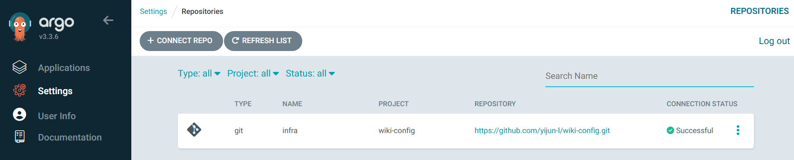
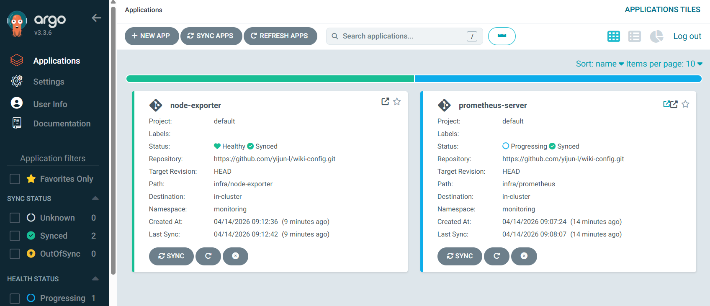
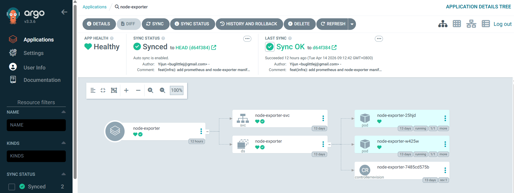

# GitOps

In traditional software delivery, deploying apps often requires manual steps or complex scripts. GitOps changes this by **treating infrastructure and application state as code, with Git as the single source of truth**.

## Core principles

- **Declarative**: The entire system is described in configuration files (YAML, Helm, etc.).
- **Versioned**: The desired state is stored in Git.
- **Automated Pull**: Approved changes are automatically pulled from Git and applied to the cluster.
- **Self-healing**: The system continuously checks the "Live State" and aligns it with the "Desired State."

# ArgoCD

Argo CD is a declarative GitOps continuous delivery tool designed specifically for Kubernetes. It runs inside your cluster and acts as a "watchdog," constantly ensuring that your cluster environment matches the desired state defined in your Git repository. Below is the key benefits:
- **Drift Detection**: If someone manually modifies a Kubernetes resource (e.g., via kubectl edit), Argo CD detects this "out of sync" state and can automatically revert it to the desired state.
- **Multi-Cluster Management**: A single Argo CD instance can efficiently manage deployments across multiple Kubernetes clusters, simplifying cross-cluster operations.
- **RBAC & Security**: It provides fine-grained access control and a user-friendly UI, making it easy to visualize complex deployments while maintaining security.
- **Better Developer Experience**: Developers only need to push code to Git—they don’t require direct kubectl access to production, streamlining their workflow.

## Workflow

1. **Define**: Store your Kubernetes manifests (Plain YAML, Kustomize, or Helm) in a Git repository, this becomes your single source of truth for the desired state.
2. **Connect**: Create an Application resource in Argo CD, which points to your Git repository URL and specifies the target Kubernetes cluster and namespace.
3. **Monitor**: Argo CD then continuously compares the desired state (from Git) with the live state (running in your cluster) to check for discrepancies.
4. **Sync**: Finally, sync the desired state to the cluster in one of two ways:
   - **Manual Sync**: After reviewing changes, click "Sync" in the Argo CD UI to apply them.
   - **Auto-Sync**: Argo CD automatically applies changes as soon as they are merged into the main branch of your Git repository.


## Deploy ArgoCD in Kubernetes

Create a dedicated namespace for ArgoCD and apply the official manifests.

```shell
kubectl create namespace argocd
kubectl apply -n argocd --server-side -f https://raw.githubusercontent.com/argoproj/argo-cd/stable/manifests/install.yaml

## disable argoCD https
kubectl patch configmap argocd-cmd-params-cm -n argocd --type merge -p '{"data": {"server.insecure": "true"}}'
kubectl rollout restart deployment argocd-server -n argocd
```

Configure external access to ArgoCD GUI

```yaml
apiVersion: gateway.networking.k8s.io/v1beta1
kind: ReferenceGrant
metadata:
  name: allow-gw-to-argocd
  namespace: argocd
spec:
  from:
  - group: gateway.networking.k8s.io
    kind: Gateway
    namespace: istio-ingress
  to:
  - group: ""
    kind: Service
    name: argocd-server
---
apiVersion: gateway.networking.k8s.io/v1
kind: HTTPRoute
metadata:
  name: argocd-route
  namespace: argocd
spec:
  parentRefs:
  - name: external-gw
    namespace: istio-ingress
  hostnames:
  - "argocd.local"
  rules:
  - matches:
    - path:
        type: PathPrefix
        value: /
    backendRefs:
    - name: argocd-server
      namespace: argocd
      port: 80
```

ArgoCD automatically creates an initial admin secret upon deployment

```shell
# Get GUI 'admin' password
kubectl -n argocd get secret argocd-initial-admin-secret -o jsonpath="{.data.password}" | base64 -d; echo
h7kNsMuImNod1EkM
```

## Sync with Git Repo

Extract the Prometheus and Node Exporter YAML configurations from https://github.com/yijun-l/wiki/blob/main/doc/2-1%20Prometheus.md, and organize them into the config repository with the following directory structure:

```shell
$ tree wiki-config/infra
wiki-config/infra
├── node-exporter
│   ├── daemonset.yaml
│   └── service.yaml
└── prometheus
    ├── configmap.yaml
    ├── deployment.yaml
    ├── ingress.yaml
    ├── rbac.yaml
    └── service.yaml
```

### Connect Git Repository to ArgoCD

Before ArgoCD can sync resources, it needs to connect to the Git repository.

Navigate to `Settings - Repositories - connect repo`, and configure with following parameters:
- Choose your connection method: `VIA HTTP/HTTPS`
- Type: `git`
- Name: `Infra`
- Project: `wiki-config`
- Repository URL: `https://github.com/yijun-l/wiki-config.git`

After configuration, ArgoCD will validate the connection to the Git repository. If successful, the repository will be listed under "Repositories" and ready for use in ArgoCD applications.



### Create a New ArgoCD Application

An ArgoCD Application defines the relationship between the Git repository (source) and the Kubernetes cluster (destination). Create an application for Prometheus to enable automatic syncing.

Navigate to `Applications - new app`, and configure with following parameters:
- Application Name: `prometheus-server`
- Project Name: `default`
- SYNC POLICY: `Automatic`
- Repository URL: `https://github.com/yijun-l/wiki-config.git`
- Path: `infra/prometheus`
- Cluster URL: `https://kubernetes.default.svc`
- Namespace: `monitoring`

Once the application is created, ArgoCD will automatically start syncing the Prometheus resources from the Git repository to the monitoring namespace. You can monitor the sync status in the ArgoCD GUI.



When the application is synced successfully, the deployed resources will have ArgoCD tracking labels. These labels are automatically added by ArgoCD to identify resources it manages.

```shell
$ kubectl describe -n monitoring service/node-exporter-svc
Name:           node-exporter-svc
Namespace:      monitoring
Labels:         <none>
Annotations:    argocd.argoproj.io/tracking-id: node-exporter:/Service:monitoring/node-exporter-svc
...

$ kubectl describe -n monitoring daemonset.apps/node-exporter
Name:           node-exporter
Namespace:      monitoring
Selector:       app=node-exporter
Node-Selector:  <none>
Labels:         <none>
Annotations:    argocd.argoproj.io/tracking-id: node-exporter:apps/DaemonSet:monitoring/node-exporter
                deprecated.daemonset.template.generation: 1
...
```



## Test Self-Heal Functionality 

With the `Self Heal` option enabled in the ArgoCD Application sync policy, ArgoCD continuously monitors the cluster resources and automatically restores them to the desired state.

```shell
$ kubectl get -n monitoring daemonset.apps/node-exporter
NAME            DESIRED   CURRENT   READY   UP-TO-DATE   AVAILABLE   NODE SELECTOR   AGE
node-exporter   2         2         2       2            2           <none>          13d

$ kubectl delete -f node-exporter.yaml
daemonset.apps "node-exporter" deleted from monitoring namespace
service "node-exporter-svc" deleted from monitoring namespace

$ kubectl get daemonset.apps/node-exporter -n monitoring
NAME            DESIRED   CURRENT   READY   UP-TO-DATE   AVAILABLE   NODE SELECTOR   AGE
node-exporter   2         2         0       2            0           <none>          1s
$ kubectl get daemonset.apps/node-exporter -n monitoring
NAME            DESIRED   CURRENT   READY   UP-TO-DATE   AVAILABLE   NODE SELECTOR   AGE
node-exporter   2         2         2       2            2           <none>          12s
```

As shown in the output, after manually deleting the Node Exporter DaemonSet and Service, ArgoCD detects the drift and automatically recreates the resources within seconds. This ensures the cluster state remains consistent with the configuration stored in Git, reducing manual intervention and improving reliability.