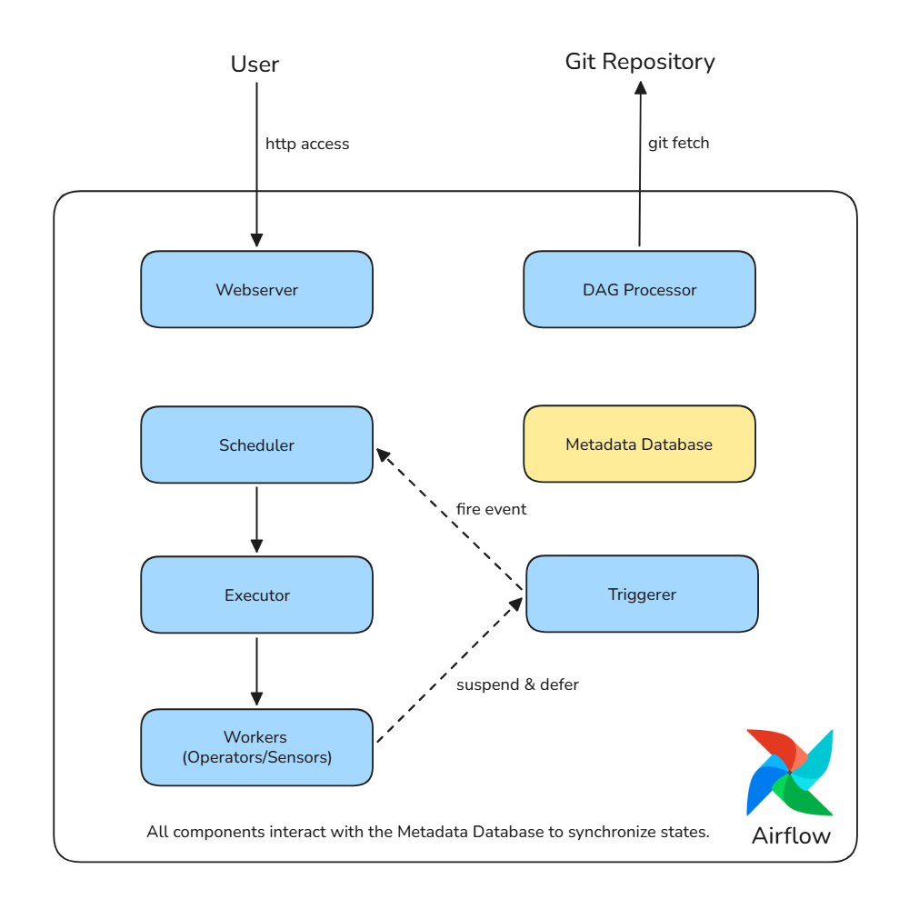
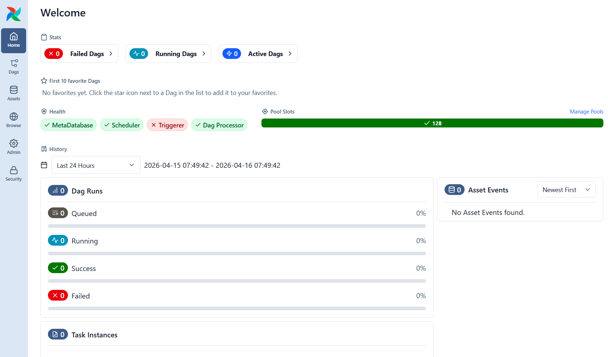
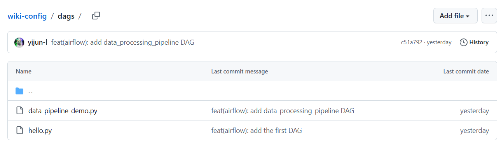
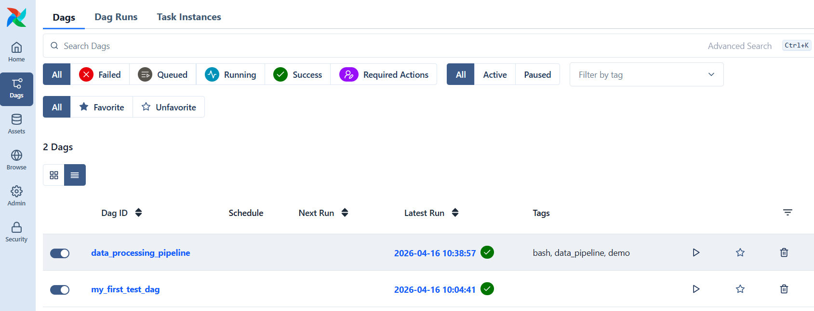
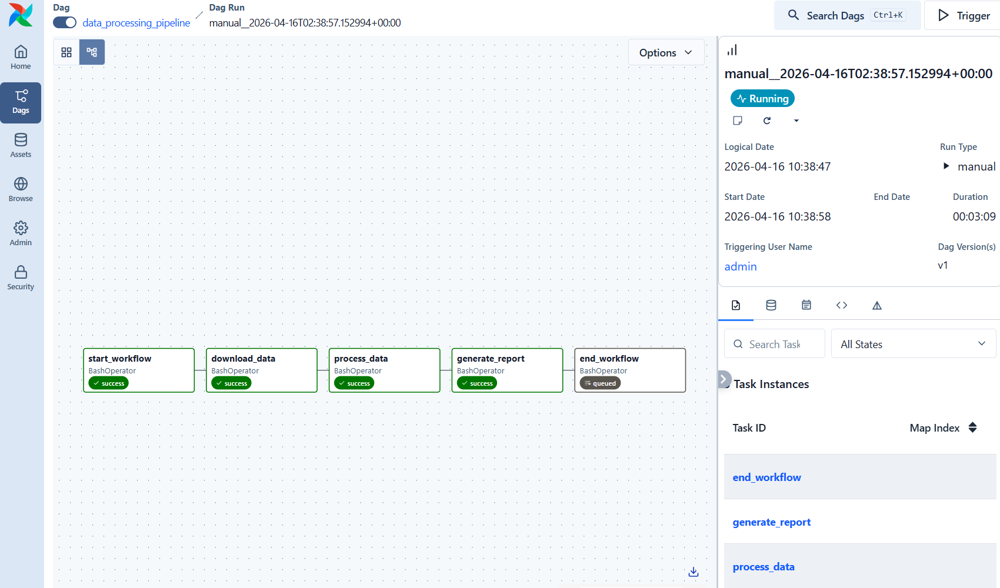

# AirFlow

**Apache Airflow** is the industry-standard, Python-based orchestrator for "**Configuration as Code**." It enables teams to programmatically define, schedule, and monitor complex task sequences using Python code. This approach replaces rigid or manual processes with automated and scalable data pipelines that provide high visibility into every stage of the workflow.

## Core Components

Airflow’s functionality relies on several core components working in tandem, each playing a distinct role in the workflow lifecycle:

- **Scheduler**: monitors all DAGs and tasks. It evaluates dependencies and timing to determine which tasks are ready to run, then hands them off to the Executor.

- **Executor**: determines how and where tasks are run. In Kubernetes environments, the `KubernetesExecutor` is the standard, as it launches each task in an isolated Pod for optimal resource scaling.

- **Workers**: receive tasks from the Executor, run the actual code defined in your Operators, and report the success or failure back to the system.

- **Metadata Database**: usually powered by PostgreSQL or MySQL, this is the "Single Source of Truth." It stores the state of every task, DAG, and user configuration, ensuring all other components stay synchronized.

- **Webserver**: provides a visual dashboard to inspect logs, manage DAG runs, and troubleshoot failures through a browser.

- **DAG Processor**: constantly scans your Python files and converts the complex logic into a simplified, serialized format for the Metadata Database.

- **Triggerer**: handles "deferrable" tasks (like waiting for an external job to finish) without wasting a Worker slot, allowing Airflow to scale to thousands of concurrent waits.

- **Operators & Sensors**: The building blocks of a DAG. Operators define what to do (e.g., SparkK8sOperator), while Sensors define what to wait for.

### Workflow Lifecycle

The seamless interaction between these components ensures reliable execution through a streamlined sequence:

1. **Serialization**: Once workflow files (DAGs) are available in the shared volume, the DAG Processor parses them into a serialized JSON format. By storing this logic in the Metadata Database, it allows other components to access the DAG structure efficiently without the overhead of executing Python code.

2. **Scheduling**: The Scheduler polls the database. Once a DAG's schedule interval is met and its dependencies are satisfied, it creates a "Task Instance" and pushes it to the Executor.

3. **Execution**: The Executor (e.g., `KubernetesExecutor`) requests the K8s API to launch a Worker Pod. This Worker invokes the Operator (for instance, the SparkK8sOperator which then triggers a Spark job on the cluster).

4. **Monitoring & Deferral**: If the task is "deferrable," the Worker hands the polling logic to the Triggerer to save resources. Otherwise, the Worker monitors the task to completion.

5. **State Sync**: All status updates (Running, Success, Failed) are written to the Metadata Database. The Webserver fetches this data to provide real-time monitoring for the user, while the Scheduler uses it to trigger the next downstream tasks in the pipeline.



## Deploy Airflow in Kubernetes

This minimal installation disables **Redis** and **StatsD** to reduce overhead. It leverages the `KubernetesExecutor` to handle task execution, providing full isolation by running every task as an independent Kubernetes Pod.

```shell
$ helm repo add apache-airflow https://airflow.apache.org
$ helm upgrade --install airflow apache-airflow/airflow \
  --namespace airflow \
  --create-namespace \
  --set executor=KubernetesExecutor \
  --set redis.enabled=false \
  --set statsd.enabled=false \
  --set triggerer.enabled=false \
  --set webserver.replicas=1 \
  --set scheduler.replicas=1
```

Update the Metadata Database PVC to a specific storage class.

```shell
$ kubectl edit pvc -n airflow data-airflow-postgresql-0

# Clean up orphaned PVCs from disabled components
kubectl delete pvc -n airflow redis-db-airflow-redis-0
kubectl delete pvc -n airflow logs-airflow-triggerer-0
kubectl delete pvc -n airflow logs-airflow-worker-0
```

Ensure all core components are in a Running state.

```shell
$ kubectl get all -n airflow
NAME                                        READY   STATUS    RESTARTS   AGE
pod/airflow-api-server-74d5664677-b7bcj     1/1     Running   0          21m
pod/airflow-dag-processor-75bbdb967-jhqwg   2/2     Running   0          21m
pod/airflow-postgresql-0                    1/1     Running   0          21m
pod/airflow-scheduler-76958d8b6f-z4mlx      2/2     Running   0          21m

NAME                            TYPE        CLUSTER-IP       EXTERNAL-IP   PORT(S)    AGE
service/airflow-api-server      ClusterIP   10.109.214.126   <none>        8080/TCP   21m
service/airflow-postgresql      ClusterIP   10.108.75.23     <none>        5432/TCP   21m
service/airflow-postgresql-hl   ClusterIP   None             <none>        5432/TCP   21m

NAME                                    READY   UP-TO-DATE   AVAILABLE   AGE
deployment.apps/airflow-api-server      1/1     1            1           21m
deployment.apps/airflow-dag-processor   1/1     1            1           21m
deployment.apps/airflow-scheduler       1/1     1            1           21m

NAME                                              DESIRED   CURRENT   READY   AGE
replicaset.apps/airflow-api-server-74d5664677     1         1         1       21m
replicaset.apps/airflow-dag-processor-75bbdb967   1         1         1       21m
replicaset.apps/airflow-scheduler-76958d8b6f      1         1         1       21m

NAME                                  READY   AGE
statefulset.apps/airflow-postgresql   1/1     21m

$ kubectl get pvc -n airflow
NAME                        STATUS   VOLUME                                     CAPACITY   ACCESS MODES   STORAGECLASS   VOLUMEATTRIBUTESCLASS   AGE
data-airflow-postgresql-0   Bound    pvc-3ef5d5c1-0694-4c36-b974-986aa9a36a17   8Gi        RWO            local-path     <unset>                 24m
```

After setting up your `ReferenceGrant` and `HTTPRoute` for external traffic, create an administrative account to access the Web UI.

```shell
$ kubectl exec -it deployment/airflow-api-server -n airflow -- \
  airflow users create \
  --username admin \
  --firstname admin \
  --lastname admin \
  --role Admin \
  --email admin@example.com \
  --password admin
```

Then you could access Airflow GUI.




## Deploying DAGs via GitOps

In a GitOps-driven workflow, DAG definitions are managed as code within a Git repository rather than being uploaded manually.

First, push the DAG files to the remote repository.



Update your Helm release to enable the GitSync mechanism. This will allow the DAG Processor to continuously pull and parse the latest changes from your repository.

```shell
$ helm upgrade --install airflow apache-airflow/airflow -n airflow \
  --reuse-values \
  --set dags.gitSync.enabled=true \
  --set dags.gitSync.repo=https://github.com/yijun-l/wiki-config \
  --set dags.gitSync.branch=main \
  --set dags.gitSync.subPath=dags
```

Once the synchronization is complete, the new DAGs will automatically appear in the Airflow Web UI, ready to be triggered or scheduled.



### DAG Implementation

The following `data_pipeline_demo.py` defines a linear data pipeline. Airflow parses this logic to establish a clear execution order, which can be visualized and managed via the Graph View in the Web UI.

```python
# Import required Airflow modules and datetime
from airflow import DAG
from airflow.operators.bash import BashOperator
from datetime import datetime

# Define a DAG for a simple data processing pipeline
with DAG(
    dag_id='data_processing_pipeline',          # Unique identifier for the DAG
    start_date=datetime(2024, 1, 1),            # Start date of the DAG
    schedule=None,                               # No automatic schedule, trigger manually
    catchup=False,                               # Disable backfilling for past dates
    tags=['data_pipeline', 'demo', 'bash']       # Tags for UI filtering
) as dag:

    # Task 1: Mark the start of the workflow
    start_task = BashOperator(
        task_id='start_workflow',
        bash_command='echo "=== Data pipeline started ===" && sleep 2',
    )

    # Task 2: Simulate data download from a source
    download_data_task = BashOperator(
        task_id='download_data',
        bash_command='echo "Downloading raw data..." && sleep 3 && echo "Data download completed"',
    )

    # Task 3: Simulate data cleaning and transformation
    process_data_task = BashOperator(
        task_id='process_data',
        bash_command='echo "Processing and cleaning data..." && sleep 3 && echo "Data processing completed"',
    )

    # Task 4: Simulate report generation
    generate_report_task = BashOperator(
        task_id='generate_report',
        bash_command='echo "Generating analytics report..." && sleep 2 && echo "Report generated successfully"',
    )

    # Task 5: Mark the end of the workflow
    end_task = BashOperator(
        task_id='end_workflow',
        bash_command='echo "=== Data pipeline finished successfully ===" && sleep 200',
    )

    # Define task dependencies (execution order)
    start_task >> download_data_task >> process_data_task >> generate_report_task >> end_task
```

