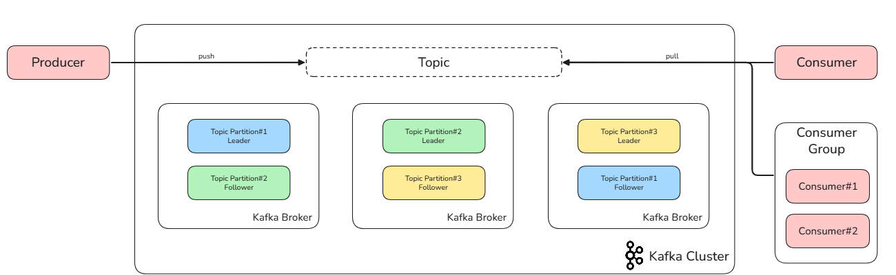
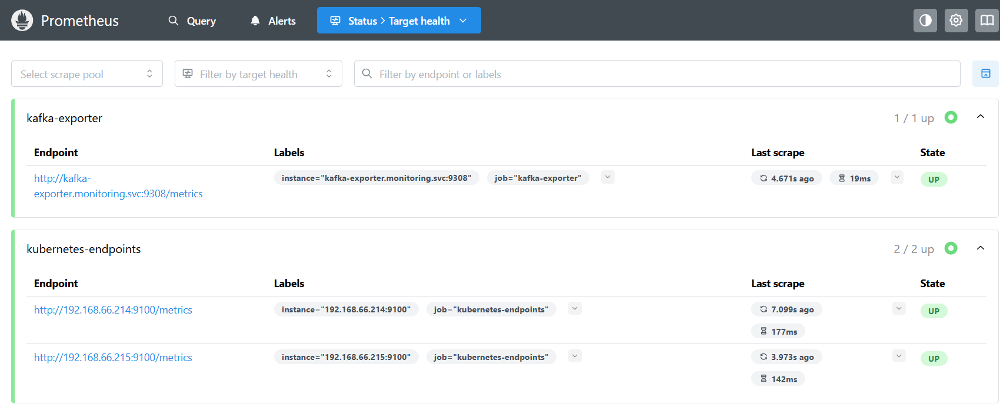
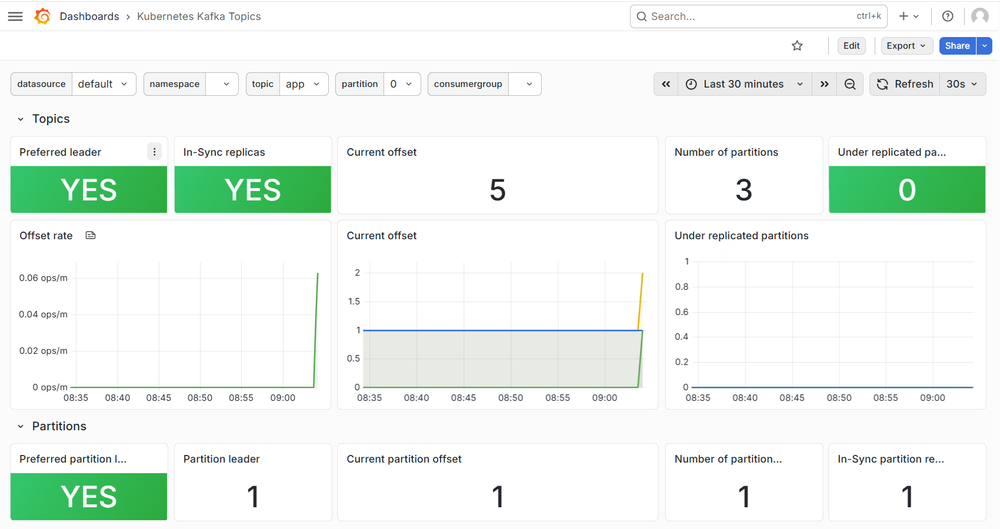

# Kafka

**Apache Kafka** is an open-source distributed streaming platform designed for high-throughput, low-latency, and fault-tolerant real-time data processing.

Previously, Kafka relied on **Apache ZooKeeper** for metadata management, which increased operational complexity. The introduction of **KRaft (Kafka Raft)** Mode (a built-in consensus protocol) eliminates this dependency, simplifying the architecture and improving scalability.

## Core Terminology

- **Producer**: An application that publishes messages to specific Kafka topics.

- **Consumer**: An application that subscribes to and processes messages.

- **Consumer Group**: A collaborative group of consumers that parallelizes message processing, ensuring each partition is handled by only one member to avoid duplication.

- **Topic**: A logical category used to organize messages.

- **Partition**: A physical subdivision of a topic. Each partition is an ordered, immutable sequence of messages. Distributing partitions across multiple brokers enables horizontal scaling and parallelism.

- **Broker**: A single Kafka server that stores data and handles client requests.

- **Replication**: The process of copying partitions across brokers for fault tolerance. Each partition has a Leader (handles all I/O) and Followers (sync data from the leader). If a leader fails, a follower is elected as the new leader.

- **Offset**: A unique identifier representing a message’s position within a partition. Consumers use offsets to track their progress, allowing them to resume exactly where they left off after a restart.

See a basic workflow:




## Deploy Kafka in Kubernetes

For learning purposes, we will deploy a single-node Kafka Broker. The manifest files are available in the: https://github.com/yijun-l/wiki-config/tree/main/infra/kafka

### Verify Deployment

After applying the manifests, verify that the Kafka pod and service are running:

```shell
$ kubectl get all -n kafka
NAME          READY   STATUS    RESTARTS   AGE
pod/kafka-0   1/1     Running   0          24h

NAME                    TYPE        CLUSTER-IP     EXTERNAL-IP   PORT(S)             AGE
service/kafka-service   ClusterIP   10.102.139.4   <none>        9092/TCP,9093/TCP   24h

NAME                     READY   AGE
statefulset.apps/kafka   1/1     24h
```

### Topic Management

Access the Kafka pod to create and manage topics using the built-in scripts.

```shell
$ kubectl exec -it kafka-0 -n kafka -- bash

# Topic 'app' with 3 partitions
$ /opt/kafka/bin/kafka-topics.sh --create --topic app --bootstrap-server localhost:9092 --partitions 3 --replication-factor 1
Created topic app.

# Topic 'db' with 2 partitions
$ /opt/kafka/bin/kafka-topics.sh --create --topic db --bootstrap-server localhost:9092 --partitions 2 --replication-factor 1
Created topic db.

## Verify and describe topics:
$ /opt/kafka/bin/kafka-topics.sh --list --bootstrap-server kafka-service.kafka.svc:9092
app
db

$ /opt/kafka/bin/kafka-topics.sh --describe --bootstrap-server kafka-service.kafka.svc:9092
Topic: app      TopicId: a-Kic2RiTF-ldilBcOeIOw PartitionCount: 3       ReplicationFactor: 1    Configs: min.insync.replicas=1
        Topic: app      Partition: 0    Leader: 1       Replicas: 1     Isr: 1  Elr:    LastKnownElr:
        Topic: app      Partition: 1    Leader: 1       Replicas: 1     Isr: 1  Elr:    LastKnownElr:
        Topic: app      Partition: 2    Leader: 1       Replicas: 1     Isr: 1  Elr:    LastKnownElr:
Topic: db       TopicId: b9z8mHOfSbWsfuXJH71doA PartitionCount: 2       ReplicationFactor: 1    Configs: min.insync.replicas=1
        Topic: db       Partition: 0    Leader: 1       Replicas: 1     Isr: 1  Elr:    LastKnownElr:
        Topic: db       Partition: 1    Leader: 1       Replicas: 1     Isr: 1  Elr:    LastKnownElr:
```

### Producer and Consumer Test

To test connectivity, we will deploy a Python-based client pod.

```yaml
apiVersion: v1
kind: Pod
metadata:
  name: py
  namespace: test
spec:
  containers:
  - name: python-client
    image: python:3.9-slim
    command: ["/bin/sh", "-c"]
    args:
      - sleep infinity
```

Run a simple Python script to test:

```shell
$ kubectl exec -it py -n test -- bash
$ pip install kafka-python

$  cat << EOF > app.py
from kafka import KafkaProducer, KafkaConsumer

producer = KafkaProducer(bootstrap_servers='kafka-service.kafka.svc:9092')
producer.send('app', b'Hello Kafka!')

consumer = KafkaConsumer('app', bootstrap_servers='kafka-service.kafka.svc:9092', auto_offset_reset='earliest')
for msg in consumer:
    print(msg.value.decode())
EOF

$  python app.py
Hello Kafka!
```

### Monitoring with Kafka Exporter

To visualize Kafka metrics, we can deploy the Kafka Exporter. Manifests are located in the: https://github.com/yijun-l/wiki-config/tree/main/infra/node-exporter

Once deployed, update `prometheus.yml` in Prometheus to scrape the Kafka Exporter endpoint.



Then you can then monitor topic traffic and offsets in Grafana Dashboard (Below is https://grafana.com/grafana/dashboards/10122-kafka-topics/):


