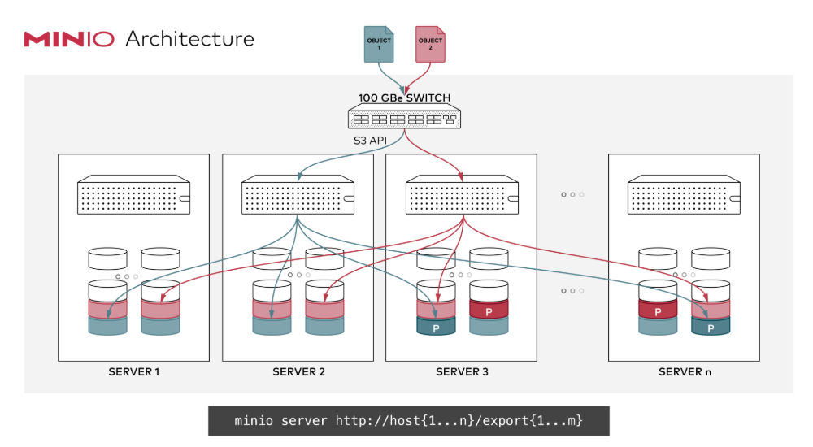
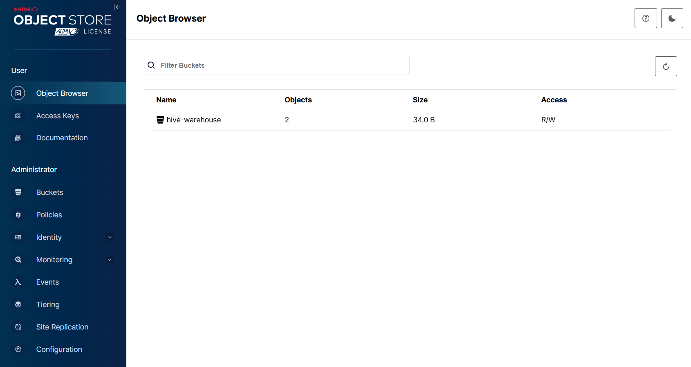

# MinIO

## Object Storage

**Object storage** is a cloud-native paradigm engineered to manage massive volumes of **unstructured data** (such as images) and **semi-structured data** (such as JSON). Unlike traditional hierarchical file systems, it uses a flat namespace, which makes it a foundational building block for modern data lake and lakehouse architectures.

In this model, each data unit is stored as an independent object, consisting of:

- **Raw Data**: the actual payload (e.g., blobs, images, logs)
- **Metadata**: customizable key-value pairs for classification and indexing
- **Unique Identifier**: a globally unique key used for retrieval

Key benefits: 
- **Massive Scalability**: enables horizontal scaling to petabyte-scale storage without service interruption
- **API-Centric Access**: all operations are performed via standard HTTP RESTful APIs, ensuring cross-platform compatibility
- **Decoupled Architecture**: storage and compute are separated, allowing independent scaling for better cost and performance optimization

### Amazon S3

**Amazon S3 (Simple Storage Service)**, introduced by AWS, was the first large-scale commercial implementation of cloud-based object storage. Beyond being a successful product, S3 established the **consistent programming model** and **API** that have since become the universal industry standard.

The S3 API provides a unified specification for the object storage data and interaction models:

- **Buckets**: Logical namespaces used to organize and isolate objects.

- **Objects**: The atomic storage units, encapsulating raw data, rich metadata, and a unique identifier.

- **Object Keys**: A unique, path-like string used for granular object retrieval within a bucket.

- **RESTful Operations**: Standardized HTTP-based methods, primarily PUT (Upload), GET (Download), DELETE, and LIST.

- **Identity and Access Management (IAM)**: Robust security mechanisms, including Bucket Policies and fine-grained access control.

Today, many storage systems implement the S3-compatible API, allowing applications to interact with different storage backends using the same interface.

## MinIO

MinIO is a high-performance, open-source object storage server that implements the S3-compatible API.



## Deploy MinIO in Kubernetes 

You can find the deployment manifests in https://github.com/yijun-l/wiki-config/tree/main/infra/hive/minio

### Check cluster status

Once deployed, you can access the MinIO pod and verify the cluster status using the MinIO Client (`mc`):

```shell
$ kubectl exec -it deployment/minio -n hive -- bash

$ mc alias set local http://127.0.0.1:9000 minioadmin minio123
Added `local` successfully.

$ mc admin info local
●  127.0.0.1:9000
   Uptime: 4 hours
   Version: 2024-10-29T16:01:48Z
   Network: 1/1 OK
   Drives: 1/1 OK
   Pool: 1

┌──────┬────────────────────────┬─────────────────────┬──────────────┐
│ Pool │ Drives Usage           │ Erasure stripe size │ Erasure sets │
│ 1st  │ 22.0% (total: 138 GiB) │ 1                   │ 1            │
└──────┴────────────────────────┴─────────────────────┴──────────────┘

1 drive online, 0 drives offline, EC:0
```

###  Manage Users and Permissions

MinIO provides fine-grained access control through users and policies. Here, we create a user and assign administrative privileges:

```shell
$ mc admin user add local test test1234
Added user `test` successfully.

$ mc admin policy attach local consoleAdmin --user test
Attached Policies: [consoleAdmin]
To User: test

$ mc admin user list local
enabled    test                  consoleAdmin
```

### Create and Configure Buckets

Buckets are the primary containers for your data. The following commands demonstrate creating a bucket and setting its access policy:
 
```shell
$ mc mb local/hive-warehouse
Bucket created successfully `local/hive-warehouse`.

$ mc anonymous set public local/hive-warehouse
Access permission for `local/hive-warehouse` is set to `public`

$ mc ls local
[2026-05-03 13:35:57 UTC]     0B hive-warehouse/
```

### Management Interface (GUI)

MinIO also provides a web-based graphical interface for basic management and verification.



Starting from the MinIO release on 2025-05-24, **the native web UI only supports object browsing** with all admin features removed. All administrative tasks require using the `mc` command-line tool. 

Details in https://github.com/minio/minio/releases/tag/RELEASE.2025-05-24T17-08-30Z


