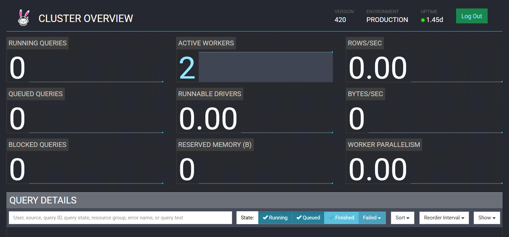
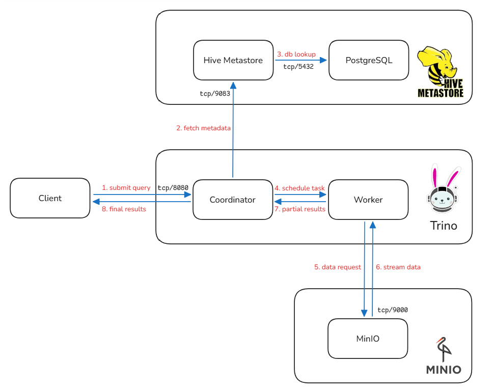
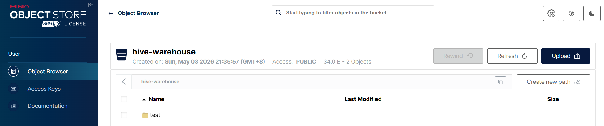

# HMS and Trino

**Object storage** systems such as MinIO provide highly durable, scalable, and cost-effective solutions for storing massive volumes of data. However, data in object storage is typically unstructured (persisted as raw binary files without schema definitions) making it unsuitable for direct SQL-based querying and traditional relational analysis.

To address this limitation, **Hive Metastore (HMS)** and **Trino** play key roles in modern data lake architectures. HMS provides a centralized metadata layer, while Trino enables distributed SQL query execution. Together, they bridge the gap between unstructured storage and structured data analytics.

## Hive Metastore (HMS)

HMS is the centralized metadata service in a data lake architecture. It acts as a unified catalog that stores database schemas, table definitions, partition information, and the physical locations of underlying data files.

Instead of interacting directly with raw object storage, query engines rely on HMS to resolve logical table definitions into actual data paths. This abstraction allows multiple compute engines to share consistent metadata and operate on the same datasets without being tightly coupled to the storage layer.

To persist metadata reliably, HMS relies on a relational database backend. It supports an embedded database (Apache Derby) for testing and lightweight deployments, as well as external databases such as PostgreSQL or MySQL for production use. All schema definitions, table metadata, and transactional information are stored in this database, making it a critical dependency in the overall architecture.

### Deploy HMS in Kubernetes

The HMS Kubernetes manifests are available at: https://github.com/yijun-l/wiki-config/tree/main/infra/hive/hms
The corresponding PostgreSQL manifests can be found at: https://github.com/yijun-l/wiki-config/tree/main/infra/hive/postgresql

Once deployed, HMS initializes its metadata schema in PostgreSQL. This can be verified by connecting to the database and listing the created tables:

```shell
$ kubectl exec -it deployment/postgres -n hive -- psql -h postgres -p 5432 -U hive -d hive_metastore
psql (14.22)

hive_metastore=# \conninfo
You are connected to database "hive_metastore" as user "hive" on host "postgres" (address "10.96.137.5") at port "5432".

hive_metastore=# \dt
                   List of relations
 Schema |             Name              | Type  | Owner
--------+-------------------------------+-------+-------
 public | BUCKETING_COLS                | table | hive
 public | CDS                           | table | hive
...
(74 rows)
```

A large number of system tables (such as `DBS`, `TBLS`, `COLUMNS_V2`, and `PARTITIONS`) should be present, indicating that the metastore schema has been successfully initialized.

## Trino

Trino is a stateless, high-performance MPP (Massively Parallel Processing) SQL query engine designed for low-latency, interactive analytics. It follows a coordinator–worker architecture, where the coordinator parses SQL queries, generates optimized execution plans, and schedules tasks across multiple worker nodes for parallel execution.

Unlike traditional data warehouses, Trino does not store data. Instead, it focuses purely on query processing, retrieving data from underlying storage systems (such as object storage) and leveraging metadata provided by services like HMS.

### Deploy Trino in Kubernetes

The Trino Kubernetes manifests are available at: https://github.com/yijun-l/wiki-config/tree/main/infra/hive/trino

Once deployed, you can connect to the Trino coordinator and verify the setup:

```shell
$ kubectl exec -it deploy/trino-coordinator -n hive -- trino

trino> SHOW CATALOGS;
 Catalog
---------
 hive
 system

trino> SHOW SCHEMAS FROM hive;
       Schema
--------------------
 default
 information_schema
```

The presence of the hive catalog and accessible schemas indicates that Trino is successfully connected to HMS and can query metadata from the metastore.

Trino also provided a GUI:



## Workflow 

The modern data lake query stack consists of three decoupled yet tightly integrated layers, forming a complete workflow for data storage, metadata management, and distributed query processing.

- **Storage Layer**: is responsible for persisting raw data in open formats such as Parquet, ORC, and Avro. MinIO provides an S3-compatible object storage interface, offering high durability and cost-efficient scalability for large-scale datasets.

- **Metadata Layer**: is managed by **HMS**, which stores table schemas, partition information, and the physical locations of data files in object storage. It abstracts raw object files into logical relational tables, enabling compute engines to interact with structured metadata instead of raw storage paths.

- **Compute Layer**: is handled by **Trino**, a distributed SQL engine that connects to HMS for metadata discovery and executes parallel query processing over data stored in MinIO. It performs query planning, task scheduling, and distributed execution, returning results to client applications.

### End-to-End Query Workflow

A typical query execution flow is as follows:

1. Client applications submit SQL queries to the Trino coordinator.
2. The coordinator retrieves metadata (schemas, partitions, and file locations) from HMS.
3. Trino workers read raw data directly from MinIO via the S3 protocol.
4. Trino performs distributed computation and returns the final result set to the client.



### Verify in Kubernetes

After deployment, the full stack can be validated by checking all running components:

```shell
$ kubectl get po -n hive
NAME                                 READY   STATUS    RESTARTS   AGE
hive-metastore-0                     1/1     Running   0          13h
minio-664ffc94d8-wqjgx               1/1     Running   0          2d4h
postgres-c4559f698-8rm2v             1/1     Running   0          13h
trino-coordinator-6f98cdd99b-phdvg   1/1     Running   0          11h
trino-worker-595679fb9c-q5lgc        1/1     Running   0          11h
```

Connect to the Trino coordinator and create a test table and Insert sample data:

```shell
$ kubectl exec -it deploy/trino-coordinator -n hive -- trino

trino> CREATE TABLE hive.default.test_minio (id INT, name VARCHAR) WITH (format = 'TEXTFILE', external_location = 's3a://hive-warehouse/test/');
CREATE TABLE

trino> INSERT INTO hive.default.test_minio VALUES (1, 'hello-minio');
INSERT: 1 row

trino> SELECT * FROM hive.default.test_minio;
 id |    name
----+-------------
  1 | hello-minio
```




