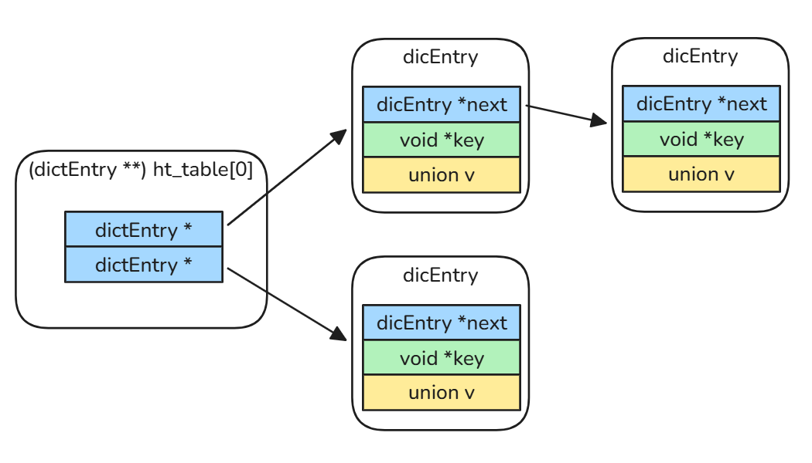
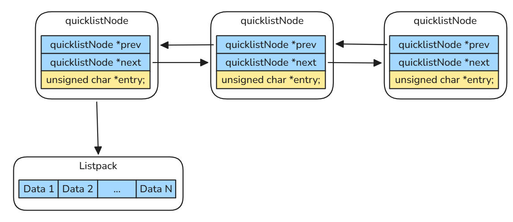
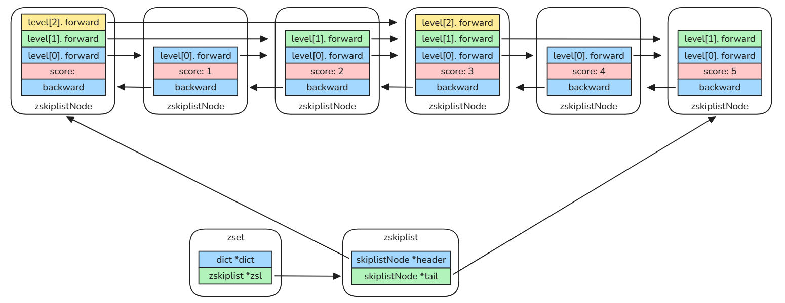
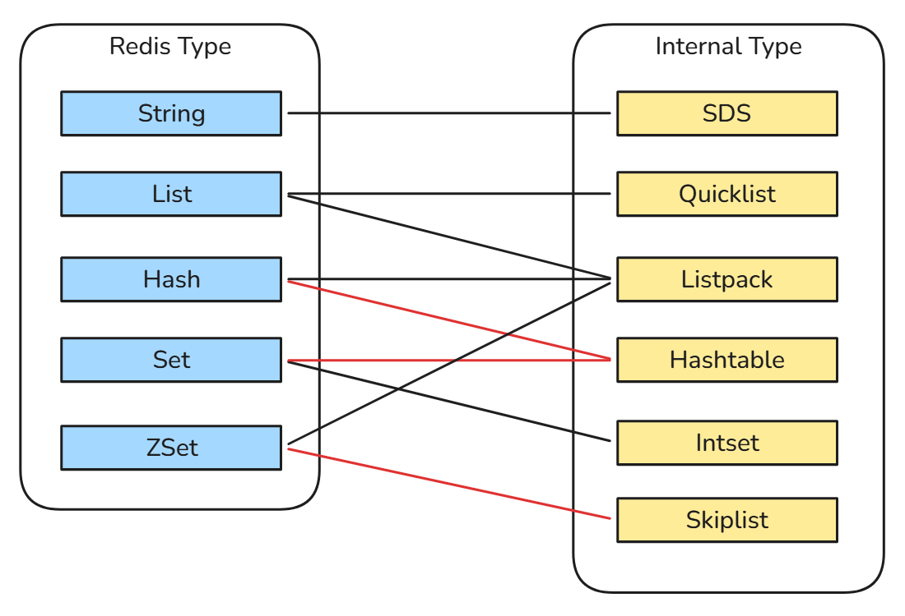

# Redis

**Redis (Remote Dictionary Server)** is an open-source, in-memory data structure store widely utilized as a database, cache, and message broker. It delivers exceptional performance, supporting hundreds of thousands of operations per second with sub-millisecond latency.

## Core Data Structures

At its essence, **Redis is a key-value store**: all data is accessed via **a unique string-based key**, while only the **value storage format** and **internal metadata** vary across different data types.

Redis achieves its high performance through its **hashtable** implementation, which enables average **O(1)** time complexity for key lookups.

All code snippets in this article are based on **Redis 7.2.6**, the most stable and widely used production release.

```c
// src/dict.h
struct dict {
    dictType *type;

    dictEntry **ht_table[2];
    unsigned long ht_used[2];

    long rehashidx; /* rehashing not in progress if rehashidx == -1 */

    /* Keep small vars at end for optimal (minimal) struct padding */
    int16_t pauserehash; /* If >0 rehashing is paused (<0 indicates coding error) */
    signed char ht_size_exp[2]; /* exponent of size. (size = 1<<exp) */

    void *metadata[];           /* An arbitrary number of bytes (starting at a
                                 * pointer-aligned address) of size as defined
                                 * by dictType's dictEntryBytes. */
};

// src/dict.c
struct dictEntry {
    void *key;
    union {
        void *val;
        uint64_t u64;
        int64_t s64;
        double d;
    } v;
    struct dictEntry *next;     /* Next entry in the same hash bucket. */
    void *metadata[];           /* An arbitrary number of bytes (starting at a
                                 * pointer-aligned address) of size as returned
                                 * by dictType's dictEntryMetadataBytes(). */
};
```



### Strings

**Strings** are the most fundamental binary-safe data type in Redis, widely used for caching, configuration, and atomic counters. 

Instead of null-terminated C strings, Redis uses **SDS (Simple Dynamic String)** for **all keys** and **string values**. SDS provides **O(1)** length lookup through a dedicated len field, ensures binary safety, and avoids buffer overflow issues common in traditional C string handling.

To reduce memory overhead, Redis uses **compact packed headers** (such as `sdshdr8`) that eliminate padding and store both the current length and allocated capacity for efficient memory management:

```c
// src/sds.h
struct __attribute__ ((__packed__)) sdshdr8 {
    uint8_t len; /* used */
    uint8_t alloc; /* excluding the header and null terminator */
    unsigned char flags; /* 3 lsb of type, 5 unused bits */
    char buf[];
};
```

### Lists

**Lists** are ordered collections used for queues, task pipelines, and message buffering. They support **O(1)** operations at both ends (e.g., `LPUSH`, `RPOP`). 

Modern Redis implements lists using **Quicklist**, a hybrid structure that combines a doubly linked list with compact **Listpacks**, balancing memory efficiency and performance.

A `quicklistNode` is a node in the doubly linked list, each pointing to a **Listpack**.

```c
// src/quicklist.h
/* quicklistNode is a 32 byte struct describing a listpack for a quicklist.
 * We use bit fields keep the quicklistNode at 32 bytes.
 * count: 16 bits, max 65536 (max lp bytes is 65k, so max count actually < 32k).
 * encoding: 2 bits, RAW=1, LZF=2.
 * container: 2 bits, PLAIN=1 (a single item as char array), PACKED=2 (listpack with multiple items).
 * recompress: 1 bit, bool, true if node is temporary decompressed for usage.
 * attempted_compress: 1 bit, boolean, used for verifying during testing.
 * extra: 10 bits, free for future use; pads out the remainder of 32 bits */
typedef struct quicklistNode {
    struct quicklistNode *prev;
    struct quicklistNode *next;
    unsigned char *entry;
    size_t sz;             /* entry size in bytes */
    unsigned int count : 16;     /* count of items in listpack */
    unsigned int encoding : 2;   /* RAW==1 or LZF==2 */
    unsigned int container : 2;  /* PLAIN==1 or PACKED==2 */
    unsigned int recompress : 1; /* was this node previous compressed? */
    unsigned int attempted_compress : 1; /* node can't compress; too small */
    unsigned int dont_compress : 1; /* prevent compression of entry that will be used later */
    unsigned int extra : 9; /* more bits to steal for future usage */
} quicklistNode;
```

Inside a Listpack, elements are stored contiguously to eliminate pointer overhead. Each entry consists of:

- **Encoding** (header): type + length information
- **Data** (payload): binary-safe content
- **Backlen** (tail): length of the current entry (used for backward traversal)



### Hashes

**Hashes** are maps between string fields and string values, making them the perfect data type to represent objects (e.g., a User profile with fields like `name`, `email`, and `age`).

In modern Redis, Hashes are initially stored as a **Listpack** to minimize memory overhead through tight encoding. As the number of fields grows or individual values exceed specific limits, Redis transparently converts the structure into a **Hashtable** (`struct dict`), ensuring **O(1)** average time complexity for field lookups.

### Sets

**Sets** are unordered collections of unique strings. They are highly efficient for membership testing and performing set theory operations like intersections (`SINTER`), unions (`SUNION`), and differences (`SDIFF`), which are commonly used for social graphs or tagging systems.

For sets containing only integers, Redis uses a highly memory-efficient **Intset**. Once a string is added or the set grows beyond a certain size, it transitions to a **Hashtable** (`struct dict`) where the members are stored as keys and the values are set to NULL.

```c
// src/intset.h
typedef struct intset {
    uint32_t encoding;
    uint32_t length;
    int8_t contents[];
} intset;
```

### Sorted Sets (ZSets)

**Sorted Sets** are similar to **Sets** but associate every member with a floating-point score. This keeps members permanently ordered by score, supporting efficient range queries such as fetching the top 10 players, making ZSets ideal for leaderboards and priority queues.

For small-sized ZSets, Redis uses a compact **Listpack** layout to save memory, storing member-score pairs sequentially with linear **O(n)** lookup performance. Once the entry count or member size exceeds configured limits, Redis automatically upgrades to a dual-structure design: a **Hashtable** and a **Skip List**. The **Hashtable** enables **O(1)** score lookups by mapping each member directly to its score. The **Skip List** delivers **O(log N)** time complexity for ordered insertions, deletions, and range traversals; it maintains multi-level linked nodes to achieve balanced-tree search efficiency without complex tree rebalancing overhead.

```c
// src/server.h
/* ZSETs use a specialized version of Skiplists */
typedef struct zskiplistNode {
    sds ele;
    double score;
    struct zskiplistNode *backward;
    struct zskiplistLevel {
        struct zskiplistNode *forward;
        unsigned long span;
    } level[];
} zskiplistNode;

typedef struct zskiplist {
    struct zskiplistNode *header, *tail;
    unsigned long length;
    int level;
} zskiplist;

typedef struct zset {
    dict *dict;
    zskiplist *zsl;
} zset;
```



A summary of the relationship between **Redis Basic Data Types** and their **Internal Data Structures**.



## Persistence Mechanisms

Since Redis stores data primarily in memory, persistence is essential to prevent data loss after crashes or restarts. Redis provides two complementary persistence mechanisms: **RDB** and **AOF**.

### RDB (Redis Database)

**RDB** persistence creates compact binary snapshots of the entire dataset at configurable time intervals. Snapshots can be triggered automatically using the `save` configuration or manually with commands such as `SAVE` and `BGSAVE`.

During `BGSAVE`, Redis forks a child process to write the snapshot to disk while the parent process continues serving requests. This **copy-on-write** mechanism minimizes service interruption and keeps runtime performance efficient.

However, **RDB** snapshots are periodic rather than continuous. If Redis crashes before the next snapshot is generated, recently written data may be lost.

### AOF (Append Only File)

**AOF** persistence logs every write operation received by Redis in an append-only format. On restart, Redis reconstructs the dataset by replaying the recorded commands sequentially.

Compared with **RDB**, **AOF** provides stronger durability guarantees because write operations are persisted more frequently. Redis supports multiple fsync policies:

- `always`: `fsync` after every write for maximum durability
- `everysec`: `fsync` once per second (recommended default)
- `no`: rely on the operating system for flushing

To prevent unlimited file growth, Redis periodically rewrites the `AOF` file in the background. The rewritten file contains the minimal set of commands required to rebuild the current dataset, significantly reducing file size.

### Hybrid Persistence

Modern Redis deployments often enable both RDB and AOF simultaneously. In this hybrid approach:

- **RDB** provides fast recovery and compact snapshots
- **AOF** provides stronger durability and minimizes data loss

Redis 4.0 introduced mixed persistence, where an **AOF** rewrite can embed an **RDB** snapshot as a base image followed by incremental AOF commands. This significantly improves restart speed while retaining **AOF** durability benefits.

## High Availability & Scalability

Redis provides several mechanisms to improve fault tolerance, availability, and horizontal scalability in production environments.

### Replication

**Redis replication** uses a primary-replica architecture. The primary node handles write operations, while replicas asynchronously synchronize data from the primary.

Replication provides several benefits:

- Data redundancy for fault tolerance
- Read scaling by distributing read requests across replicas
- Backup nodes for failover scenarios

Synchronization typically begins with a full sync, where the replica receives an RDB snapshot from the primary. Afterward, incremental updates are propagated through the replication stream.

Because replication is asynchronous by default, replicas may temporarily lag behind the primary under heavy write workloads.

### Sentinel

**Redis Sentinel** is a distributed monitoring and failover system designed for high availability in replicated environments.

Sentinel continuously monitors Redis instances and performs several critical tasks:

- Detects primary node failures
- Automatically promotes a replica to become the new primary
- Reconfigures remaining replicas
- Notifies clients about topology changes

A Sentinel deployment usually consists of multiple Sentinel nodes to avoid split-brain scenarios and improve decision reliability through quorum voting.

Sentinel significantly improves operational resilience, but it does not provide automatic sharding or distributed data partitioning.

### Redis Cluster

**Redis Cluster** provides native horizontal scalability through automatic data sharding.

The cluster divides the keyspace into 16,384 hash slots, which are distributed across multiple nodes. Each node is responsible for a subset of slots, allowing data and traffic to scale horizontally.

Clients communicate directly with the appropriate node based on the key's hash slot. If a node fails, its replica can be automatically promoted to maintain availability.

Redis Cluster eliminates the single-node memory limitation and enables large-scale distributed deployments. However, it also introduces operational complexity, cross-slot limitations, and stricter requirements for client-side cluster awareness.

## Deploy Redis Replication in Kubernetes

The Redis manifests are available at: https://github.com/yijun-l/wiki-config/tree/main/infra/redis

After deployment, verify that all Redis Pods are running correctly:

```shell
$ kubectl get po -n redis
NAME         READY   STATUS    RESTARTS   AGE
redis-ss-0   1/1     Running   0          84s
redis-ss-1   1/1     Running   0          58s
redis-ss-2   1/1     Running   0          31s
```

Check the replication topology from the primary node:

```shell
$ kubectl exec -it redis-ss-0 -n redis -- redis-cli info replication
# Replication
role:master
connected_slaves:2
slave0:ip=10.244.4.68,port=6379,state=online,offset=98,lag=0
slave1:ip=10.244.3.236,port=6379,state=online,offset=98,lag=0
master_failover_state:no-failover
master_replid:8075d506ae47a80c5aa68a40f067a5c050e2f5e7
master_replid2:0000000000000000000000000000000000000000
master_repl_offset:98
second_repl_offset:-1
repl_backlog_active:1
repl_backlog_size:1048576
repl_backlog_first_byte_offset:1
repl_backlog_histlen:98
```

Write test data into the primary node, and verify that the replicas receive the data:

```shell
$ kubectl exec -it redis-ss-0 -n redis -- redis-cli set test "hello redis!"
OK

$ kubectl exec -it redis-ss-1 -n redis -- redis-cli get test
"hello redis!"

$ kubectl exec -it redis-ss-2 -n redis -- redis-cli get test
"hello redis!"
```