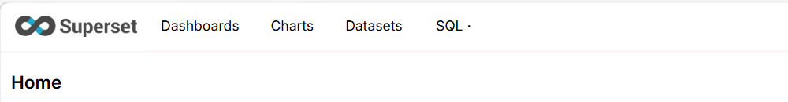
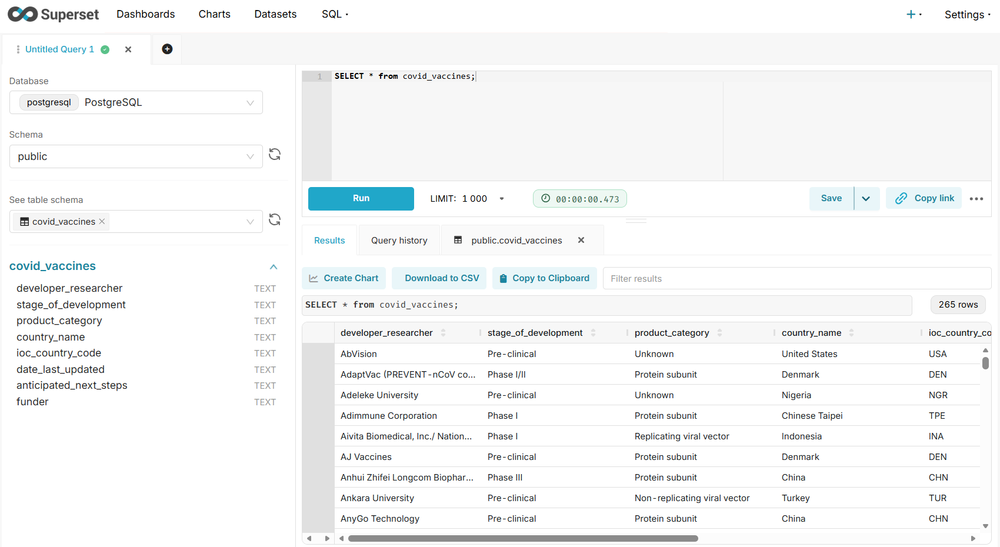
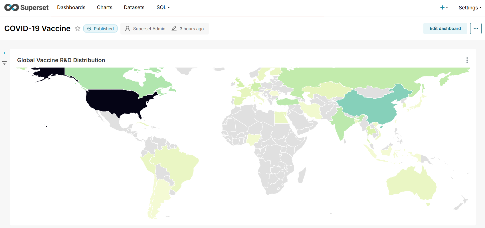

# Superset

**Apache Superset** is a leading open-source, cloud-native **Business Intelligence (BI)** and data visualization platform. Designed for self-service analytics and interactive data exploration, Superset provides a lightweight visualization layer, leaving data storage and heavy computation to external modern data engines (e.g., PostgreSQL, ClickHouse, Trino, Snowflake).

Key features:

- **Intuitive Exploration**: Drag-and-drop chart building with a rich visualization library.
- **Powerful SQL IDE**: SQL Lab with query history and saved queries for deep analytics.
- **Enterprise-Ready**: Role-Based Access Control (RBAC) and high scalability.
- **Extensive Connectivity**: Native support for any database compatible with Python's SQLAlchemy.

## The Data & UI Object Model

The core workflow of Superset follows a strict hierarchical pipeline. To deliver insights to end-users, data flows through four progressive abstractions: `Database > Dataset > Chart > Dashboard`, which correspond to the main navigation structure in the Superset UI.



**Database**: The foundation layer. It manages the connection string, authentication, and access protocols to an external data source, allowing Superset to send queries without holding actual business data.

**Dataset**: A logical view curated from a Database. It can wrap a physical table, a database view, or a custom SQL query. It is where you define business logic, such as column types, metrics (aggregations), and default time fields. Crucially, all visualizations must be built upon a Dataset, not directly on a raw Database.

**Chart**: A standalone visualization (e.g., bar chart, map, table) built from a single Dataset. It encapsulates specific query configurations, filters, metrics, and chart-specific styles. Each chart independently triggers its underlying query upon interaction.

**Dashboard**: The final, customer-facing deliverable. It acts as a unified canvas that aggregates multiple Charts. Dashboards manage layout grid, provide cross-chart filtering, and deliver the final analytical story to stakeholders without querying the database directly.

Superset focuses on the visualization and analytics layer, while storage and computation are handled by external databases or data lake engines.

## System Architecture & Components

To sustain the object model and data flow described above, Superset utilizes a cloud-native architecture consisting of five interactive components:

**Frontend UI (React)**: The visual interface where users interact with SQL Lab, edit charts, and explore dashboards. It communicates with the backend via REST APIs.

**Backend Service (Flask)**: The engine room. Written in Python, it handles user authentication, authorization (RBAC), API routing, and orchestrates incoming frontend requests into native SQL queries.

**Metadata Database (PostgreSQL/MySQL)**: The platform’s memory. It stores only Superset's application data (users, dashboards, chart configurations, and database credentials)—never the actual business data.

**External Data Sources**: The muscle. Since Superset is storage-less, all heavy lifting and analytical calculations are executed live on these connected databases or data lakes.

**Cache & Async Workers (Redis + Celery)**: The performance booster. In production, Redis caches query results to prevent DB overloading, while Celery handles long-running SQL Lab queries and scheduled reports asynchronously to guarantee a snappy user experience.

## Deploy Superset in Kubernetes

The customized `values.yaml` configuration file used for this deployment is available at: https://github.com/yijun-l/wiki-config/tree/main/infra/superset

Add the official repository and install the chart:

```shell
$ helm repo add superset https://apache.github.io/superset
$ helm upgrade --install superset superset/superset -n bi -f values.yaml

$ kubectl get po -n bi
NAME                               READY   STATUS      RESTARTS   AGE
superset-6b456cd9df-lbj7b          1/1     Running     0          32h
superset-init-db-nxzlf             0/1     Completed   0          32h
superset-postgresql-0              1/1     Running     0          32h
superset-redis-master-0            1/1     Running     0          32h
superset-worker-6679c47c77-7r75c   1/1     Running     0          32h

$ kubectl exec -it -n bi deployment/superset -- superset version
Superset 5.0.0
```

### Provisioning External Database Connection
1. Access the Superset GUI via your browser and log in with the default credentials (`admin` // `admin`).
2. Navigate to **"Settings - Database Connections"**, and click the **"+ Database"** button.
3. Configure the connection details as follows:
   - Step 1 (Engine): Select **PostgreSQL**
   - Step 2 (Parameters):
     - Host: `superset-postgresql`
     - Port: `5432`
     - Database name: `superset`
     - Username: `superset`
     - Password: `superset`
   - Step 3: Click **"Finish"** to establish the connection string.
4. Click **"Edit"** on the newly added database connection. Navigate to **"Advanced - Security"**, check the option **"Allow file uploads to database"**, and save the changes.

### Ingesting Sample Data and Customizing Datasets

Download the official example from the Apache Superset repository: https://github.com/apache-superset/examples-data/blob/master/datasets/examples/covid_vaccines.csv

1. Navigate to **"+ - Data - Upload CSV to database"**.
2. Configure the ingestion properties:
   - CSV File: `covid_vaccines.csv` 
   - Database: `PostgreSQL` 
   - Schema: `public` 
   - Table Name: `covid_vaccines`
3. Click **"Upload"** to trigger the background processing.

Upon successful upload, a physical table named **"covid_vaccines"** will be created inside the PostgreSQL **"superset"** database. Concurrently, Superset will automatically abstract this database subset into a logical **Dataset** with the same name, making it available for subsequent chart generation.

We can check the DB details in **"SQL - SQL Lab"**



### Creating Charts and Dashboards

1. Navigate to **"Datasets"** and click on the "**covid_vaccines**" dataset to open the Chart Exploration workflow.
2. Configure the chart with the following visualization properties:
   - Visualization Type: `World Map`
   - Country Column: `ioc_country_code` 
   - Country Field Type: `code International Olympic Committee`
   - Metrics: `COUNT(*)`
3. Click **"Update chart"** to compile the query and render the **"Global Vaccine R&D Distribution"** map.
4. Click **"Save"** to add this standalone chart to a newly created Dashboard **"COVID-19 Vaccine"**, which serves as the final, customer-facing delivery product.

