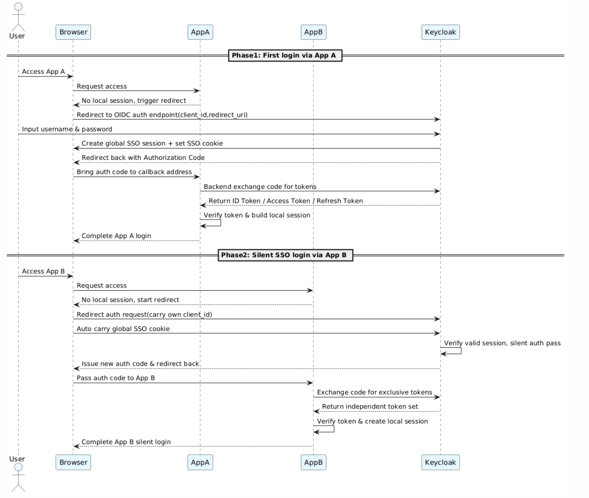
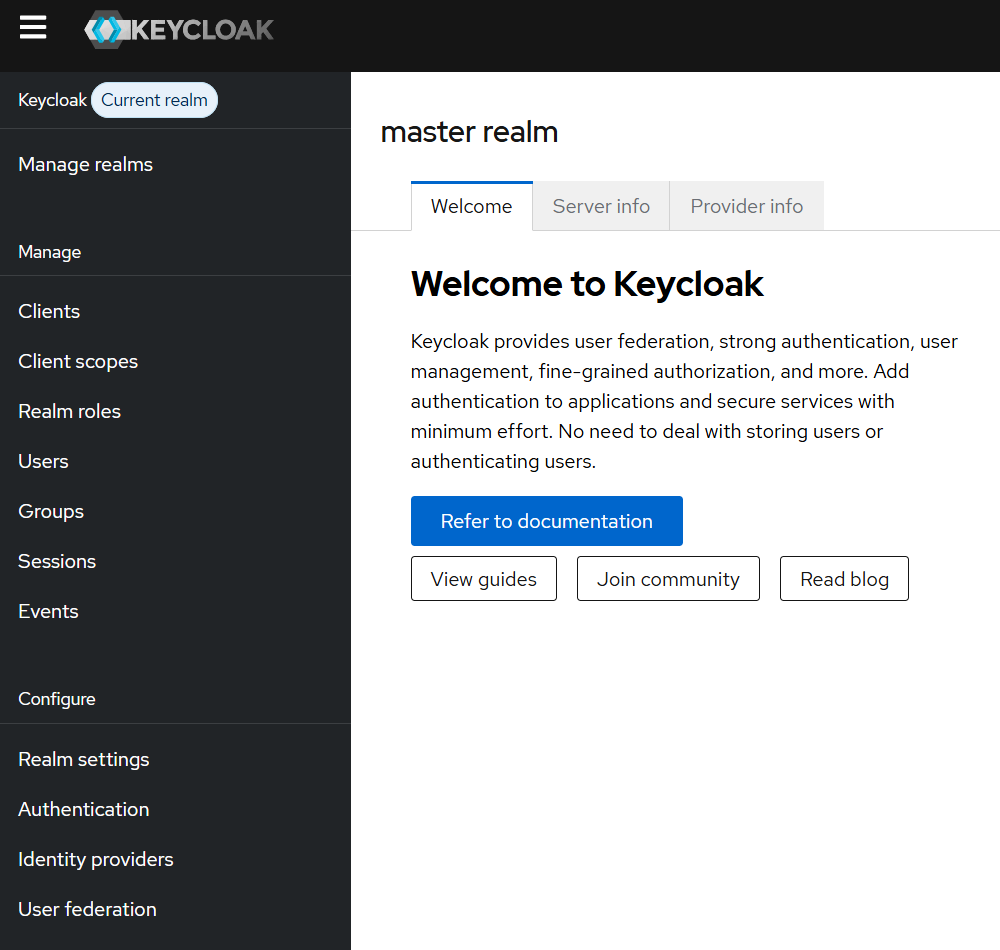
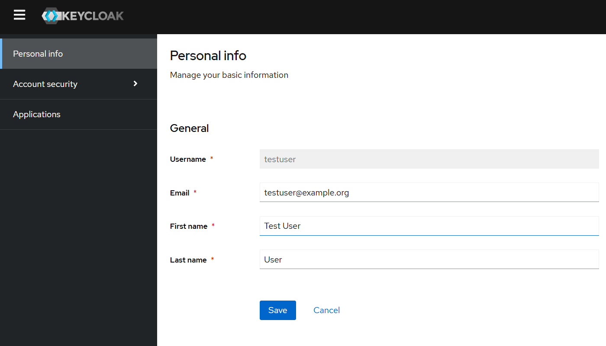

# Keycloak

Modern cloud-native microservice architectures require centralized identity authentication and access control. To eliminate fragmented login logic, inconsistent permission management, and security risks across distributed systems, **Keycloak** provides enterprise-grade **Identity and Access Management (IAM)** capabilities, including SSO, authentication, authorization, and identity federation.

## SSO

**Single Sign-On (SSO)** is a centralized identity authentication mechanism that allows users to access multiple independent applications and services after a single login. By leveraging standard security protocols, SSO removes repetitive authentication steps, improves user experience, and enables unified enterprise access governance.

In distributed and cloud-native environments, independently implemented login systems often result in fragmented identities, inconsistent authorization policies, and increased operational complexity. SSO centralizes identity verification, session management, and token issuance through a trusted **Identity Provider (IdP)**. Once authenticated, users can securely access multiple applications without re-entering credentials.

Modern SSO implementations commonly rely on industry-standard protocols such as **OAuth 2.0**, **OpenID Connect (OIDC)**, and **SAML 2.0**, enabling secure and interoperable authentication across web applications, APIs, and microservices.

### The SSO Verification Process Between Two Applications (OIDC Flow)

To understand how single sign-on works in practice, consider an ecosystem with an **Identity Provider (Keycloak)** and two separate web applications: **App A** and **App B**. The standard OIDC Authorization Code Flow operates as follows:



#### Phase 1: Initial Authentication Through App A

**Scenario**: No existing local session and no global SSO session in the browser.

1. The user accesses App A, which detects no valid local login session.
2. App A redirects the browser to Keycloak’s OIDC authorization endpoint with standard parameters including client_id and redirect_uri.
3. The user completes credential verification on the Keycloak login page to finish identity authentication.
4. Keycloak creates a global cross-app SSO session and writes the root-domain SSO cookie to the browser.
5. Keycloak generates a one-time authorization code and redirects the browser back to App A via the registered callback address.
6. App A’s backend requests Keycloak’s token endpoint to exchange the authorization code for valid tokens.
7. Keycloak verifies the request and returns standard OIDC tokens: ID Token, Access Token and optional Refresh Token.
8. App A validates the token validity and establishes an independent local application session.

#### Phase 2: Silent SSO Authentication Through App B

**Scenario**: Browser holds valid Keycloak global SSO session, but App B has no local session.

1. The user accesses App B, which has no valid local login session.
2. App B redirects the browser to Keycloak’s OIDC endpoint with its exclusive client_id and redirect URI.
3. The browser carries the global SSO cookie to Keycloak, which completes silent authentication without repeated password input.
4. Keycloak issues a new exclusive one-time authorization code for App B.
5. App B’s backend exchanges the received authorization code for a dedicated set of OIDC tokens.
6. App B verifies the tokens and creates an independent local session, completing cross-app SSO login.

## Keycloak Core Components

Keycloak is an open-source IAM solution designed to streamline SSO implementation. Its core capabilities can be mapped directly to the logical divisions found in its administrative console:

**Realms**: The top-level administrative boundary. A realm manages a distinct set of users, credentials, roles, and groups. The default Master realm is reserved for global administration, while custom realms isolate specific application ecosystems.

**Clients**: Applications and services that request Keycloak to authenticate users. Clients can be configured as Public (e.g., Single Page Apps, Mobile Apps) or Confidential (e.g., traditional backend web apps requiring a client secret).

**Client Scopes**: A mechanism to limit the claims and roles encoded within a token. When a client requests access, it specifies scopes (e.g., profile, email) to define what user data Keycloak should share.

**User Federation**: Bridges Keycloak with existing enterprise user directories like LDAP or Active Directory, syncing or federating users dynamically.

**Identity Providers (IdP)**: Enables social login (Google, GitHub) or enterprise federation (OIDC/SAML IdPs), allowing Keycloak to act as a broker.

**Authentication Flows**: Highly customizable pipelines that dictate the exact steps required for user interactions, such as browser logins, registration, password resets, and execution of **multi-factor authentication (MFA)**.

## Deploy Keycloak in Kubernetes

The manifests are available at: https://github.com/yijun-l/wiki-config/tree/main/infra/sso

### Verify the Deployment

After applying the manifests, verify that all core component Pods (**Keycloak**, **OpenLDAP**, and **PostgreSQL**) are running correctly:

```shell
$ kubectl get po -n sso
NAME                        READY   STATUS    RESTARTS   AGE
keycloak-6dd7958d5b-npvws   1/1     Running   0          2d5h
openldap-d8ff4f5dc-cjq5g    1/1     Running   0          47h
postgres-9f768c46c-vccvb    1/1     Running   0          2d5h
```

### Initialize OpenLDAP Data

Exec into the OpenLDAP container to create the initial organizational units (OUs) and a test user.

```shell
$ kubectl exec -it deployment/openldap -n sso -- bash

$ cat << EOF > /tmp/init.ldif
dn: ou=users,dc=example,dc=org
objectClass: organizationalUnit
ou: users

dn: ou=groups,dc=example,dc=org
objectClass: organizationalUnit
ou: groups

dn: uid=testuser,ou=users,dc=example,dc=org
objectClass: inetOrgPerson
objectClass: organizationalPerson
objectClass: person
cn: Test User
sn: User
uid: testuser
userPassword: password123
mail: testuser@example.org
EOF

$ ldapadd -x -D "cn=admin,dc=example,dc=org" -w "admin123" -f /tmp/init.ldif
adding new entry "ou=users,dc=example,dc=org"
adding new entry "ou=groups,dc=example,dc=org"
adding new entry "uid=testuser,ou=users,dc=example,dc=org"
```

### Configure Keycloak User Federation

#### 1. Access Keycloak Admin Console

Open your browser, navigate to Keycloak Admin URL, and log in with your admin credentials (`admin` / `admin123`).



#### 2. Create a Realm

Navigate to **"Manage realms"** and click **"Create realm"** to create a custom realm.

#### 3. Add LDAP Provider

- Navigate to **"User federation"** and click **"Add ldap providers"**
- Configure the LDAP provider, and click **"Save"**
   - UI display name: `openldap`
   - Vendor: `Other`
   - Connection URL: `ldap://openldap.sso.svc:389`
   - Bind type: `simple`
   - Bind DN: `cn=admin,dc=example,dc=org`
   - Bind credentials: `admin123`
   - Edit mode: `WRITABLE`
   - Users DN: `ou=users,dc=example,dc=org`
   - Username LDAP attribute: `uid`
   - RDN LDAP attribute: `uid`
   - UUID LDAP attribute: `entryUUID`
   - User object classes: `inetOrgPerson, organizationalPerson, person`
- After saving, click **"Action"** in the top right and select **"Sync all users"**. You should see a success message: **"Sync of users finished successfully. 1 users added, 0 users updated, 0 users removed, 0 users failed."**

#### 4. Verify SSO Login

To test the integration, navigate to the Keycloak account console for the new realm: http://keycloak.local:30257/realms/OpenLDAP/account/

Log in using the test user credentials
- Username / Email: `testuser` (or `testuser@example.org`)
- Password: `password123`


