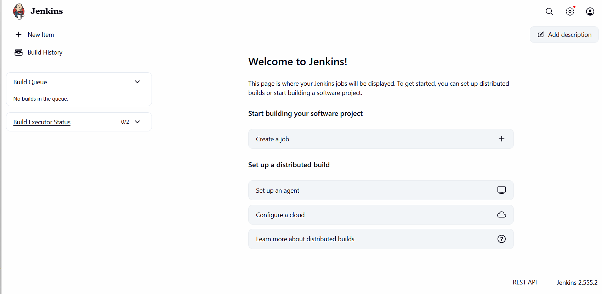
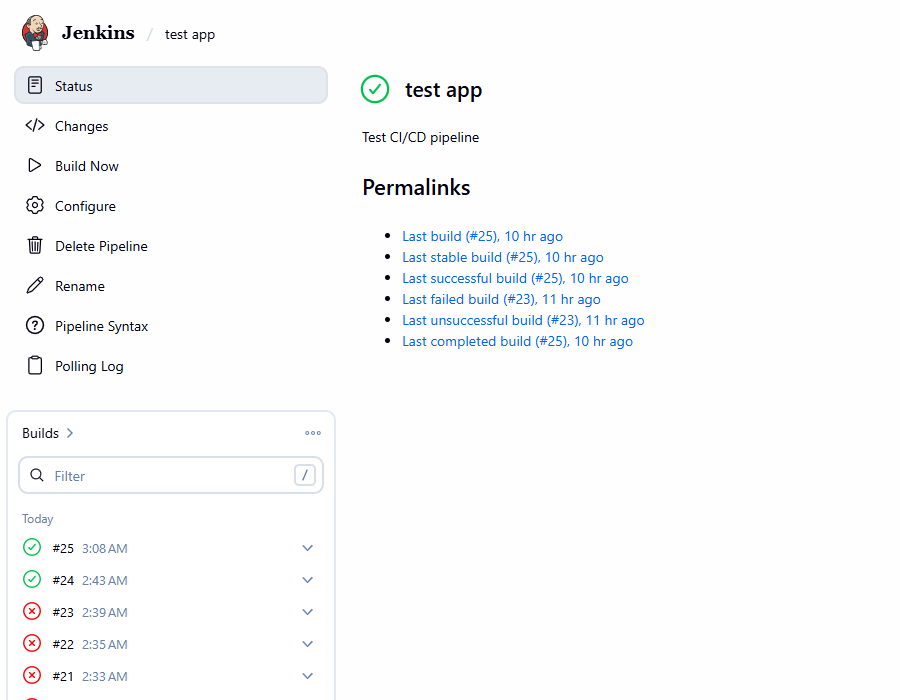
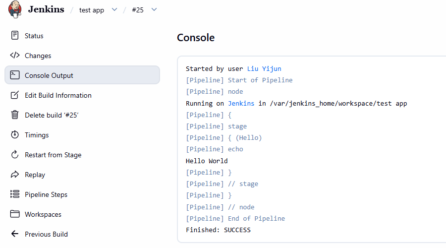

# Jenkins

While modern GitOps and container-native CI/CD tools have reshaped the DevOps landscape, Jenkins remains a foundational pillar in enterprise automation. Originally built for static, server-based environments, Jenkins has evolved into a versatile, programmable orchestration engine capable of bridging legacy infrastructure with cloud-native workflows.

## Core Functionality

At its core, Jenkins is an open-source automation server designed to orchestrate **continuous integration (CI)** and **continuous delivery (CD)** workflows. In a cloud-native context, its primary responsibilities shift from simple code compilation to end-to-end pipeline lifecycle management.

### Pipeline as Code (Groovy DSL)

Rather than relying on manual UI configurations, Jenkins defines workflows through a `Jenkinsfile` using a Groovy-based **Domain Specific Language (DSL)**. This allows pipelines to be version-controlled, audited, and treated with the same rigor as application code.

### Infrastructure Provisioning & Orchestration

While tools like **Argo CD** handle GitOps-driven deployment inside Kubernetes, Jenkins excels at the "outer loop" of orchestration. It triggers cloud-native infrastructure setup (via Terraform), interacts with cloud provider APIs (Azure, AWS), and dispatches downstream deployment workflows.

### Strong Extensibility

With a vast ecosystem of over 1,800 plugins, Jenkins serves as the "universal glue." It bridges isolated systems including legacy internal order management APIs, relational databases and enterprise security scanners, linking them to modern container registries and Kubernetes clusters.

## Internal Components

Jenkins supports complex enterprise automation workloads through a decoupled, distributed execution architecture. The core components and their operational mechanisms are defined as follows:

### The Controller (Formerly Master Node)

**The Controller** serves as the central management node of a Jenkins instance. It is not designed to execute resource-intensive build and workload tasks. Its core responsibilities cover:

- Hosting web user interface and HTTP API services
- Parsing and compiling Groovy scripts defined in `Jenkinsfile`
- Managing build task scheduling, project configuration and credential management
- Orchestrating the full lifecycle of distributed execution agents

### Agents (Executors)

**Agents** are execution nodes responsible for running all pipeline-defined operational steps. Traditional Jenkins deployments rely on persistent virtual machine agents, while cloud-native architectures utilize the Jenkins Kubernetes plugin to provision ephemeral Pod-based agents dynamically.

- Agent Pods are created on demand when pipeline stages are triggered
- Single Pod agents support multi-container configuration for differentiated tasks, such as Maven containers for project building and kubectl containers for Kubernetes deployment
- Agent Pods are automatically terminated upon stage completion, ensuring no idle resource consumption and providing a clean execution environment for every build task

### Plugins & Security Mechanisms

**Plugin Management**: Jenkins leverages Java bytecode plugins to expand native functionalities. It adopts **Jenkins Configuration as Code (JCasC)** to unify plugin deployment specifications and remove manual configuration work in cloud-native production scenarios.

**Credential Security Management**: The built-in Credentials Plugin provides a secure isolated subsystem on the Controller node. It encrypts and centrally stores sensitive resources including SSH keys, cloud service principals and kubeconfig files, and injects credentials into agent execution environments dynamically without exposing plaintext data in build logs.

## Deploy Jenkins in Kubernetes

The manifests are available at: https://github.com/yijun-l/wiki-config/tree/main/infra/jenkins

After applying the manifests, verify that the Jenkins Pod is up and running:

```shell
$ kubectl get po -n jenkins
NAME                      READY   STATUS    RESTARTS   AGE
jenkins-6c77469fc-kvcw6   1/1     Running   0          7m26s
```

### Initial Setup and Authentication

When accessing the Jenkins GUI for the first time, you will be prompted to unlock it using an initial administrator password. Retrieve this password by executing the following command inside the container:

```shell
$ kubectl exec -it deploy/jenkins -n jenkins -- cat /var/jenkins_home/secrets/initialAdminPassword
d4a034733f0a4a979a5d7296bae18f06
```

For this setup, skip the default plugin installation wizard and proceed to create the initial Admin User.



### Running a Test Pipeline

To verify the installation, you can create a minimal, "Hello World" smoke-test pipeline.

1. In the Jenkins dashboard, click **"Create a job"** (or **"New Item"**)
2. Enter a name for the job (e.g., "test app"), select **"Pipeline"**, and click **"OK"**.
3. Scroll down to the **"Pipeline"** section, set the Definition to **"Pipeline script"**, and paste the following declarative pipeline code:

    ```shell
    pipeline {
        agent any
    
        stages {
            stage('Hello') {
                steps {
                    echo 'Hello World'
                }
            }
        }
    }
    ```

4. Click **"Save"** to store the job configuration.

    
   
5. In the job control panel, click **"Build Now"** to trigger the execution.

You can monitor the progress and view the successful **"Hello World"** message by checking the **Console Output** of the build.

